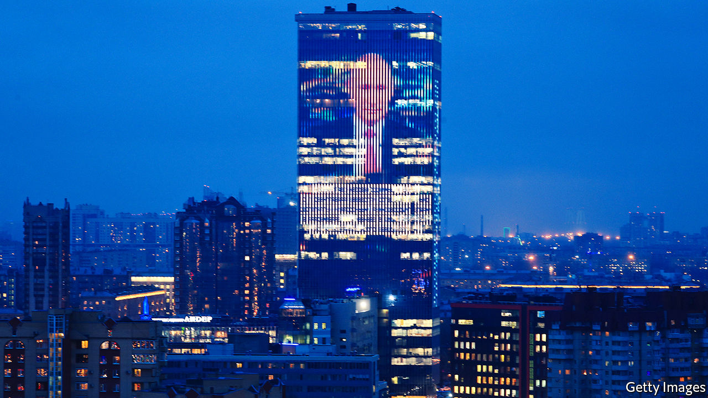

## Guess why?

# Putin proposes a rewrite of Russia’s constitution

> Term limits are for the little people

> Jan 16th 2020MOSCOW

THAT VLADIMIR PUTIN would try to retain power after his current presidential term expires in 2024 was never in much doubt. Ageing autocrats rarely leave office voluntarily, particularly if their rule has been tainted by war, repression and graft. The only questions were how Mr Putin would get round the term-limits imposed by the constitution and what this might mean for his anxious entourage.

On January 15th Mr Putin launched a “transition” aimed at ensuring his continuing role as Russia’s national leader. In his state-of-the-union speech he proposed sweeping changes to the constitution and laid plans that could give him a new role within a transformed political system. Within hours the government led by Dmitry Medvedev, Russia’s subservient prime minister, resigned. This was, as he put it, “to give our president the ability to make any necessary decisions.”

He was promptly replaced by Mikhail Mishustin, a hitherto obscure technocrat who had run Russia’s tax service. The reshuffle was not explicitly linked to the proposed constitutional changes. But it added a sense of drama and indicated to the confused Russian public that significant changes are afoot.

In reality, swapping one technocrat for another makes little difference. “All members of the ruling elite, starting from a certain level, look alike and are interchangeable,” says Ekaterina Schulmann, a political scientist. But the unpopular Mr Medvedev had become a liability. That does not mean he is gone for good. For now, he has been made deputy head of the security council, a powerful body that acts as a de facto politburo. He could even emerge as Russia’s new president in 2024, thanks to his combination of weakness and loyalty.

Russians have seen this ballet before. In 2011 Mr Putin announced he would return to the Kremlin after sitting out one term as prime minister, swapping jobs with Mr Medvedev, who filled in as president between 2008 and 2012. Some people were so offended by this trickery that they took to the streets. This time, Mr Putin’s announcement was met with indifference. Alexei Navalny, the main opposition leader, tweeted: “How dumb are all those who said Putin would leave in 2024.”

One reason for the muted reaction is that Mr Putin’s manoeuvre is intentionally obscure. He said nothing about his own future role, except to indicate that the “transition” has started. Although the details of his plan are unclear, it could elevate him above any elected job and formalise his role as a monarch in all but name.

To ensure no rival emerges, he suggested curbing the powers of a future president and limiting him or her to two terms (by removing the existing qualifier “consecutive”). Mr Putin also suggested expanding the powers of the Duma (parliament), dominated by his own United Russia party. Kirill Rogov, an analyst, notes that in a rigged electoral system more power for the Duma means more power for the dominant political party.

This led some observers to suggest that Mr Putin is contemplating the role of the leader of the ruling party, speaker of parliament or prime minister. He has good reason to avoid these options, however. United Russia, dubbed the party of “thieves and crooks” by Mr Navalny, is so unpopular among Russia’s voters that many of its functionaries preferred to run as independents in recent local elections.

A more likely scenario is that Mr Putin beefs up the State Council, an advisory body he set up in 2000 and which includes regional governors as well as the speakers of the Duma and the upper chamber of parliament. Mr Putin now proposes giving it executive powers. He also said he would extend the powers of regional governors. An empowered State Council, with Mr Putin as its head, could resemble a Soviet-era Central Committee of the Communist Party, where regional first secretaries were both powerful and loyal to the general secretary. To seal Russia off from the world, a revised constitution would also reduce the sway of international court rulings and conventions over Russian law.

Mr Putin’s plan demonstrates his personal power, but the manner and the timing of his announcement hint at underlying vulnerabilities. Last summer’s protests in Moscow were sparked by the Kremlin’s refusal to register any independent candidates for local elections. Mr Navalny inflicted hefty losses on the ruling party in the capital by urging his supporters to vote tactically against it. Mr Putin’s popularity ratings have been steadily sliding.

This may explain his haste in announcing the changes to the constitution. Parliamentary elections are due next year, and the fear of more street protests and political losses mean the Kremlin would rather lock in its changes under the current Duma. Still, Russia is far from safe from upheaval. Mr Putin may continue to rule in some form or other after 2024, but he cannot extinguish the feelings of injustice and discontent that make it so dangerous for him ever to leave the presidency. ■

## URL

https://www.economist.com/europe/2020/01/16/putin-proposes-a-rewrite-of-russias-constitution
