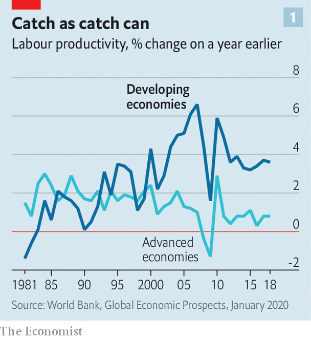
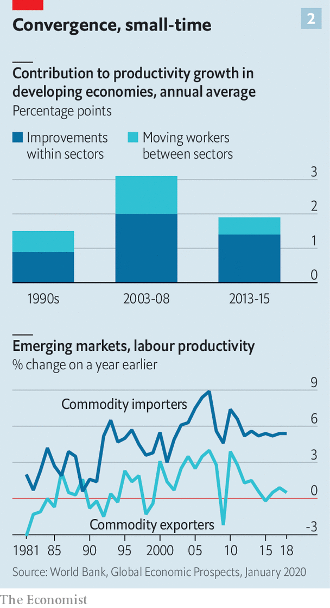

## Not just a first-world problem

# Emerging economies are experiencing a prolonged productivity slowdown

> They seem doomed to lag behind rich countries for longer than had been hoped

> Jan 16th 2020HONG KONG

HOW DO MODERN innovations stack up with those of the past? Some economists, such as Robert Gordon of Northwestern University, argue that driverless cars, 3D printers and so on pale into insignificance compared with the fruits of previous industrial revolutions, such as mass production (see Free exchange). That, they think, explains a prolonged productivity slowdown in America and other rich economies that the financial crisis deepened.

But what about everywhere else? Developing countries are, by definition, some distance from the technological frontier. One consolation of their position is the vast backlog of past innovations that remain for them to exploit more fully. Their growth depends more on imitation than innovation. A country where most people still ride scooters does not have to worry if the next Tesla fails to arrive on schedule.

And yet they too have suffered a productivity let-down. According to a new World Bank report, the slowdown is the “steepest, longest and broadest yet”, based on data going back four decades (see chart 1). The GDP per worker of developing economies is almost 14% lower than it would have been had productivity not lost momentum.

The Institute of International Finance, a think-tank, believes that emerging markets now suffer from a variant of the “secular stagnation” that haunts the rich world. Oxford Economics, a consultancy, argues that emerging markets have lost both volatility and vigour, consigning them to “grating stability”. Capital Economics, another consultancy, predicts that in the coming decade, “the widespread emerging-market catch-up growth of the past two decades will come to an end”. In most of the emerging markets it tracks, GDP per person grew less quickly last year than in America. Imitation is supposed to be easier than innovation. But even as leading economies are finding it harder to break a path, many of their followers have lost their way entirely.

How did this happen? When they look at the rich world, some economists worry that big firms have it too easy. Without stiff competition, they have little incentive to innovate or invest. But when they look at the poor world, some worry that big firms now have it too hard. In a survey of over 15,000 companies, the World Bank shows that large firms in poor countries tend to be more productive and more likely to export than their smaller rivals. In the past, these firms have been important conduits for improved know-how and technologies acquired from partners and rivals abroad and passed on to suppliers and imitators at home. But the “routes to technology transfer are narrowing”, the bank points out, thanks to rising protectionism and the halt in the expansion of global value chains.

A lack of technology transfer is only part of the problem, however. Half of the slowdown in labour-productivity growth in recent years reflects not a failure to imitate but a failure to accumulate: weak investment has left labour with too little capital to work with. This shortfall in investment explains all the productivity slowdown in South Asia, the Middle East and north Africa, and two-thirds of that in Europe and Central Asia. That is a serious problem, but also a reassuringly conventional one. Insofar as low capital spending stems from a lack of credit or confidence, it is easy enough to imagine a reversal once financial wounds heal and animal spirits revive.

Reluctance to mobilise capital has been matched by labour’s sluggishness in moving. In any country, some parts of the economy (such as manufacturing) are more productive than others (such as agriculture). But this gap is unusually large in developing countries, where the modern and the medieval often coexist. In principle, therefore, emerging economies have much to gain from moving workers between sectors, even if productivity within each sector does not improve. In the typical developing country, this movement contributed about 1.1 percentage points to growth in the years before the global financial crisis. That contribution has dropped to just 0.5 points in more recent years (see chart 2). In Latin America and the Middle East, the contribution was negative: workers moved the wrong way, to where they were less productive.

Perhaps the simplest explanation for the productivity bust lies in the boom that preceded it. For five extraordinary years, punctuated by the global financial crisis, China enjoyed exceptional growth that pulled commodity-exporters behind it. That very success left the Asian giant with less room for further catch-up growth, contributing to its inevitable slowdown. Its growth has also become more self-contained and less commodity-intensive.

The changing pace and pattern of China’s growth proved a disaster for the many developing economies that export commodities, especially in Latin America and the Middle East. Their productivity growth has collapsed. But in other developing economies, claims of secular stagnation and the end of catch-up growth seem exaggerated. Their productivity growth is close to its 25-year average and still comfortably above that of the rich world. It is slow only in comparison with a handful of years before and after the global financial crisis.

In a World Bank publication 25 years ago Lant Pritchett, now at Oxford University, emphasised that catch-up growth was historically quite rare. Yes, imitation should be easier than innovation (and returns to investment should be high where capital is scarce). But other factors often got in the way. After all, if poor countries reliably grew faster than rich ones, there would not be so many poor countries still around. The “dominant feature” of modern economic history was not convergence between rich and poor countries, wrote Mr Pritchett, but “divergence, big time”.

The past decade, for all its disappointments, has bucked that historical trend, if less impressively than the decade before it. For emerging economies, the 2010s were a let-down. But they were still the second-best decade of the past 50 years.■

## URL

https://www.economist.com/finance-and-economics/2020/01/16/emerging-economies-are-experiencing-a-prolonged-productivity-slowdown
