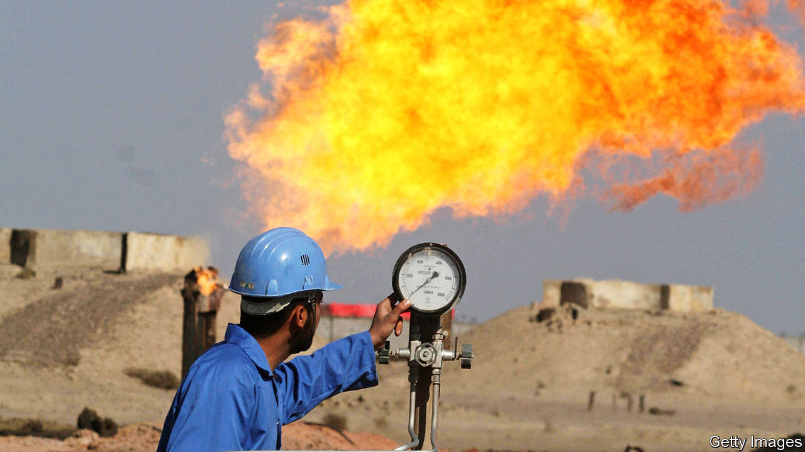

## Crude calculus

# Oil markets shrug off tension in the Middle East

> After a brief jump to over $70 a barrel, the price of Brent crude has subsided again

> Jan 16th 2020ABU DHABI

IT HAS BEEN a busy start to the year for the oil industry in the Middle East. The chief executives of Saudi Aramco, ExxonMobil and Total were among those who gathered on January 13th in Dhahran, in Saudi Arabia, for the International Petroleum Technology Conference. On January 11th Abu Dhabi, in the United Arab Emirates, welcomed energy ministers and executives for its Sustainability Week. They had plenty to talk about: a few days earlier, the region had looked close to war.

America killed Qassem Suleimani, one of Iran’s top commanders, in Iraq on January 3rd. Iran bombed an American base in Iraq in retaliation on January 8th. That strike killed no Americans and the threat of war has receded for now, but further conflict seems likely. Oil markets, however, are unbothered. After a brief jump to over $70 a barrel, the price of Brent crude subsided to $64 on January 13th, lower than before Suleimani’s death. On January 14th oil traders were preoccupied not by fears of violence, but by crude inventories and news of a trade deal between China and America. 

Oil producers in the Middle East are adjusting to a new normal. Geopolitics threatens to disrupt crude production, but the broader oil market is unconcerned. The threat to oil infrastructure is real. Iran and its proxies may continue to attack pipelines, tankers and processing facilities, as they did last year. “We have squeezed Iran with these sanctions and they have no way out,” says a former senior American military official, who expects further violence. Iraq, which has become the second-largest producer in the Organisation of the Petroleum Exporting Countries (OPEC), might also see a sudden drop in output. President Donald Trump has threatened sanctions if Iraqi lawmakers make good on their vote this month to push out American forces.

Meanwhile America’s role in protecting the region’s oil infrastructure looks uncertain. “We are independent, and we do not need Middle East oil,” Mr Trump declared on January 8th. That is not strictly true. In October America imported 741,000 barrels a day of crude oil and petroleum products from Gulf producers. Because oil is a globally traded commodity, its price at a pump in Rhode Island is still linked to policy in Riyadh. Even so, America is far less dependent on imports than it used to be, with monthly imports falling by about 40% from a peak in 2006. Last September America exported more oil than it imported. And Mr Trump does not seem particularly interested in going to war over oil.

In September, after strikes blamed on Iran knocked out more than half of Saudi Arabia’s output, America sent more troops to the region but declined to stage a counter-attack. The Suleimani strike, after the killing of an Iraqi-American blamed on Iranian proxies, made clear that Mr Trump would respond to the deaths of Americans. The same is not true for an attack on oil infrastructure. Mr Trump has suggested that America’s allies in NATO should do more to protect oil interests in the region. Forty years ago Jimmy Carter laid out what would become known as the Carter Doctrine: America would act to protect its energy interests abroad. In 2020 Mr Trump seems disinclined to hold that line.

Oil markets are staying calm partly because buyers and sellers seem to be discounting the possibility that Iran will close the Strait of Hormuz, through which around 20% of the world’s oil passes. They are also reassured by Saudi Arabia’s speedy recovery from September’s attacks. The next month Saudi Aramco showed off a vast command centre within its headquarters to The Economist, emphasising its capacity to respond nimbly to any problems. Saudi Arabia has invested in new security measures, too. New supplies from America, Brazil, Guyana and Norway have also helped contain the price of crude. This year geopolitical risk may make oil operations in the Middle East harder, without making oil much more expensive. ■