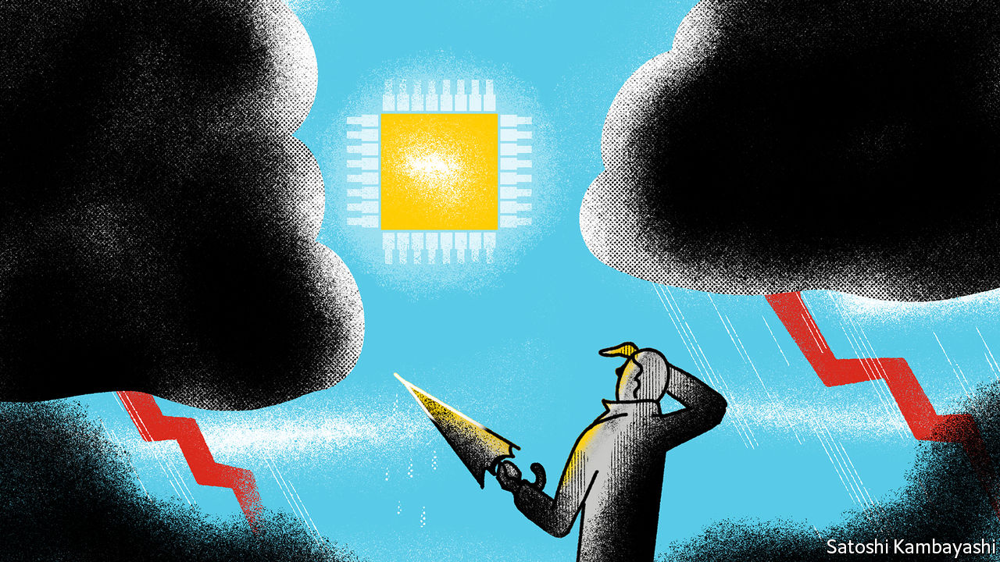
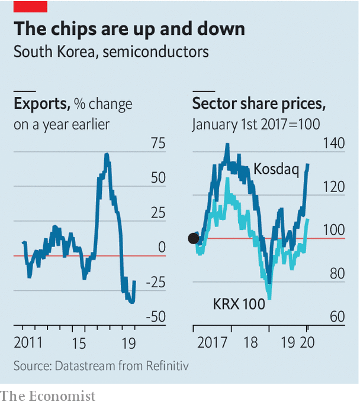

## Buttonwood

# What the semiconductor industry tells us about the world economy

> Blessed are the chipmakers

> Jan 16th 2020

THE SETTING for Robert Harris’s thriller, “Enigma”, is wartime Britain, where everything is rationed except for the rain. It follows Tom Jericho, a young prodigy stationed at Bletchley Park, the real-life centre of code-breaking operations, who is part of a team of cryptologists trying to break the code used by Germany’s armed forces. The work has frustration built in. Any progress can be undone if the enemy changes the code—which he will if he suspects that it has been cracked.

The novel comes to mind when considering the mysteries of shifts in the economic cycle and market reactions. The mood has clearly changed for the better since the middle of last year. Fears of recession have receded. Global equity prices have rallied. Bond yields have perked up. A truce in the trade war, however fragile, has helped. But the improvement in mood coincided with signs of life in Asia’s manufacturing hubs.

The key to these coded messages is the semiconductor industry. Cars, smartphones, gadgets and cloud-computing servers rely on components, notably memory chips, that are disproportionately made in emerging Asia. The mood-sensitive parts of aggregate demand—capital spending by firms and non-essential purchases by consumers—have microchips in there somewhere. The chip industry itself has savage mini-cycles. When it turns down, it is a sign of trouble ahead in the world economy. When it perks up, as it has done recently, there is reason to be more optimistic.

The cost structure of the chip business is central to this enigma. A semiconductor fabrication plant, or fab, costs billions of dollars to build. A sudden jump in orders, such as occurred in 2017, is met with increased capacity. But when demand falls, the fabs just keep producing. They are highly automated with few staff, so running costs are low. Continuous output makes sense but leads to occasional gluts and sagging prices, as happened through most of last year. Stocks become bloated. When demand picks up again, as it did late last year, stocks are drawn down and prices begin to stabilise.

Until quite recently the industry’s rhythms, and the tautness or slackness of Asia’s supply chains in general, were dictated by the two- or three-year life-cycle of smartphones. Export orders for Taiwanese electronics, for instance, tended to spike whenever a new Apple or Galaxy handset was launched. But the smartphone market is now saturated. Consumers find that an old model works almost as well as a newer one—and this might still be the case even when the new 5G generation of phones reaches the market. What drives growth in demand now is cloud computing, electrification of cars, wearable gadgetry and gaming, says Shawn Kim of Morgan Stanley. The cloud is a particular force. As firms ramp up capital spending of all kinds, that in turn spurs investment in cloud capacity, where business-related software lives.

What signals should market cryptologists be looking at? One measure is exports of semiconductors from South Korea, says Alicia Garcia-Herrero, chief economist for Asia at Natixis, an investment bank, who is based in Hong Kong. South Korea is pivotal to Asia’s supply chain, she says, and its shipments of semiconductors help predict exports in the region more generally. After a brutal 2019 the trend has bottomed out and is turning (see chart). Another signal is the financial health of big Asian chip companies, such as Samsung and SK Hynix. Those averse to digging deep into financial statements could simply monitor industry share prices. Or they could look for inflection points in the price of DRAM, a type of memory chip used to store data on servers and computers.

Technology’s share of global GDP will continue to grow. In principle, then, these signals will become even more closely watched. But other forces are at work. China has designs to be self-sufficient in electronic components, a goal made more urgent by the trade-tech wars. The short-term effect is to give a boost to Asia’s tech industry. But in the longer term, firms might find themselves displaced by Chinese rivals, at least in China’s own market.

To the extent that China succeeds, it will devalue the signals that arrive from the more open parts of emerging Asia. Market-watchers will come to feel the same frustration felt by Mr Harris’s fictional codebreakers at Bletchley. The codes keep changing. For now, though, the message from Asia is that the sun is peeking through the clouds—or, at least, that it has stopped raining.

## URL

https://www.economist.com/finance-and-economics/2020/01/16/what-the-semiconductor-industry-tells-us-about-the-world-economy
