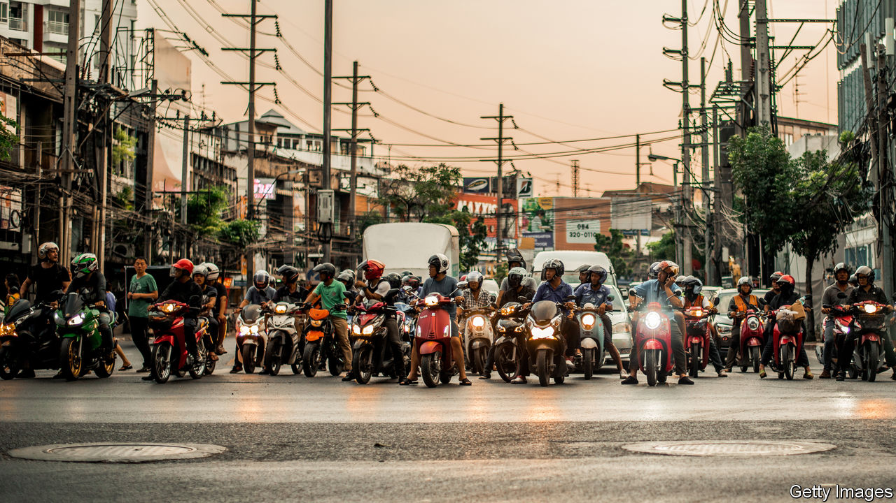
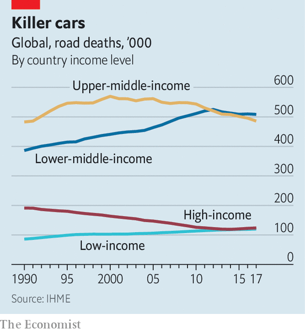

## Crunch time

# Globally, roads are deadlier than HIV or murder

> The tragedy is that this is so easy to change

> Jan 16th 2020BANGKOK

A YEAR AGO Nungroothai Tantasirin’s daughter, Hataipat, was hit by a motorbike while crossing the road near Bangkok. Soon after she died of her injuries. Ms Nungroothai threw herself into campaigning for a pedestrian bridge and took the bike rider to court, winning a hefty financial settlement. But nothing brings back a lost daughter—and reminders of the tragedy are everywhere. Recently, the school where Ms Nungroothai teaches returned from holidays. One child turned up with a head wound from a crash. Another teacher was off sick, having been struck by a motorbike while walking along the side of the road.

Thais know that their roads are dangerous. Local journalists cover tragedies like the death of Hataipat Tantasirin and diligently report the carnage that occurs around New Year’s Eve and Songkran, the Thai new year. According to official statistics, 19,930 people perished from injuries sustained on Thailand’s roads in 2018, including 837 in Bangkok. The country’s annual road-death rate is almost double the global average and more than seven times the rate in nearby Singapore, a wealthy financial hub. What is less well known is how easy it would be to change this.

Globally, road accidents kill more people every year than malaria or HIV/AIDS. Spencer James and other researchers at the Institute for Health Metrics and Evaluation (IHME) in America put the death toll in 2017 at 1.24m. According to IHME, the overall number of deaths has been more or less static since the turn of the century. But that disguises a lot of movement up and down in individual countries.

In many poor countries, especially African ones, road accidents are killing more people (see chart). Those countries have swelling, young populations, a fast-growing fleet of cars and motorbikes, and a limited supply of trauma surgeons. It is impossible to know for sure because official statistics are so inadequate, but deaths are thought to have risen by 40% since 1990 in countries that the World Bank defines as low-income, such as Afghanistan. In many rich countries, by contrast, roads that were pretty safe are becoming even safer. In Estonia and Ireland, the number of deaths has fallen by about two-thirds since the late 1990s.

The most important and intriguing changes are taking place in middle-income countries, such as Thailand. These contain most of the world’s people and have some of the most dangerous roads. They also tend to be close to an inflection point. In China and South Africa deaths have been falling since about 2000, according to IHME—though crashes still claim about a quarter of a million Chinese lives each year. In India deaths peaked in 2012. It is possible that the Philippines reached a peak four years ago. In Kenya and Nigeria deaths are still rising.

Roads in middle-income countries often change quickly, in ways that make them both safer and more dangerous. On the outskirts of Bangkok, Somchart Ninkled oversees a small group of volunteer ambulance drivers and “body snatchers”, as they are grimly known. These men are called to diverse emergencies, often involving snakes, which they grab with their bare hands. They also scrape at least one person off the roads every night. Crashes are getting worse, they say, as motorbikes become more powerful and roads grow smoother and faster. On the plus side, more people seem to be wearing helmets. And the police have at least put a stop to the local road races that were once common.

Rob McInerney, head of the International Road Assessment Programme, a charity, says that countries tend to go through three phases. They begin with poor, slow roads. As they grow wealthier, they pave the roads. Traffic moves faster, which pushes up the death rate (from Australia to Zambia, the physical law is the same: to calculate an object’s kinetic energy, you multiply half its mass by the square of its speed). In the third phase, countries act to make their roads safer. The trick is to reach the third stage sooner, by focusing earlier and more closely on fatal accidents.

How to do that? The answer is probably not education and training, says Soames Job of the World Bank. Some studies suggest that training drivers makes them more dangerous; perhaps they become cockier. Besides, routinely wearing helmets and seat-belts, obeying speed limits and avoiding drink-driving—all things that save lives—are not advanced skills. They are practices which people know they should follow but often don’t. Dangerous driving is not a fixed cultural trait, as some imagine. People respond to incentives, such as traffic laws that are actually enforced.

In Thailand motorbike helmets are compulsory. In Bangkok 85% of drivers and 55% of pillion riders wear them, according to roadside surveys. That is better than in the past, and much better than the national average. Perhaps urbanites follow the rules because they can afford helmets, or value their brains more highly—evidence from India suggests that university graduates are more likely to wear helmets. But in all probability Bangkok residents wear helmets because they fear being stopped and fined if they do not. Rittporn Yomram, a motorbike taxi driver in Bangkok, says that many passengers hesitate to wear helmets—unless they see a cop.

The police can also reduce speeding and drink-driving, if people truly fear the consequences of being caught. Thailand’s cops wrote almost 12m tickets in 2018; unfortunately, due to poor record-keeping, only 12% of them were paid. Major-general Eakkarak Limsanggas of the Royal Thai Police has cracked down on drink-driving by setting up roadblocks around Bangkok. He thinks this had an effect, although the penalties are less harsh than in many countries. But it was not long before politicians started calling, arguing that the roadblocks were harming the night-time economy and telling him to lighten up.

Countries can make their roads safer even if they are unable or unwilling to make drivers behave better. Many poor and middle-income countries have built concrete medians, especially in and around cities. These prevent head-on crashes—generally the most lethal kind—and give pedestrians a small safe zone halfway across a road. Development banks and groups such as the Millennium Challenge Corporation now insist that the roads they pay for are built to high safety standards.

Roundabouts, chicanes and road humps all reduce speeds and save lives. One study, by academics at the University of KwaZulu-Natal in South Africa, found that the number of pedestrian injuries in two districts of Durban fell from 659 in the two years before speed bumps were built to 519 in the two years after. The number of deaths fell more sharply, from 24 to eight. Mr McInerney points out that fast four-lane roads are still being built through villages in many countries. But in Peru and elsewhere, local people have responded by building illegal speed bumps.

In Bangkok, the road where Hataipat Tantasirin was hit by a motorbike has a new pedestrian footbridge. That will save lives, if people use it. The body snatchers report that they are often called to accidents where pedestrians have been hit by cars or motorbikes directly under footbridges. Apparently, they use them for shade. ■

## URL

https://www.economist.com/international/2020/01/16/globally-roads-are-deadlier-than-hiv-or-murder
