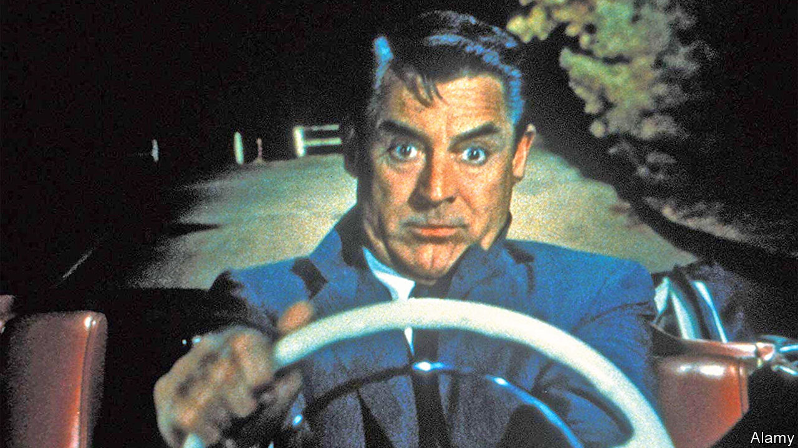

## You might as well do the white line

# Painting lines on roads saves lives

> Simple things can reduce deaths in traffic accidents

> Jan 16th 2020

FIFTEEN MINUTES into Alfred Hitchcock’s film “North by Northwest”, Roger Thornhill, the character played by Cary Grant, has a heap of problems. Having been mistaken for another man, he has been kidnapped by two armed thugs and driven out of New York City. The thugs have poured a large bourbon into him and put him behind the wheel of a car, which they have aimed over the edge of a cliff. Thornhill has another problem which heightens the drama. The road’s edge is unmarked.

When “North by Northwest” was released, in 1959, most American roads lacked painted edge lines. Even the centre lines shown in that film were not yet standardised. Could simply painting lines on roads have saved hundreds of thousands of Americans?

In their book “Reducing Global Road Traffic Tragedies”, Gerald Balcar and Bo Elfving argue that it did. The first American centre line appeared near Detroit in 1911; the man responsible for it claimed a leaky milk van leaving a white streak inspired him. Over the next few decades, road engineers began to favour yellow centre lines, which were made reflective by adding glass beads to paint. But edge lines remained rare outside cities.

What changed that were studies from the 1950s showing that painted edge lines cut road accidents, especially fatal ones. In the early 1970s Potters Industries (which made the glass beads, and employed Mr Balcar) calculated that driving on a rural road at night was six times deadlier than driving on an urban road during the day. Cars were running off the roads largely because drivers could not detect their edges.

As edge lines and marked intersections proliferated, and Americans started wearing seat-belts, the road-death rate began to fall. The car chase in the 1968 film “Bullitt” takes place on impeccably engineered roads, with centre lines and edge lines, energy-absorbing crash barriers and soft, obstacle-free road margins. To make such roads deadly, you need muscle cars, insane speeds, a shotgun and a strategically placed petrol station.