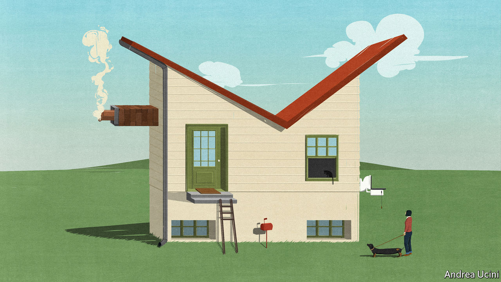

## The horrible housing blunder

# Home ownership is the West’s biggest economic-policy mistake

> It is an obsession that undermines growth, fairness and public faith in capitalism

> Jan 16th 2020

ECONOMIES CAN suffer both sudden crashes and chronic diseases. Housing markets in the rich world have caused both types of problem. A trillion dollars of dud mortgages blew up the financial system in 2007-08. But just as pernicious is the creeping dysfunction that housing has created over decades: vibrant cities without space to grow; ageing homeowners sitting in half-empty homes who are keen to protect their view; and a generation of young people who cannot easily afford to rent or buy and think capitalism has let them down. As [our special report](https://www.economist.com//special-report/2020/01/16/housing-is-at-the-root-of-many-of-the-rich-worlds-problems) this week explains, much of the blame lies with warped housing policies that date back to the second world war and which are intertwined with an infatuation with home ownership. They have caused one of the rich world’s most serious and longest-running economic failures. A fresh architecture is urgently needed.

At the root of that failure is a lack of building, especially near the thriving cities in which jobs are plentiful. From Sydney to Sydenham, fiddly regulations protect an elite of existing homeowners and prevent developers from building the skyscrapers and flats that the modern economy demands. The resulting high rents and house prices make it hard for workers to move to where the most productive jobs are, and have slowed growth. Overall housing costs in America absorb 11% of GDP, up from 8% in the 1970s. If just three big cities—New York, San Francisco and San Jose—relaxed planning rules, America’s GDP could be 4% higher. That is an enormous prize. 

As well as being merely inefficient, housing markets are deeply unfair. Over a period of decades, falling interest rates have compounded inadequate supply and led to a surge in prices. In America the frenzy is concentrated in thriving cities; in other rich countries average national prices have soared, especially in English-speaking countries where punting on property is a national sport. The financial crisis did not kill off the trend. In Britain inflation-adjusted house prices are roughly equal to their pre-crisis peak, while real wages are no higher. In Australia, despite recent falls, prices remain 20% higher than in 2008. In Canada they are up by half. 

The soaring cost of housing has created gaping inequalities and inflamed both generational and geographical divides. In 1990 a generation of baby-boomers, with a median age of 35, owned a third of America’s real estate by value. In 2019 a similarly sized cohort of millennials, aged 31, owned just 4%. Young people’s view that housing is out of reach—unless you have rich parents—helps explain their drift towards “millennial socialism”. And homeowners of all ages who are trapped in declining places resent the windfall housing gains enjoyed in and around successful cities. In Britain areas with stagnant housing markets were more likely to vote for Brexit in 2016, even after accounting for differences in income and demography.

You might think fear and envy about housing is part of the human condition. In fact, the property pathology has its roots in a shift in public policy in the 1950s towards promoting home ownership. Since then governments have used subsidies, tax breaks and sales of public housing to encourage owner-occupation over renting. Politicians on the right have seen home ownership as a way to win votes by encouraging responsible citizenship. Those on the left see housing as a conduit for redistribution and for nudging poorer households to build wealth.

These arguments are overstated. It is hard to show whether property ownership makes better citizens. If you ignore leverage, it is usually better to own shares than to own homes. And the cult of owner-occupation has huge costs. Those who own homes often become NIMBYs who resist development in an effort to protect their investments. Data-crunching by The Economist suggests that the number of new houses constructed per person in the rich world has fallen by half since the 1960s. Because supply is constrained and the system is skewed towards ownership, most people feel they risk being left behind if they rent. As a result politicians focus on subsidising marginal buyers, as Britain has done in recent years. That channels cash to the middle classes and further boosts prices. And it fuels the build-up of mortgage debt that makes crises more likely.

It does not have to be this way. Not everywhere is afflicted with every part of the housing curse. Tokyo has no property shortage; between 2013 and 2017 it put up 728,000 dwellings—more than England did—without destroying quality of life. The number of rough sleepers has dropped by 80% in the past 20 years. Switzerland gives local governments fiscal incentives to allow housing development—one reason why there is almost twice as much home-building per person as in America. New Zealand recoups some of homeowners’ windfall gains through land and property taxes based on valuations that are frequently updated.

Most important, in a few places the rate of home ownership is low and no one bats an eyelid. It is just 50% in Germany, which has a rental sector that encourages long-term tenancies and provides clear and enforceable rights for renters. With ample supply and few tax breaks or subsidies for owner-occupiers, home ownership is far less alluring and the political clout of NIMBYs is muted. Despite strong recent growth in some cities, Germany’s real house prices are, on average, no higher than they were in 1980.

Is it possible to escape the home-ownership fetish? Few governments today can ignore the anger over housing shortages and intergenerational unfairness. Some have responded with bad ideas like rent controls or even more mortgage subsidies. Yet there has been some progress. America has capped its tax break for mortgage-interest payments. Britain has banned murky upfront fees from rental contracts and curbed risky mortgage lending. A fledgling YIMBY—“yes in my backyard”—movement has sprung up in many successful cities to promote construction. Those, like this newspaper, who want popular support for free markets to endure should hope that such movements succeed. Far from shoring up capitalism, housing policies have made the system unsafe, inefficient and unfair. Time to tear down this rotten edifice and build a new housing market that works. ■

## URL

https://www.economist.com/leaders/2020/01/16/home-ownership-is-the-wests-biggest-economic-policy-mistake
