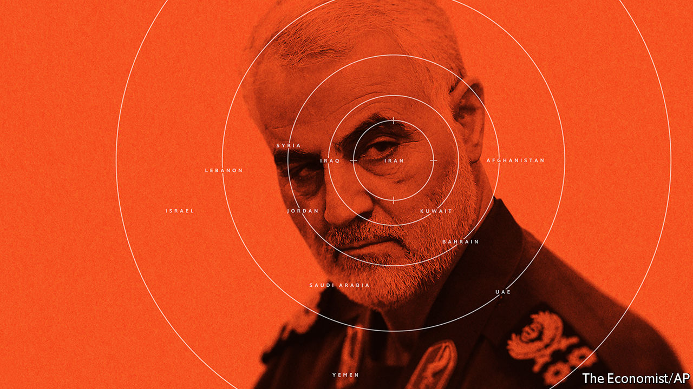

## On Iran, hormone therapy, Ireland, Dominic Cummings

# Letters to the editor

> A selection of correspondence

> Jan 18th 2020

It is short-sighted to think that “two tests” will define whether the killing of Qassem Suleimani was a success: “its effect on deterrence and on Iran’s regional power” (“Masterstroke or madness?”, [January 11th](https://www.economist.com//leaders/2020/01/09/donald-trump-wants-to-curb-iran-has-he-gone-about-it-the-right-way)). The killing failed a more important test. It breached a settled rule of international law prohibiting the use of force in international relations, except in response to an actual attack or to an imminent threat. Mike Pompeo, America’s secretary of state, all but admitted that no such attack was foreseen when he claimed, irreconcilably, that an attack was imminent, but we simply didn’t know where or when.

That makes it harder to distinguish and reject the legality of Iranian justifications for retaliation in revenge. Indeed, how do we reject the legality of any country’s use of force to avenge some prior insult? Accepting the legality of the drone strike that killed Suleimani reverberates far beyond Iran and its neighbourhood. It makes the world a much more dangerous place.

GABOR RONAProfessor of practiceCardozo Law SchoolNew York

I doubt that it was in line with your usual standards of prudence and civility to suggest, referring to Suleimani, that “ridding the world of a baleful individual” was a “worthwhile achievement”. I look forward to you trying to spell out the plausible and precise criteria for applying such complacent language to the killing of one obviously baleful individual but not, perhaps, to another.

AREND SMILDEUtrecht, Netherlands

It is surprising that your correspondents may have ignored an important aspect of hormone-replacement therapy (Letters, [January 11th](https://www.economist.com//letters/2020/01/11/letters-to-the-editor)), given that, in spite of many studies, the adverse effects of HRT, if any, remain unclear. It should be recognised that so many women have greatly improved their well-being while on these therapies, and that their libido and sexual function have been enhanced. Happiness and health go together.

ROBERT WINSTONProfessor of science and societyImperial College London

I read with interest the heated exchange of letters commenting on your recent article about treating menopause. It appears that the correspondents were unaware of the recent update on the Women’s Health Initiative trial presented at the San Antonio Breast Cancer Symposium in December. Now that we have 18 years of data following on from that landmark trial, it appears that it is the combination of oestrogen plus progesterone in women who have not had a hysterectomy that is the cancer-causing problem, leading to a 29% increased incidence of breast cancer. The use of oestrogen alone in women who no longer have a uterus actually demonstrated a 23% reduction in breast-cancer incidence, in that same study.

These are important data for women to be aware of. As newer methods of molecular or radiologic screening for uterine pre-cancerous changes are developed, I predict we will be able to offer postmenopausal oestrogen replacement safely to the majority of women, whether or not they have had a hysterectomy.

LOWELL HARTAssociate professor of internal medicine, hematology and oncologyWake Forest University School of MedicineWinston-Salem, North Carolina

Regarding the liberalisation of Ireland (“Personal and political”, [December 21st](https://www.economist.com//christmas-specials/2019/12/18/the-liberalisation-of-ireland)), the “profound shift” in Irish social attitudes over the past four decades has been matched by a similarly profound change in economic circumstances. Today’s older generation in Ireland lived through an era in which the economy transformed from one of the poorest in Europe to one of the wealthiest. It is perhaps unsurprising that people who have seen rapid economic growth bring about drastically increased living standards are less conservative and fearful of change in their social attitudes than those of similar generations elsewhere.

Vitriolic culture wars in other countries are normally accompanied by sluggish economic growth and stagnating living standards. So, instead of trying to persuade conservatives to change their social attitudes, liberals should focus on growth-enhancing measures to attain progress.

COLM HARNEYLondon

The introduction of universal free secondary education in 1967 was the single most important piece of social policy in the second half of the 20th century in Ireland, helping transform the culture. If ever there was a case study on the role of education in remoulding a country it was this. It made Ireland enlightened, successful and normal.

DAVID MERRIMANCork

The ideas Dominic Cummings has put forth about reshaping the British state sound alarmingly familiar (“The Cummings plan”, [January 4th](https://www.economist.com//britain/2020/01/02/dominic-cummingss-plan-to-reshape-the-state)). It is the old arrogant and irrational dream (or nightmare) about central hierarchical steering and control by technocrats and managers, who know everything (and better) than consensus-oriented politicians and bureaucrats. The prime minister’s adviser points to the Apollo programme, which brought the world’s best scientists and engineers into government projects. I suggest he reads “The Moon and the Ghetto” by Richard Nelson.

This book, published in 1977, explains the difference between sending a man to the Moon and solving poverty, or why large technical problems are thoroughly different from engineering social systems. Governing involves continuous adaptation and learning about how to achieve what we want. This invariably involves conflict and consensus, not quick, arrogant and streamlined decision-making.

Is there a better description of Mr Cummings’s own role in Brexit? His devil-may-care, break-the-rules approach to policy sounds dangerously like a quip from his master, Boris Johnson: “There are no disasters but only opportunities, and indeed opportunities for fresh disasters.”

WERNER JANNProfessor emeritus of administration and organisationPotsdam UniversityPotsdam, Germany

“The Cummings plan” involves accumulating as many scapegoats as possible. His Leave campaign blamed Britain’s problems on the European Union. The onus for delays to the withdrawal agreement was shifted to Parliament. The purpose of his assault on a resistant civil service is to combine it with Brussels as whipping boys for the unravelling of Brexit that will shortly commence.

ROD TIPPLECambridge, Cambridgeshire

I recall that the gifted brother of Sherlock Holmes, Mycroft, is described in one affair as not just being in the government, but, occasionally, he is the government. Mycroft discreetly handles policy in every field, not always successfully, but with the highest loyalty and patriotism. And when taken into his confidence, Sherlock supports him completely. What are Mr Cummings’s credentials?

BRYAN STONEEttingen, Switzerland