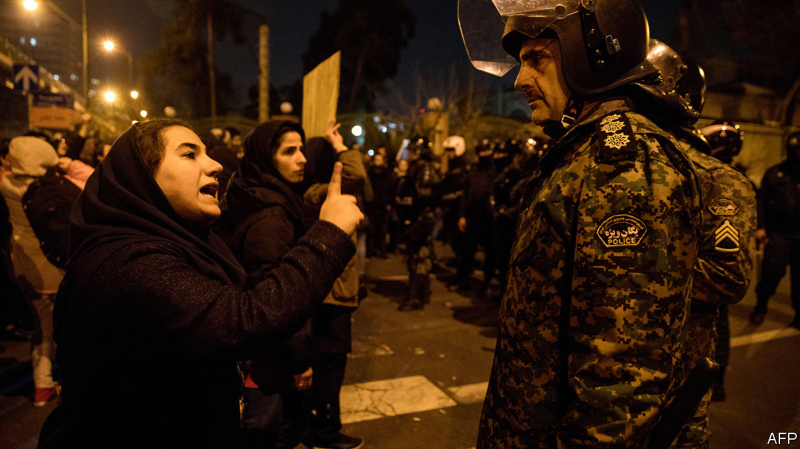

## Regime on edge

# Iran’s leaders risk being overwhelmed by crises they created

> The regime is facing pressure at home and from abroad

> Jan 16th 2020

SO UPSET WERE they over the crash of a Ukrainian passenger jet that not one but two officials in Iran’s Islamic Revolutionary Guard Corps (IRGC), including its leader, said they wished they were dead. The IRGC, the regime’s Praetorian guard, shot down the plane by mistake over Tehran on January 8th, then tried to cover it up. The mea culpas came days later, after officials were caught in their lies. But the feelings of regret were short-lived. When thousands of Iranians took to the streets to voice their anger, the IRGC sent its bully boys to knock back the crowds; when the thumping failed to work, some opened fire.

Force has quelled previous protests, most recently in November, when the authorities killed hundreds of people. But the regime offers no solutions to the economic anxiety and political stagnation lying beneath all the anger. So it lunges from crisis to crisis, as the ranks of the discontented grow. Meanwhile pressure from abroad is rising. On January 14th Britain, France and Germany formally accused Iran of breaching an agreement, signed in 2015, to curb its nuclear programme. “We feel the system is on the brink,” says one protester.

In early January Iran had come together in national mourning after America’s assassination of Qassem Suleimani, its most prominent general, who was in charge of the IRGC’s foreign operations. But hours after the IRGC retaliated with missile strikes on American targets in Iraq, killing no one, its operatives in Tehran mistook the passenger jet taking off from the international airport for an incoming cruise missile. They shot it down, killing all 176 people on board. The dead included dozens of young Iranians going to study in Canada. For three days the Guards said a mechanical failure was to blame. Mourning on state television was muted. The official disregard contrasted with the huge funeral staged for General Suleimani.

The big protests in 2017 and 2019 started in provincial cities and featured mostly working-class Iranians. The latest unrest, by contrast, began in Tehran and has rippled outward. Students and middle-class Iranians have taken the lead. Some tore down portraits of General Suleimani and called for the downfall of the supreme leader, Ayatollah Ali Khamenei. Others mocked the IRGC’s attempt to deflect criticism by stirring up anti-American and anti-Israeli sentiment. At Shahid Beheshti University in Tehran, crowds refused to walk on giant American and Israeli flags that had been painted on the ground.

Prominent members of Iran’s nomenklatura have openly broken with the regime. Newspapers printed apologies for betraying their readers and promised to hold the authorities to account. “Officials who misled the media are guilty too,” tweeted Kian Abdollahi, editor-in-chief of the semi-official Tasnim news agency. “We are all ashamed before the people.” Gelare Jabbari, a television anchor, apologised “for lying to you on TV for 13 years”. Artists pulled out of festivals. The only female Iranian athlete to win an Olympic medal, Kimia Alizadeh, announced her defection.

The regime now rests on a loyalist rump, which seems to be weakening. Several conservative politicians, such as Ali Larijani, the speaker of parliament, have announced their retirement in recent months. The rest have engaged in a blame game with more pragmatic types, such as President Hassan Rouhani. Hardliners have called for his resignation. Mr Rouhani, in turn, says that IRGC leaders should be prosecuted. The authorities say they have detained several people, but seemingly no bigwigs. One person was reportedly arrested for posting a video of the missile hitting the plane online.

Unrelenting economic decline, hastened by American sanctions, gnaws at the credibility of the government’s pragmatists and hardliners alike. The IMF forecasts that GDP will shrink by 9.5% this year. Economists say Iran must sell 1m barrels of oil a day to stay afloat, but it has exported at best half of that in recent months. Starved of funds, capital expenditure has all but ground to a halt. Printing more rials might stimulate the economy, but would also boost inflation, which is running near 40% a year. The economy “is like a man in his 90s with ten diseases laid flat in hospital”, says an Iranian academic.

Many of the ailments can be traced back to President Donald Trump’s decision in 2018 to pull America out of a deal that curbed Iran’s nuclear programme in return for relief from sanctions. Mr Trump wants a new agreement that also curbs Iran’s missile programme and its regional meddling. “Let’s replace [the old deal] with the Trump deal,” adds Boris Johnson, Britain’s prime minister. Mr Rouhani has dismissed the idea and refuses to talk to Mr Trump. “Iran could have followed Mexico, which renegotiated NAFTA and benefited,” says an Iranian political scientist. “Even protracted negotiations might have kept Mr Trump in the nuclear deal and spared it sanctions.”

Instead the regime has challenged America and alienated the European signatories to the deal by lifting all limits on its production of enriched uranium, which can be used for nuclear energy or, if concentrated enough, a bomb. Its actions pushed Britain, France and Germany to invoke the deal’s dispute mechanism on January 14th—which could ultimately spell the end of it. America may have played a role in the decision. According to the Washington Post, Mr Trump threatened to impose a 25% tariff on European car imports if the three countries refused to act.

For Iran, the status quo is untenable. But with his nuclear deal in tatters, his brother in prison (on charges of corruption) and his presidency ending next year, Mr Rouhani looks like a lame duck. Some Iranians believe the IRGC stands a better chance of changing Iran. Its strength has grown over the past decade, along with its role in the economy; it might be better placed to challenge clerical rule and make up with America. But a coup seems unlikely. The IRGC, now sullied, remains in the grip of the clergy. Each unit, from platoon upwards, has a clerical commissioner who vets promotions and reports directly to Mr Khamenei. The religious indoctrination of recruits has increased.

For his part, Mr Khamenei has not apologised for the plane crash, perhaps fearing it would show weakness. On January 17th he is due to lead Friday prayers in Tehran for the first time in eight years. Expect his message to be uncompromising. He is likely to endorse the IRGC and warn that protesters will be treated as traitors.

Mr Khamenei may count on outlasting Mr Trump, who faces an election in November. In the meantime, he will rely on the IRGC and the clergy to smother dissent. The Council of Guardians, an appointed group of clerics and Islamic jurists, has barred 90 MPs, nearly a third of the parliament, from running for re-election next month. Most are moderates. In the words of one Iranian analyst, Iran’s clerics learnt from the shah’s downfall in the Islamic revolution of 1979 that a regime weakens itself when it starts to reform. ■

## URL

https://www.economist.com/middle-east-and-africa/2020/01/16/irans-leaders-risk-being-overwhelmed-by-crises-they-created
