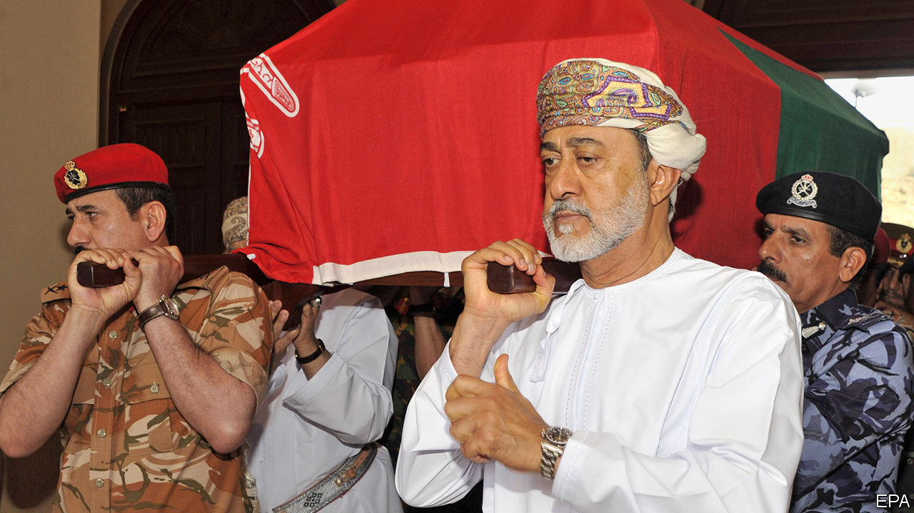

## What comes after Qaboos?

# The new sultan of Oman hopes to lead as well as the last one

> But he will face plenty of challenges

> Jan 16th 2020

SULTAN QABOOS of Oman left little to chance. Long before he died he sealed two envelopes containing the name of his chosen successor—and a back-up, just in case. Hours after his death was announced on January 10th, relatives gathered to open the envelope. Everyone suspected the candidate would be one of his cousins. Which one was a surprise: not Asad bin Tariq, who had been elevated to deputy prime minister in 2017, but Haitham, a longtime diplomat. Still, the succession went off without a hitch. The new sultan swore an oath and pledged to continue the policies of the man who built the modern Omani state.

Sultan Qaboos seized power from his father, with British help, in 1970, when he was 29. The older man ruled as a recluse. When he was deposed Oman had just three schools and 10km of paved roads. Sultan Qaboos changed all that. Though it is not as oil-rich as its neighbours, in 2010 Oman was ranked by the UN as the country that had developed most over the previous 40 years, ahead even of China. The Sultan also charted an independent foreign policy: fond of Britain, willing to host Israeli prime ministers, but also happy to meet Iranian ayatollahs and Chinese businessmen.

Many of those foreigners descended on Muscat this week to pay their respects. Britain sent both Prince Charles and Boris Johnson, the prime minister, a remarkable show of affinity for a faraway state (Oman is the one Gulf country where Britain, not America, is primus inter pares). That relationship remains on solid ground with Sultan Haitham, an Oxford graduate.

Indeed, little is likely to change in Oman’s foreign affairs. Sultan Qaboos charted the course, but many Omanis are now proud of a policy that has kept them out of the region’s myriad fights and made their country a trusted mediator. In his first speech as sultan, Haitham pledged to adhere to his predecessor’s principles. “We’re on the Indian Ocean, not only the Gulf. We look out as well as in,” says an adviser to the late sultan.

Still, a few questions linger. One is how Sultan Haitham will manage relations with President Donald Trump. Sultan Qaboos is said to have been upset by the president’s decision to withdraw from the nuclear deal with Iran, which grew out of secret talks in Muscat. Mr Trump sent only a middling delegation to his funeral, led by the energy secretary. But the new sultan will be familiar with the Americans from his days as a diplomat, when he helped negotiate agreements that allow America to use Omani airfields and position military kit in the sultanate. If Mr Trump decides to pursue his own deal with Iran, he may ask for help.

Other Gulf states, meanwhile, may see an opportunity to meddle. Saudi Arabia and the United Arab Emirates (UAE) resented Sultan Qaboos’s neutrality in the war in Yemen, his refusal to join the blockade of Qatar and his ties to Iran. In recent years Omani officials and foreign diplomats have worried that the country could find itself subjected to the same treatment as Qatar. When Britain held a military exercise on Oman’s Indian Ocean coast in 2018, diplomats described it as a message to the UAE, a sign that Oman had powerful friends.

Wealthier neighbours could try to put pressure on the new sultan more subtly—by dangling the prospect of needed investment. Oman pumps 1m barrels of oil a day, about a quarter of the UAE’s output. That small stream still accounts for more than 70% of government revenues. Last year the state had to raid its sovereign-wealth fund to finance the deficit. The World Bank puts youth unemployment at a staggering 49%. Inward foreign direct investment is growing, but is still largely concentrated in oil and gas.

Sultan Haitham has little economic nous and is not known for his managerial savvy. The ministry of culture, which he ran, was seen as dysfunctional. Oman-watchers fear he lacks energy and hope he will delegate to younger officials. “There’s a new generation of leaders coming up,” says a diplomat. “They understand that things need to be upgraded a bit.” ■

## URL

https://www.economist.com/middle-east-and-africa/2020/01/16/the-new-sultan-of-oman-hopes-to-lead-as-well-as-the-last-one
