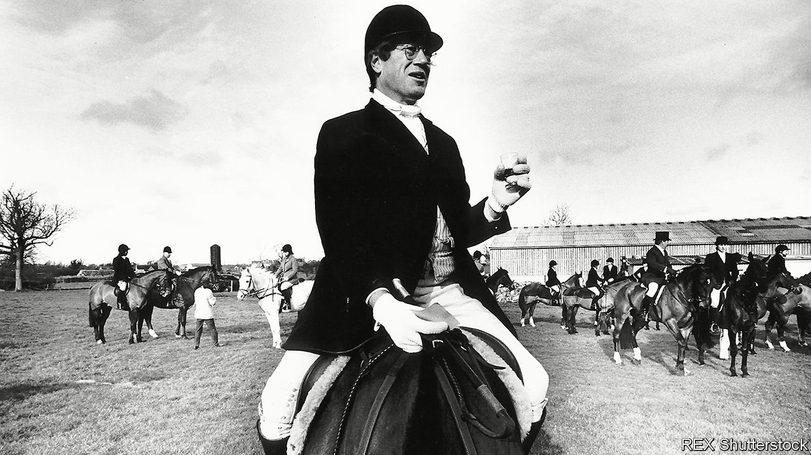

## Defender of the right

# Obituary: Sir Roger Scruton died on January 12th

> The conservative philosopher and controversialist was 75

> Jan 18th 2020

ON FROSTY WINTER mornings, or at any season, there was no greater pleasure for Roger Scruton than to ease into woollen breeches and a frock-coat, pull on his boots, mount his old horse and, in the wake of the milling hounds, set off for the hunt. His life, he had concluded, fell like Caesar’s Gaul into three parts. In the first he was a wretched youth, fighting an often drunk, ardently socialist father who, after he had won a scholarship to Cambridge, would not speak to him. In the second, restless part he travelled, wrote, and built up an academic life in philosophy at Birkbeck College and elsewhere. And in the third, from the early 1990s, he went hunting. It combined in one activity his three abiding passions: conservatism, controversy, and Englishness.

There was no doubt that in mid-life and later he more often felt like the fox, the individual plucked from his species to be scapegoated and killed. His opinions got him barred from universities and dismissed from a government commission—though, since his remarks had been distorted, he was quickly reinstated. They made him such a figure of scorn at Birkbeck that he read for the Bar in case they threw him out. Running against the prevailing modernist orthodoxy of the liberal-left, lamenting the loss of everything from classical education to stiff upper lips to England itself, he often found himself as lonely as Reynard racing for the coverts.

Being alone, he lashed out all the more. Targets worth attacking lay on every side, beginning with that ludicrous gobbledygook of Marx and Foucault and the sanctimoniousness of those who promoted it: the unparalleled bigotry of the left. He moved on to leftist “intellectuals”, fools, frauds and firebrands, as he characterised them in “Thinkers of the New Left” in 1985. He took on multiculturalism, which harmed immigrant children by not instructing them in the ways and customs of England—as well as the ridiculous charge that he was a racist, rather than a patriot, for encouraging that argument in the Salisbury Review when he was editor. Then he wondered aloud whether homosexuality, like incest, had been stigmatised for the justifiable reason that it threatened the healthy survival of the human race.

All this got him into a good deal of trouble. He did not see why it should. To speak his mind openly was surely not such an intolerable thing. His biggest lapse from the morality he saw fading on every side came when he was not open, but plotted secretly in 2002 to place pro-smoking articles in several magazines while taking a fee from Japan Tobacco. The disgrace that followed disrupted his academic life and caused him to flee to America, his pariah’s wounds now, as he admitted, deserved. After a few years he returned, though. He had to; he missed hunting too much.

The landscape he rode through was the Wiltshire claylands, lying under the ancient chalk figure of the White Horse on its hill, a country with its ancestry still evident in villages, Jacobean mansions and the patchwork of the fields. This sense of deep belonging in a place was expressed in English common law, laid down by custom, habit and precedent like a stratum of stone; it was reinforced by membership of institutions, from the cricket team to the Church of England, each with their observances. All this had to be preserved. That was why he was a conservative and, though a Kantian by instinct, a Hegelian in his conviction that people’s ideas of the world were shaped by language, tradition, culture, the spirit of a place. He had seen enough tearing down, whether by vandal developers ripping the heart from Georgian towns or by rioters in Paris in 1968, to know that he was firmly on the other side.

And this was a frustrating place to be. English conservatives found thinking precarious, and did not unite round abstractions like the French; they believed that ideas should be inherited, then ignored. He was not happy with a full-throttle defence of capitalism, and worship of the free market, as in Margaret Thatcher’s reign of terror, did not seduce him either. As he wrote in “The Meaning of Conservatism”, the core conservative value was not competition, but attachment: the defence of civil society and a certain way of life. The state should stay small not just because bureaucratisation was bad, but because when government intervened people ceased to help each other and social capital dwindled. He saw this exemplified in eastern Europe, where in the 1980s he secretly supported the Czechs against a withering communist regime which, controlling everything, left them only with emptiness. By contrast, thrown from his horse on the hunt once, he was rescued by a fellow-member who instinctively stayed behind. This precious pre-modern soul became his second wife.

The hunt epitomised other values for him. It brought the classes together not as equals, but in a common purpose. It expressed his freedom, by custom and tradition, to follow that purpose over his neighbours’ fields. The hedges he jumped were a vestige of old livestock agriculture which he, too, had preserved for some years by running a farm at Sunday Hill and leasing out his grass. The beauty of his land as he returned to it went, as Kant said, beyond the limits of reason. It made him feel at home in the universe.

And that, in the end, summed up England for him. As he argued in “England: An Elegy” in 2000, it was not a nation—it had never quite succeeded at that—but a home, in which, as in his old farmhouse, he could ease off his boots, pour a glass of wine, and know the place as his. As occupiers went in his particular part of it, he was very new, a town boy who also kept two rooms in the Albany off Piccadilly and whose accent was still foreign. But like Mustafa, the local craftsman cobbler, he had learned the ancient art of fitting in.

His ideas, too, had mellowed amid the grass. He spoke warmly of feminism as part of natural reform, decrying only the destructive kind. He regretted his thoughts about homosexuality, which was complicated. Towards any nonsense from the left, however, he remained on high alert—ready, as soon as he heard it flustering the hen-coop, to seize crop and helmet and cry “Tally ho!” ■