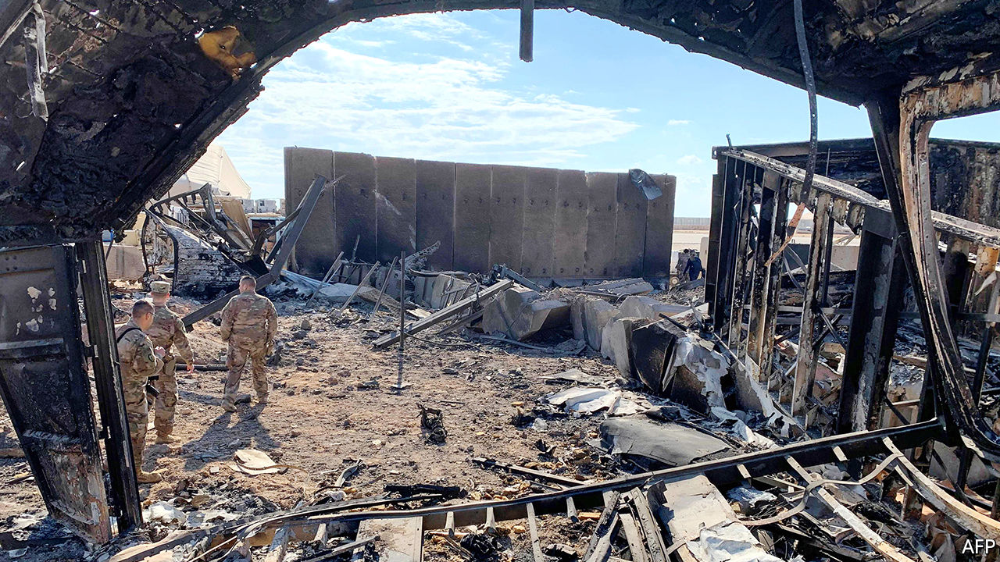

## Missile technology

# Iran’s attack on Iraq shows how precise missiles have become

> It scored a series of bullseyes

> Jan 16th 2020

SATELLITE PHOTOGRAPHS of Ain al-Asad, an air base in western Iraq currently used by American forces, showed the aftermath of an Iranian ballistic-missile strike on January 8th. They were pictures of precision. Iran had struck at the heart of the sprawling base, in an area packed with planes, helicopters and buildings. The precision, however, was paradoxical. The missiles scored six direct hits, but against evacuated aircraft hangars. This, presumably, was enough retaliation for honour’s sake after an American air-to-surface missile had killed Qassem Suleimani, a prominent Iranian general, five days earlier, without being sufficient to provoke counter-retaliation. “The most important takeaway from Iran’s strike is just how precise their short-range ballistic missiles were,” says Vipin Narang of the Massachusetts Institute of Technology. “The accuracy revolution is real and no longer a monopoly of the United States. This has huge implications for modern conflict.”

A missile’s accuracy is measured by its circular error probable (CEP), a radius within which half of all launches will fall. The lower the CEP, the more precise the missile. When Saddam Hussein chose to lash out during the Gulf war of 1991 he sprayed scores of Scud missiles at Israel and Saudi Arabia. His rockets had a CEP of more than two kilometres. That is fine for terrorising cities, but useless for hitting—or avoiding—specific buildings. More Israelis died from heart attacks and stress than from blasts. Though one Iraqi Scud killed 28 American soldiers in Saudi Arabia, it did so not by hitting its target but by breaking up and showering debris over their barracks.

Without knowing for sure where Iran aimed its latest missiles it is hard to calculate their CEP, but experts have estimated values from 100 metres down to little over ten—half the wingspan of the Reaper drones stationed at Ain al-Asad. If each missile hit a pre-assigned building, says Michael Elleman of the International Institute for Strategic Studies, it could imply a CEP as small as five metres. Similar precision was on display in an attack on Saudi Arabian oil facilities on September 14th last year, widely attributed to Iranian drones and cruise missiles.

How did Iran achieve such accuracy? In a report published in November, America’s Defence Intelligence Agency pointed to “improved guidance technology and manoeuvrability”. There are many ways to guide a missile. The Iranian SA-15 air-defence system with which Iranian soldiers mistakenly shot down a Ukrainian airliner on January 8th would have used radar to track its prey and sent instructions to the missile via radio. In the past, hitting a particular spot on the ground would similarly have required having visual or electronic sight of the target: typically either remote control via a missile-mounted television camera or someone guiding the missile by pointing a laser at the target. The alternative, if these were impractical for a particular target, was an exquisite piece of technology called an inertial navigation system. This uses on-board gyroscopes and accelerometers to calculate a projectile’s position, velocity and attitude relative to its starting point.

“Inertial navigation was perhaps the pinnacle of mechanical engineering and among the most complicated objects ever manufactured,” says Aaron Karp of Old Dominion University in Virginia, a former adviser on missiles to the UN secretary-general. But in the 1990s these were superseded by micro-electromechanical systems (MEMS)—chips with vibrating mechanical structures that detect angular motion. MEMS technology is cheap and ubiquitous (it is used in car airbags and toy drones). That makes it hard to restrict by way of military-export controls.

Today’s rocketeers also have an embarrassment of satellite-positioning, navigation and timing services unavailable to Saddam. If signals from America’s GPS constellation are jammed, they can tune into Russia’s GLONASS, Europe’s Galileo or China’s BeiDou. MEMS and satellite signals typically reinforce one another. America’s Joint Direct Attack Munition, a guidance kit attached to bombs that is now over two decades old, is thought to enable a CEP of about 30 metres if it relies on inertial navigation alone, but as little as five metres if GPS is available. Iran’s Fateh-110, one of the missiles thought to have been used against Ain al-Asad, marries inertial sensors and GPS in this way, turning what was once a crude rocket into a precision weapon.

Other sensors can boost accuracy in different ways. Terrain matching involves a missile comparing what it sees underneath itself with a pre-installed database of photographs. Sensors can also home in on the distinctive signature of a particular target, such as the heat radiated by an engine or the microwaves emitted by a radar. On top of that, the easy availability of satellite imagery enables even non-spacefaring states to scope out their targets in advance. Commercial providers sell photos with a resolution of 30cm, which is plenty good enough.

Not surprisingly, proliferation has quickened. With help from China, Saudi Arabia has expanded its ballistic-missile force a lot and last year was spotted building a rocket plant of its own. Russia has helped India to construct an accurate supersonic cruise missile, while India and Pakistan are testing a variety of ballistic missiles at a steady clip. North Korea has conducted more than 100 missile tests since Kim Jong Un took power in 2011. Cruise missiles are especially easy to build because they depend on many of the same inexpensive technologies as drones and other air-breathing—rather than rocket-powered—vehicles.

Nor are precision missiles now the sole preserve of governments. The first to fall into the hands of guerrillas were shoulder-fired anti-aircraft systems, like the CIA-supplied Stinger which felled almost 270 Soviet aircraft in Afghanistan in the 1980s. But missiles trickling down to insurgents today are far better. Iran has given both guidance systems and missiles to Hizbullah, a Lebanese militia that boasts an arsenal of 150,000 rockets, larger than many big sovereign military powers.

Indeed, Iran’s generosity with missiles has been useful to its own programme. In 2001 the country illegally imported half a dozen Russian Kh-55 missiles and produced a knock-off called the Soumar. It then provided a version of that to the Houthi movement in Yemen, which has used it and other Iranian-supplied missiles to strike targets deep in Saudi Arabia. “The conflict has provided Iran with the opportunity to study precision-guided missile operations in an actual combat environment,” says Fabian Hinz of the James Martin Centre for Nonproliferation Studies, a research group in California.

Recent demonstrations of accuracy have geopolitical implications. “If Iran has precise missiles, then any US war plan became quite a bit harder to execute in the last week,” says Christopher Clary of the University at Albany. No longer can the defence department count on patiently building up forces in ports, airfields and bases as it did before wars against Iraq in 1991 and 2003. These concerns, along with new, more threatening missile varieties, like hypersonic gliders that can take long and convoluted flight paths, and which were paraded by China in October and deployed by Russia in December, are causing renewed interest in arms control. To this end, the German government has launched a Missile Dialogue Initiative, a network of experts to help policymakers. They will have their work cut out. ■