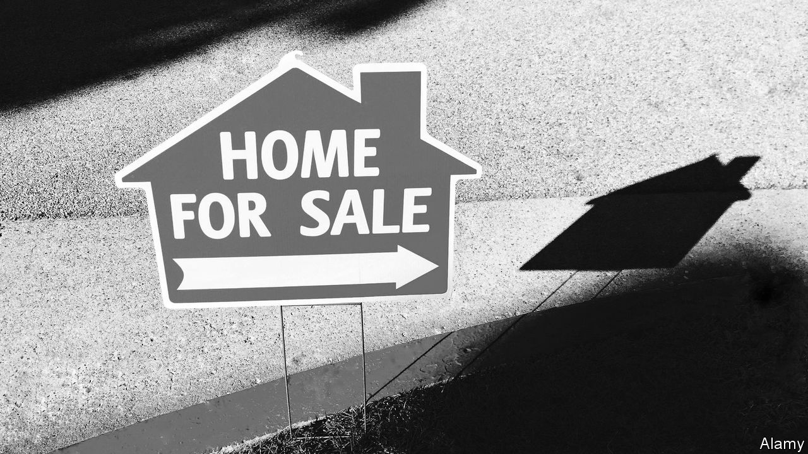
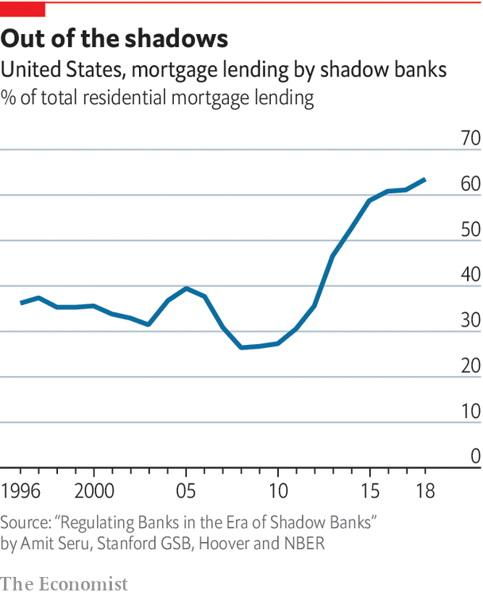

## Housing finance

# A decade on from the housing crash, new risks are emerging

> Shadow banks originate around half America’s mortgages

> Jan 16th 2020

DURING THE broadcast of the 39th Super Bowl in 2005, there was an advert for mortgages from a firm called Ameriquest. “Don’t judge too quickly,” ran the slogan. “We won’t.” Ameriquest also sponsored the half-time show, where Paul McCartney opened with “Drive My Car”. Two years later and the firm was no more, part of the wider crisis in the mortgage market which prompted a global recession and nearly caused the financial system to collapse.

Eleven years after that, at the 50th Super Bowl, a similar advert appeared for a different lender, Rocket Mortgage. A magician, a cyclist and even a toddler try to use the app to apply for home financing. “Push button, get mortgage,” the slogan read. By the Super Bowl in 2018 Rocket said it was the country’s largest mortgage lender, leading some Americans to wonder whether any lessons had been learned at all from the global crash.

Certainly the regulatory system for banks has been transformed. In the 2000s most financial regulation was “microprudential”, focusing on the soundness of individual banks. Now “macroprudential” regulation is the norm. The idea is to ensure that the financial system as a whole can withstand nasty surprises. “Macropru” is useful in a world of low interest rates. When borrowing is cheap, households can bid up house prices to unsustainable levels. But since raising interest rates does not square with the needs of the broader economy, targeted measures are required.

Since the early 2000s the number of rich countries using macro-prudential policies has doubled. In Britain not more than 15% of new mortgage lending can be for houses worth more than 4.5 times the borrower’s income. Singapore and parts of Canada now restrict purchases by foreigners.

All this can put the brakes on rapid credit growth. For high-risk borrowers, getting a mortgage is harder than it was, which is one reason why home ownership among the young has fallen. Banks have scaled back their mortgage operations. “The mortgage business… has experienced increasingly lower returns as new regulations add both sizeable costs and higher capital requirements,” wrote Jamie Dimon, the boss of JPMorgan Chase, in 2016.

But new risks are emerging. In recent years non-bank mortgage lenders (a group of non-deposit-taking lenders that includes Quicken Loans, which offers Rocket Mortgage) have proliferated. They now originate around half of America’s mortgages (see chart). A growing number of economists argue that regulators need to keep a closer eye on these firms.

Many non-bank mortgage lenders are seizing market share because they offer genuinely useful products. Safe Rate, based in Chicago, offers a new type of mortgage. When local house prices decline, so do borrowers’ monthly mortgage repayments. The benefit for the borrowers is that they save money and are less likely to default. The advantage for investors is that, by preventing foreclosures, more mortgages will be kept going and it is less likely that house prices across a region will spiral downwards.

Some non-banks, however, exist purely as a means to get around strict bank regulations. In America non-banks are more loosely regulated and supervised than traditional banks. One paper found that an increasing regulatory burden accounted for some 60% of non-bank growth in 2007-15. (In countries like Britain the difference in regulatory burdens between banks and non-banks appears smaller and the growth in their lending is lower.)

Mortgage credit in America is not rising as fast as it was in the early 2000s. According to official data, only a small share of Quicken’s loan-book is in trouble. Yet many non-banks remain highly reliant on short-term funding from traditional banks, so if wholesale markets froze again, many Americans would quickly lose access to mortgage finance. Rather than keeping mortgages on their balance-sheets, non-banks tend to sell them on—not the best incentive to be ultra-cautious, says Amit Seru of the Stanford Graduate School of Business. Non-banks also seem particularly likely to serve less creditworthy borrowers. Until regulators start properly grappling with non-bank lenders, the job of regulating America’s mortgage market will be only half-done. ■

## URL

https://www.economist.com/special-report/2020/01/16/a-decade-on-from-the-housing-crash-new-risks-are-emerging
