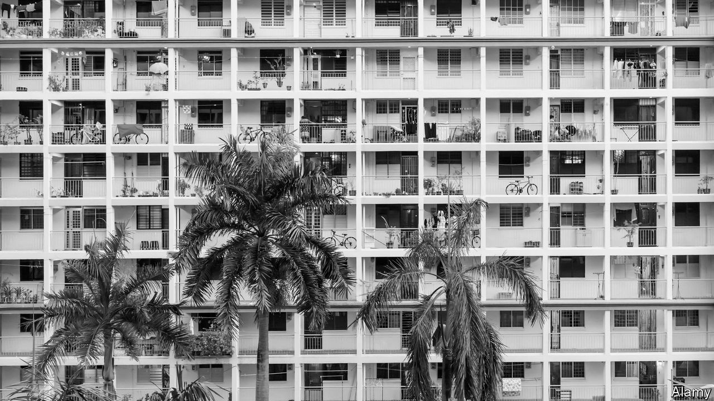

## Housing for the poor

# Governments are rethinking the provision of public housing

> Is it better to give people money or build them houses?

> Jan 16th 2020

IN THE PAST ten years the homeless population in Los Angeles has risen by 50%. In New York it is 60% up over the same period. San Francisco is widely thought to have America’s worst homelessness problem. Just metres from the headquarters of Twitter and Uber, people lie in the street, stupefied, or defecate in front of the passing traffic. The term “housing crisis” is bandied about too readily. But it is an apt way of describing what is happening in America’s most prosperous cities.

It does not have to be this way. Tokyo is as much a global city as San Francisco, yet you can go days without seeing a single person living on the streets. The inhabitants of Zug, a short drive from Zurich, are as rich as the local Kirschtorte. Astonishing wealth, a waterside location and lots of high-tech firms mean that Zug bears more than a passing resemblance to San Francisco. But in Zug there is practically no rough sleeping.

Homelessness is the extreme manifestation of a problem that governments have tried to tackle for decades. At any one time, at least some people struggle to afford decent housing on private markets. Governments have spent vast sums trying to help the poor into housing and improving conditions. Yet they are failing in their objectives. This is prompting a rethink.

Governments began intervening heavily in housing markets following the second world war. They promised to build millions of homes themselves, which they would then rent to their constituents at below-market rates. In America the Housing Act of 1949 authorised the construction of over 130,000 units of public housing a year for six years. In 1950-70 Britain built some 3m units of social housing, and over the same period West Germany put up even more. The Japanese government was equally enthusiastic.

The boom ended as governments triumphantly declared that the housing shortage had been solved. At the same time fewer people wanted to live in big blocks of homogeneous flats, especially poor-quality ones: the dash for volume had often caused governments to cut corners. A gas explosion at the Ronan Point block in London in 1968 marked a turning-point in attitudes to public housing in Britain. In the mid-1970s Pruitt-Igoe, an infamous project in St Louis, Missouri, was demolished. Around this time, economists started to think differently about the best way to provide welfare.

Rather than build houses for the poor, many argued, why not give them the money they would need to buy housing on the open market? Recipients of cash payments could then choose the sort of accommodation that suited them best. Others contended that the private sector would deliver superior housing to what the state could provide. Cash benefits also promised to be better targeted at the poor: withdrawing a monthly housing payment to someone who suddenly becomes well off is easier than kicking them out of their home.

What followed was a shift from supply-side to demand-side measures. In the early 1970s Britain started to wind down its programme of social-housing construction, but in its place gave money to poor tenants. France did something similar in the latter part of the decade. In Germany from the late 1980s, housing assets owned by municipalities were transferred to for-profit owners. In America between 1977 and 1997, the number of households receiving housing vouchers increased from 162,000 to over 1.4m.

Though economists generally prefer cash benefits over the in-kind sort, a growing number are starting to argue that providing cash assistance for housing has not proven to be as effective as expected. Giving people money increases their purchasing power. In a normal market, the increase in effective demand leads suppliers to respond accordingly. Yet the supply of housing in many cities is inelastic: when demand for housing rises, extra supply does not necessarily follow. Instead, the price of housing—which, for most poor people, is rent—goes up.

In many cases, therefore, housing benefits help landlords as much as the poor. Some research in England has found that half of the gains from housing benefits accrue to landlords. A paper from 2006 looking at France concludes that a one-euro rise in housing benefits raises rents by 80 cents.

If governments respond to rising rents by increasing housing benefits, costs can quickly spiral. Over the long run, cash payments for housing can even cost the government more than providing housing directly (though this is difficult to calculate reliably). Meanwhile, it is not clear whether the private sector is able to fill the gap when the state stops building houses itself. If not, then overall new housing supply falls, making it more expensive for everyone.

Faced with growing numbers of people unable to afford housing, there are stirrings of a global movement back towards direct provision. Last year Kanye West, a rapper, reportedly built prototypes of dome-shaped houses inspired by Tatooine, a planet in “Star Wars”, which were to be used as low-income dwellings (though after a fight with local residents, the prototypes appear to have been demolished).

Housing co-operatives are also becoming more popular. A short drive from Zug a group called “mehr als wohnen” opened “Hunziker Areal”, a housing complex, in 2014. Rents in its apartment blocks are generally far lower than the local average. Residents have a say in how the community is run. There are bikes in a “mobility station” for people to borrow and residents can tend a vegetable patch. It is a world away from what many Americans or Britons think when they hear the term “public housing”.

Governments have bigger plans. In 2018 Britain built more public housing than in any year since 1992. The South Korean government aims to increase the share of public-rental housing from 7% of the total stock to 9% by 2022. In Germany in 2018-19 the government set aside some €5bn ($5.6bn) to promote the construction of public housing.

The best way to make housing more affordable would be to make the supply more responsive to increases in demand. A big underlying reason why homelessness in Tokyo is so low is that housing is reasonably affordable. Meanwhile, Zug builds more than twice as many homes per person as San Francisco. Research suggests that a 10% fall in rents in a high-cost city such as New York results in an 8% decline in the number of homeless residents. Until governments keep overall housing costs under control, the rest is tinkering. ■

## URL

https://www.economist.com/special-report/2020/01/16/governments-are-rethinking-the-provision-of-public-housing
