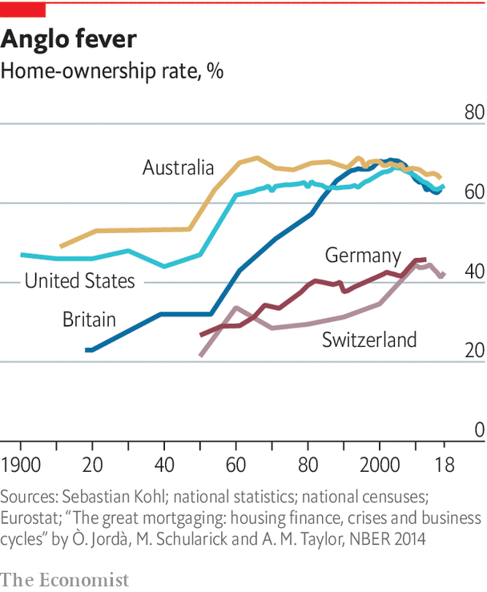

## Home ownership

# Home ownership is in decline

> That is not a big cause for concern

> Jan 16th 2020

MORE THAN nine in ten Singaporeans are homeowners, a higher rate than in any other rich country. And what a nice place it is to live. The city-state is rich, stable and has virtually no crime. The streets are clean.

Singapore seems to confirm what conservatives have long believed: that home ownership makes for richer, happier folk. Lee Kuan Yew, its first prime minister, was a big fan, arguing that it gave ordinary people “a stake in the country and its future”. Margaret Thatcher’s “right-to-buy” programme in the 1980s, allowing Britons in social housing to buy their property at knock-down prices, is said to have been influenced by the Singapore model.

It might be seen as worrying, then, that for the first time in a century home ownership in the rich world is in decline (see chart). Yet having more renters might not be such a bad thing.

For most of the past millennium, the only people with a good claim to be homeowners were landed gentry and farmers who worked the fields. Then, from the mid-20th century onwards, home ownership was democratised. A combination of rising household incomes and government policies helped more people get onto the property ladder. In most countries home ownership peaked around the year 2000.

America has some of the most generous fiscal incentives to become a home-owner. Official estimates suggest that the government forgoes over $200bn a year (over 1% of GDP) subsidising homeowners through the tax code, with policies including a tax deduction on mortgage interest and not taxing the income homeowners implicitly earn by avoiding paying rent. Mark Zandi of Moody’s Analytics adds that subsidies to mortgages provided by Fannie Mae and Freddie Mac—two government-sponsored enterprises that support much of the country’s mortgage finance—and the Department of Housing and Urban Development amount to a further $9bn or so a year.

America is especially generous, but schemes to boost home ownership are common. Most rich countries do not charge capital-gains tax on the sale of an owner-occupied house. Inheritance-tax regimes routinely make exemptions for housing. Many countries subsidise mortgages and down-payments. Yet for all this, the factors pushing home ownership down are now stronger.

One possibility is that younger folk may be less interested in home ownership. After all, many millennials desire “asset-light” lives in which they rent cars, music and clothes, rather than owning them. Why not housing too?

The private sector has spotted an opportunity. Silicon Valley types are bullish on “co-living”, where people rent a dwelling and share common spaces such as kitchens, washing facilities and gyms. Hmlet, a co-living firm, is expanding in home-ownership-obsessed Singapore. Sharing a kitchen might sometimes be annoying, but Hmlet’s properties are well kitted out.

The attraction of co-living is, however, exaggerated. The majority of people would still prefer to be homeowners. Surveys from America suggest that the share of people who think that home ownership represents a good investment is growing.

Economic factors may be a bigger cause of the decline in home ownership. With weak earnings growth since the crisis, young folk have struggled to accumulate savings for a down-payment. Tighter regulation of mortgage markets since the financial crisis has made it tougher for first-time buyers to acquire finance. Baby-boomers, looking for a return on their savings, are pushing aside prospective first-time buyers and becoming landlords. As millennials have taken on more student debt, buying a home has become trickier.

How low could the home-ownership rate go? It seems unlikely that rates in the English-speaking world will ever approach Germany’s (with a rate of just 44%) or Switzerland (40%). Home-ownership rates are the product of history and culture. Countries with a history of weak real house-price growth—Germany and Switzerland fit the bill—have lower owner-occupation, because fewer people see buying a house as a worthwhile investment. Densely built places also tend to have lower home ownership. People are generally less keen on owning a flat in a high-rise block than they are in a detached house (55% of Germans live in apartments, a high rate by international standards).

Politicians across the rich world bemoan the emergence of Generation Rent. “American home ownership rate in Q2 2016 was 62.9%—lowest rate in 51 yrs,” tweeted Donald Trump when he was campaigning for president. “WE will bring back the ‘American Dream!’ ” Boris Johnson, Britain’s prime minister, seems equally concerned about his country’s falling rate of owner-occupation.

But lower home ownership need not be a cause for concern. For one thing, owning a home is not necessarily the route to riches that many people believe it to be (see [article](https://www.economist.com//special-report/2020/01/16/owner-occupation-is-not-always-a-better-deal-than-renting)). The evidence that home ownership is good for society is, in fact, fairly weak. There are many counter-examples to Singapore. Romania probably has the world’s highest home-ownership rate, at 96%, but it has its fair share of social problems. Switzerland, at the other end of the scale, nonetheless has low crime and high social trust.

Academic studies offer only weak support for the idea of promoting home ownership. One paper suggests that owner-occupiers have better-tended gardens. But if nice shrubbery were a goal of public policy, it might be a better use of public money to subsidise wheelbarrows and trowels. Another study in America found that homeowners’ children were far more likely to graduate from high school—even after controlling for parents’ earnings. Researchers have struggled to discern which way the causality runs, however: does home ownership make good parents, or do good parents become homeowners?

Other evidence, meanwhile, finds that home ownership carries costs. The stresses of paying back a big mortgage are real. And the mad dash in the 1990s and 2000s to create “property-owning democracies” ended with the global financial system on its knees.

Home ownership does subtler sorts of economic damage, too. Indebted homebuyers are 30% less likely to become entrepreneurs, according to one study. Responsibility for a large mortgage debt may make people loth to take on further risk. When the home- ownership rate in an American state has risen, a sharp rise in unemployment has followed, according to David Blanchflower of Dartmouth College and Andrew Oswald of Warwick University. Homeowners are less willing to move to find work.

As the rented sector has grown in size, and as Generation Rent becomes a more powerful constituency, governments are putting more effort into improving the sector. One increasingly popular measure is rent control. London’s mayor, Sadiq Khan, has advocated restricting rent rises in the capital. Berlin’s legislators recently voted to freeze rents for five years. Paris reintroduced rent controls last year, having scrapped them in 2017. Such interventions are misplaced. Rent control generally dissuades investment in new construction, the last thing many of these cities needs.

More promising than rent control, however, is a move towards improving tenancies. Many politicians in English-speaking countries have Germany in mind. There, renting is not seen as a second-class tenure. It is fairly secure: the average tenancy lasts for 11-12 years, compared with 2-3 years in Britain. Some 3m Germans are members of tenants’ organisations, which can bargain on their behalf with landlords (the mascot at one association in Munich is dressed like Superman and calls himself the “Rentstopper”).

Emulating the German experience will be tricky. In Germany landlords treat tenants well not just to be nice, but because they have an incentive to do so. In recent decades Germany has seen little house-price appreciation. Since making money through capital gains is difficult, German landlords’ best hope of getting a decent return is through keeping their tenants in place for as long as possible. Only if house prices in other countries were more stable would their landlords start to behave in this way, too.

Still, governments can make some reforms. Britain has abolished letting fees, a murky system of charges slapped on by estate agents using a methodology that renters and landlords rarely understood. Spain is moving to give renters longer tenancies as standard. New Zealand is passing rules to ensure that certain basic standards for rental accommodation are met.

Perhaps the most promising development, however, is growing private investment in the rental sector. Since 2010 global institutional investment in residential property has more than doubled in real terms, not only because investors are looking for yield in a low-rate world but also because the number of potential customers is rising. Across America the share of the rental sector owned and operated by companies is rising, according to research by Hyojung Lee of Virginia Tech. By one estimate, the annual number of homes in New York City bought by professional investors has doubled in a decade.

An expansion of corporate housing will raise average standards in the rental sector. Big firms may be more professional than mom-and-pop landlords, and may also benefit from economies of scale which allow them to provide better-quality accommodation at lower prices. “Build-to-rent” apartment blocks often include goodies such as gyms and free Uber rides with the rent.

That said, corporate landlords have a more transactional relationship with their tenants. A study of Atlanta, Georgia, published by the Federal Reserve Bank of Atlanta in 2016, found that large corporate owners of single-family rentals were 8% more likely than small landlords to file eviction notices. To help the poorest or most vulnerable members of society with their housing needs, governments may need to do more. ■

## URL

https://www.economist.com/special-report/2020/01/16/home-ownership-is-in-decline
