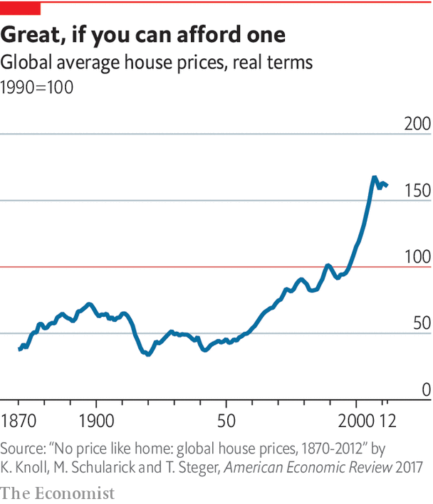
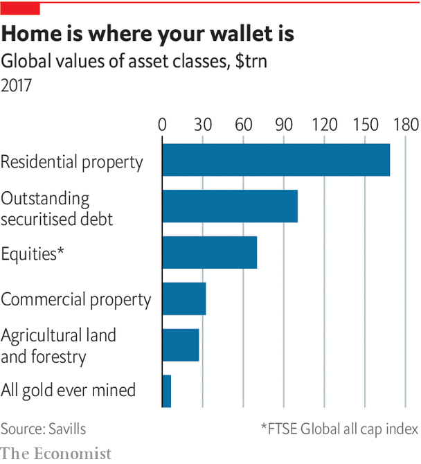
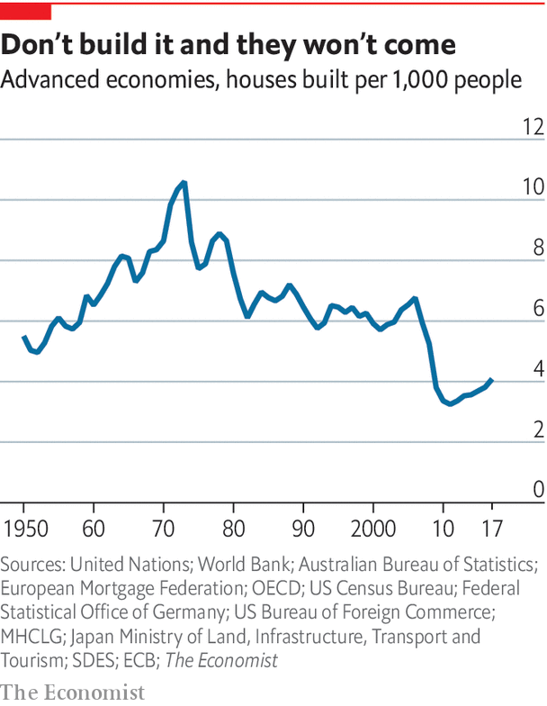

## A history

# How housing became the world’s biggest asset class

> It is only a recent phenomenon

> Jan 16th 2020

IN 1762 BENJAMIN FRANKLIN set sail from England to Philadelphia after several years away. On his arrival he was shocked by what he saw. “The Expence of Living is greatly advanc’d in my Absence,” he wrote to a friend. Housing, he thought, had become particularly expensive. “Rent of old Houses, and Value of Lands…are trebled in the last Six Years,” he complained.

If Franklin were alive today, he would be furious. Over the past 70 years housing has undergone a remarkable transformation. Until the mid-20th century house prices across the rich world were fairly stable (see chart). From then on, however, they boomed both relative to the price of other goods and services and relative to incomes. Rents went up, too. The Joint Centre for Housing Studies of Harvard University finds that the median American rent payment rose 61% in real terms between 1960 and 2016 while the median renter’s income grew by 5%. In the 18th century farmland was the world’s single-biggest asset class. In the 19th century the factories used to power the Industrial Revolution took the number-one spot. Now it is housing (see chart, below).

In capitalism’s early days house prices did see short-term booms and busts: 17th-century Amsterdam experienced a few housing bubbles, as did 19th-century America. Three main factors, however, explained long-term price stability. First, mortgage markets were poorly developed. Second, rapid improvements in transport meant that people could live farther away from their place of work, increasing the amount of economically useful land. Third, there was not much land regulation, meaning that housebuilders could build when they wanted and in the way that suited them. “For most of US history,” say Edward Glaeser of Harvard University and Joseph Gyourko of the University of Pennsylvania, “local economic booms were matched by local building booms.”

After the second world war, however, housing markets underwent a revolution. Governments across the rich world decided that they had to do more to care for their citizens—both as a thank-you for the sacrifices and to ward off the communist threat.

To this end, they vowed to boost home-ownership. A country of owner-occupiers, the thinking went, would be financially stable. People could draw down on equity in their house when they hit retirement or if they found themselves in difficulty. In the late 1940s and the 1950s manifestos of Western political parties became more likely to identify home ownership as a policy goal, according to research by Sebastian Kohl of the Max Planck Institute for the Study of Societies. Over time, the notion that owneroccupation was superior to renting became common, even apparently self-evident.

Policies to promote owner-occupation proliferated. In America the Veterans Administration made mortgages with no down-payment available to veterans in the mid-1940s. Canada established the Central Mortgage and Housing Corporation for returning war veterans. In 1950 the Japanese government established the Government Housing Loan Corporation to provide low-interest, fixed-rate mortgages. Changes to international financial regulations also encouraged banks to issue mortgages.

In a research paper Òscar Jordà, Alan Taylor and Moritz Schularick describe the second half of the 20th century as “the great mortgaging”. In 1940-2000 mortgage credit as a share of GDP across the rich world more than doubled. More people clambered onto the “housing ladder”. America’s home-ownership rate rose from around 45% to 70%; Britain’s went from 30% to 70%.

In previous centuries, a rise in demand for housing did not translate into structurally higher house prices. What had changed in the second half of the 20th century? One factor was transport speeds, which continued to improve but more slowly: trains and cars got only a bit better. So instead of moving farther and farther out to find accommodation, more people needed to look for somewhere to live closer to work. Land prices rose, and that fed into costlier housing.

In the 1950s and 1960s governments constructed large amounts of public housing, in part to rebuild their cities after the devastation of the second world war. Yet at the same time many of them tightened land regulation, gradually constraining private builders. In the 1940s and 1950s, for instance, Britain passed legislation to prevent urban sprawl. It provided for “green belts”, areas encircling cities where permission to build would be hard to obtain. Around the same time cities elsewhere, including Sydney and Christchurch, explored similar plans. From the 1960s American builders, too, began to have serious difficulty obtaining approval for building new homes.

According to calculations by The Economist, the rate of housing construction in the rich world is half what it was in the 1960s (see chart). It has become particularly hard to build in high-demand areas. Manhattan saw permission given to 13,000 new housing units in 1960 alone, whereas for the whole of the 1990s only 21,000 new units were approved. A recent paper from Knut Are Aastveit, Bruno Albuquerque and André Anundsen finds that American housing “supply elasticities”—ie, the extent to which construction responds to higher demand—have fallen since the pre-crisis housing boom.

Why did the rich world turn against new construction? The post-war rise in home ownership may have had something to do with it. In 2001 William Fischel of Dartmouth College proposed his “homevoter hypothesis”. The thinking runs that owner-occupiers have an incentive to resist development in their local area, since doing so helps preserve the value of their property. As home ownership rises, therefore, housing construction might be expected to fall.

Research supports that idea. One paper studies a ballot in 1988 in San Diego, finding that precincts with a larger share of homeowners had more votes cast in favour of growth controls. Another finds that parts of New York City with high home-ownership rates were more likely to implement measures which made development more difficult. There is little doubt that the rich world is a less friendly place to build than it once was. But to what extent is land regulation responsible for today’s sky-high prices? ■

## URL

https://www.economist.com/special-report/2020/01/16/how-housing-became-the-worlds-biggest-asset-class
