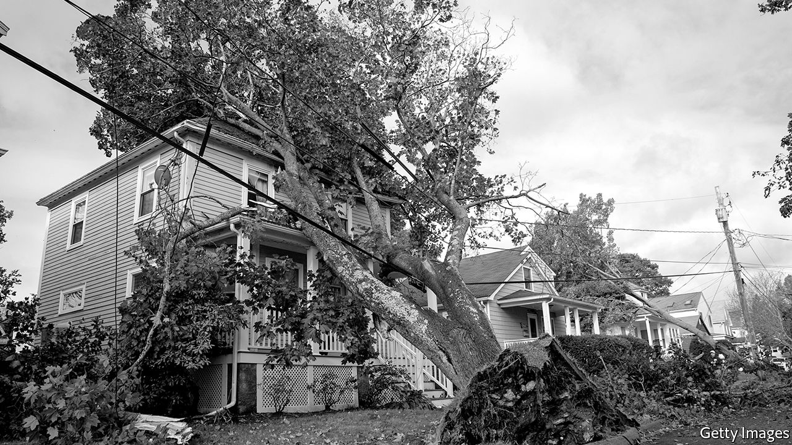

## Better off renting?

# Owner-occupation is not always a better deal than renting

> Each year American owner-occupiers pay around $200bn in maintenance costs on their homes

> Jan 16th 2020

THE QUESTION hardly seems worth asking. Is it a better deal to rent a house or to buy one? Buying a house is a wise investment for the future, the argument goes, whereas renting one amounts to little more than throwing money down the drain. A closer look at the economics, however, shows that this view may be mistaken.

For one thing, renters often devote a smaller share of their income to rent than owner-occupiers devote to repayments of mortgage interest (in both cases, this is money handed over to someone else and never seen again). Whether one is cheaper than the other depends in part on interest rates. In the early 1990s, when interest rates were higher than they are today, the average ratio of mortgage-interest repayments to income was higher than the rent-to-income ratio in many countries.

That calculation nonetheless underestimates the cost of owner-occupation. Whether a home-owner is paying off a mortgage or not, they face a number of costs that renters do not, points out Ian Mulheirn of the Tony Blair Institute, a think-tank. For instance, a residential-property transaction in an OECD country incurs a median bill of about 8% of the value of the house (transaction costs for renting tend to be trivial).

Owner-occupiers must also account for wear and tear. Each year in America they pay around $200bn in maintenance and improvement costs (about 1% of the value of the houses in their possession). Home ownership also carries opportunity costs. In recent decades housing has proven to be a good investment; that may well continue. But capital locked up in a house could have made an even higher return if invested elsewhere.

What happens when you factor all this in? Take the example of the British housing market. In the run-up to the financial crisis of 2008-10, rapid increases in house prices and rising interest rates meant the user cost of owning actually rose well above rents. But over the long run the two tenures have cost about as much as each other. This is as economic theory would predict. Renting a home, and buying the right not to have to rent a home, are economically equivalent actions.

## URL

https://www.economist.com/special-report/2020/01/16/owner-occupation-is-not-always-a-better-deal-than-renting
