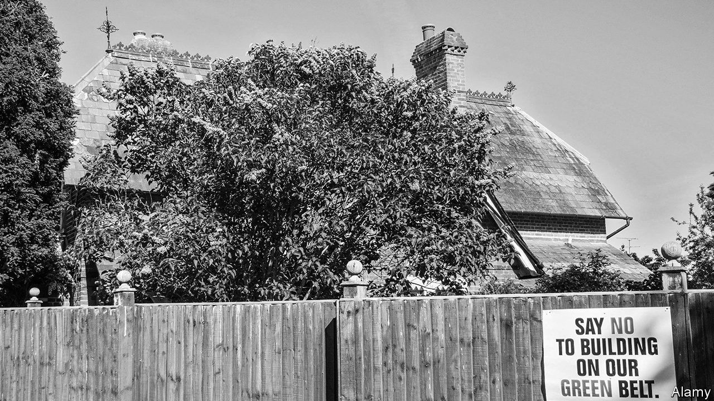

## Supply

# Politicians are finally doing something about housing shortages

> But will it reduce housing costs?

> Jan 16th 2020

TO GET A sense of why London has such expensive housing, visit Tottenham Hale. You might expect that, next to an Underground station where central London is accessible within 15 minutes, there would be plenty of houses. In fact, there is a car wash. The land on which the car wash sits is officially classified as “green belt” land, which means that building houses on it is almost impossible. Across just five big cities in England there are over 47,000 hectares (about 116,000 acres) of similar land, which is not particularly green, is close to train stations with a good service to their centres, and yet cannot be built on. That is enough space for over 2.5m new homes at average densities.

For decades the green belt was sacred. The British public imagine it, wrongly, as idyllic pasture where horses drink from streams. Politicians dared not talk about it. This is now changing. “It is time to burst the myth that the green belt is green,” Siobhain McDonagh, a Labour MP, argued last year, “and start using the non-green sites for the homes that our children so desperately need.” A cross-party group of MPs called upon the government to loosen planning in parts of the green belt. Ministers say that they are looking seriously at the issue.

Britain is not the only place where change is afoot. In 2017 Germany reformed its urban-planning law and lifted barriers to densification. Consultants to the government in Auckland detect a genuine interest in boosting housing supply. In Canada, the Ontario government is streamlining the planning process in order to increase housebuilding. In October California pushed through a broad zoning-reform bill. After decades of NIMBYism, there is clearly a backlash, led by millennials unable to afford a house. Many politicians now realise there could be political mileage in building more houses. Some activists have even coined an acronym—YIMBY, “Yes In My Back Yard”.

Many of those activists argue that overtight land regulation is the root cause of high house prices. To get a sense of the argument, compare Singapore with Hong Kong. Singapore has a fairly elastic planning system. The government owns most of the land. When house-price growth is too strong or the population is rising quickly, the state can release extra land faster than a barman at the Raffles hotel can mix a Singapore sling. In Hong Kong, by contrast, the supply of developable land is controlled by a small clique of oligarchs. What will buy you a cramped bedsit in Hong Kong will buy you a decent-sized pad in Singapore.

It is a similar story in America. The part of the country with the most elastic housing supply, Pine Bluff, a midsized city in Arkansas, has an average house price of $90,000. The cost of a house in one of the most restrictive parts, San Luis Obispo in California, is $725,000, even though building costs across America do not vary much. Common land-use regulations across America include zoning rules which allow only single-family houses and prevent the construction of apartments (94% of residential land in San Jose is zoned in this way, for instance). Since 1950 ordinances which establish exclusive zones, so that homes are not allowed in commercial areas, have become more popular.

Academic research supports the circumstantial evidence. Christian Hilber of the London School of Economics and Wouter Vermuelen of CPB Netherlands Bureau for Economic Policy Analysis found that if south-east England (the wealthiest and most regulated region) had been as open to new construction as the north-east (the least regulated), house prices in the south-east would have been 25% lower in 2008. Edward Glaeser of Harvard University finds similar results for parts of America.

Yet what a few years ago was an almost universally accepted view among housing economists—that housing is so costly because there is not enough construction—has come under attack, in particular from Ian Mulheirn of the Tony Blair Institute, a think-tank. Members of this vanguard argue that the obsession with supply restrictions misses a more important cause of high house prices: global financial markets. As interest rates have fallen across the rich world, people can take out bigger mortgages and keep their monthly repayments at a manageable level. Landlords are willing to pay more for a house to rent out, because yields on other assets have fallen.

Some evidence seems to back up the view that economists’ obsession with housing supply is misguided. In the 2000s both Ireland and Spain experienced soaring house prices, even as construction took off. A recent blogpost from researchers at the Bank of England found that most of the rise in British house prices since 2000 was down to cheaper borrowing.

In fact, both causes are important. The loosening in global financial conditions since 2000 has certainly pushed up house prices—as have low unemployment, high immigration and the rise of platforms such as Airbnb, which divert home ownership away from ordinary people. Prices have not risen because building has suddenly became vastly more difficult.

At the same time, however, the long-term rise in house prices is largely down to constrained supply. And if builders struggle to erect new dwellings quickly, a given increase in demand is largely channelled into price rises. Giovanni Favara of the Federal Reserve Board and Jean Imbs of the Paris School of Economics find that, though looser finance has led to higher house prices, that was true “to a lesser extent in areas with elastic housing supply, where the housing stock increases instead”.

Even the most ardent demand-siders agree that building more would reduce housing costs. In policy terms, that matters. Governments have more control over the domestic planning system than they do over global financial conditions. Those who manage their land better are rewarded with more stable housing markets.

Broadly speaking, three types of planning systems exist across the rich world: discretion-based; autocratic; and rules-based. The first type is commonly found in Commonwealth countries. Local residents have plenty of power to stop development plans, and they frequently do. It may be no coincidence that those countries have in recent decades seen the fastest growth in house prices, says Paul Cheshire of the London School of Economics. Parts of America follow similar rules. In San Francisco every permit is appealable and, since very few large-scale projects match existing building and planning codes, delays are common.

Autocratic planning systems do a better job of boosting housing supply. Russia has raised its annual rate of housebuilding from 400,000 a year in the early 2000s to over 1m. Singaporeans who protest against development are routinely ignored, says one with a house located near Tengah forest, some of which will soon be razed to make way for apartment blocks.

The third group—rules-based planning systems—are commonly found in European countries such as France and Germany. If developers tick all the boxes then construction is permitted, even if local residents object. These systems have generally done a better job of delivering housing. Since the 1950s Germany has built twice the number of houses as Britain, despite having only a slightly higher population.

As well as planning rules, the tax system matters. Switzerland demonstrates this well. It has a decent claim to be the world’s most democratic country, reliant as it is on referendums to decide all sorts of issues. (In 2018 it held ten national referendums, on everything from whether or not to penalise farmers who dehorn their livestock to whether or not insurance companies should be allowed to hire private detectives.) Local governments are unusually powerful. Yet NIMBYish residents appear to hold little sway. Each year Switzerland builds twice as many houses as America on a per-person basis.

To explain this apparent paradox, a paper by Mr Hilber and Olivier Schöni of Laval University points to the Swiss tax system. In countries such as Britain, though many taxes are levied at the local level, the proceeds are redistributed across the country. Local governments therefore see little economic benefit from allowing home construction, even as they must cope with the disruption. As a result they are unlikely to try too hard to override the NIMBYs.

By contrast, in Switzerland local taxes stay where they are levied, so local governments have a fiscal incentive to allow development. The process for acquiring planning permission can be slow, explains Melk Nigg, an architect in Zug, a canton close to Zurich which has the joint-highest rate of housing construction in Switzerland. But it is predictable. In the past century Swiss house prices have risen by less than those in any other rich country.

Can such policies be adopted elsewhere, especially in English-speaking countries? It is largely a question of politics. Right-leaning parties in particular recognise that, since homeowners are widely perceived to be more likely to vote for conservatives, unless they can create a new generation of owner-occupiers they will eventually be voted out of office. As the rate of home ownership falls, owner-occupiers lose political power relative to renters, meaning that liberalising planning policy has a lower political cost. And as more people come to see the urgent necessity of cutting carbon-dioxide emissions, support may grow for a new generation of houses with more efficient heating and insulation.

Nonetheless YIMBYs must tread a fine line. On the one hand, only a long-lasting construction boom has any chance of noticeably improving housing affordability. On the other hand, building on that scale would create much controversy, because of the disruption and because neighbourhoods would change. The continued rise of the YIMBYs is far from assured. ■

## URL

https://www.economist.com/special-report/2020/01/16/politicians-are-finally-doing-something-about-housing-shortages
