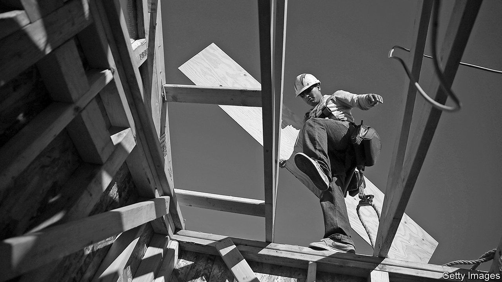

## The future

# What is the future of the rich world’s housing markets?

> It is plausible that house prices could persistently rise faster than incomes

> Jan 16th 2020

MOORE’S LAW states, roughly, that computing power doubles every two years. Time and again experts predicted its demise—surely, they reasoned, computers cannot continue getting exponentially more powerful. Yet it held for at least half a century.

More people are starting to wonder whether housing may have its own version of Moore’s law. Over the past 70 years global house prices have more than quadrupled in real terms. They are far beyond their pre-crisis peak. It may seem mad, but a paper from David Miles, formerly of the Bank of England’s monetary-policy committee, and James Sefton of Imperial College London finds that “in many countries it is plausible that house prices could now persistently rise faster than incomes”. A growing population and rising incomes increase demand for housing, which runs up against a fixed supply of land in areas where the good jobs are, and limits to improvements in transport speeds.

As this report has argued, high property prices are associated with less economic dynamism and more financial instability. But although Messrs Miles and Sefton say that ever-pricier property is “plausible”, they do not say it is inevitable. To keep housing costs down in the long term, governments need to get three things right.

The first is better regulation of housing finance. Switzerland comes close to treating home-ownership and renting equivalently in its tax system, meaning that people are not encouraged to funnel capital into the housing market. More countries should follow that example. President Donald Trump’s tax reform of 2017, which limited mortgage-interest deductions, is a step in the right direction.

More radical reforms could be considered. German mortgage-lenders embrace an unusual appraisal technique. When assessing the value of a house, they rarely refer to market price; instead they consider “mortgage-lending value”, an assessment of the probable price of a house over the economic cycle. A report from the Bank for International Settlements, a club of central banks, suggests that by discounting short-term price fluctuations, this valuation technique can stop bubbles from forming. Lenders in America once embraced the technique, points out Ed Pinto of the American Enterprise Institute, a think-tank, yet after the second world war it fell out of fashion.

The second group of reforms concerns transport. Until the mid-20th century, house prices were stable in part because the cost and ease with which people could get around improved roughly as quickly as economic growth. As getting from A to B became ever quicker, it increased the amount of developable land at an economy’s disposal. But after the second world war improvements in transport slowed, meaning that more and more people were fighting over the same amount of space. That caused house prices to rise.

More recently, commuting times into the rich world’s biggest cities have, if anything, been lengthening, raising the premium of living near or in city centres. A better train and road network, then, would allow more people to live farther afield. Driverless cars could also reduce the hassle of moving around. (And when video-conferencing is fully reliable, more people may be willing to live miles away from their office and call in for meetings.)

The third set of reforms concerns planning. This report has argued that governments are finally waking up to the fact that there is a structural undersupply of housing. They could learn from best practice internationally. Devolving taxes to the regional or local level, the norm in Switzerland, gives local governments a stronger incentive to allow development.

France has followed the Swiss example in increasing pressure on local governments to raise revenue from property taxes, “which can in turn lead to efforts to stimulate land development”, according to the OECD. Abolishing single-family-home zoning, which prevents densification, is another good option—and something Minneapolis did last year. Boosting the construction of public housing is also welcome. Singapore, where 80% of residents live in government-built flats, is in some respects the model to copy. The state regularly renovates the buildings and, more controversially, promotes mixing of different sorts of people, to help prevent the emergence of ghettos.

The gains from allowing more building would be enormous. According to one paper American GDP could be around 10% higher if there were plentiful new construction in just New York, San Francisco and San Jose. Cheaper housing would also make politics less volatile: a growing body of research shows that support for populist parties is particularly likely in countries where people cannot afford to move to the big cities, and are thus trapped in “leftbehind” places.

Some housing experts are sceptical about whether any democratic society would ever countenance such a building surge. They are too pessimistic. In Japan a series of reforms in the early-to-mid-2000s loosened the planning system, allowing applications to be processed more quickly and giving residents more discretion over how to use their land. Tokyo’s rate of housing construction has risen by 30% since the reform; in 2013-17 Tokyo put up as many houses as the whole of England. Tokyo is a more jumbled city than most rich ones, but current zoning laws ensure that it is not quite as higgledy-piggledy as, say, Houston. In inflation-adjusted terms, house prices in the Japanese capital are 9% lower than they were in 2000, while in London they are 144% higher.

Ordinary people need to change their attitudes, too. In the West many almost instinctively oppose development, either because of the inconvenience associated with it or because they dislike the very idea of housing companies making profits. Better compensating people affected by housing construction would help win over more residents. Governments could also do more to explain why a shortage of housing is bad news for everybody, rather than celebrating whenever house prices go up. Bold action is needed. Until it is taken, housing will continue to weaken the foundations of the modern world. ■