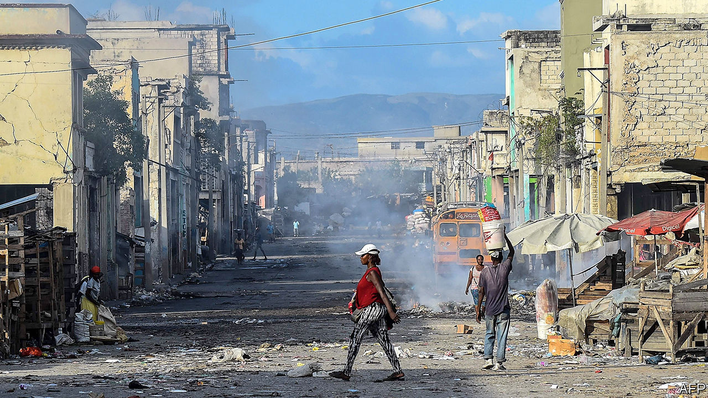

## Gourdean knot

# Jovenel Moïse tries to govern Haiti without a parliament

> Haitians are beginning to demand more from their politicians

> Jan 18th 2020PORT-AU-PRINCE

PETER CONFIDENCE lounges against a broken lamppost in a park in Petionville, a prosperous suburb of Port-au-Prince, Haiti’s capital, basking in the afternoon sun. As he rubs a tattooed St Peter on his neck he explains that Jovenel Moïse, Haiti’s president, is the only man strong enough to fix the country. Before he can finish, a passer-by selling food from a large metal pot that he lugs around interjects that the Americans should lock Mr Moïse up. Within seconds, a crowd assembles to discuss the state of the nation and the quality of its leader, nicknamed “Banana Man” because he once helped create a big banana plantation. The conversation pinballs between tirades and black humour.

Though such debate is a feature of Haitian life, the country’s parliament is silent. A new session should have begun on January 13th, the day after the tenth anniversary of a devastating earthquake. But a legislative election, due in October 2019, was never held. In the absence of a functioning legislature, the president will rule by decree. For a country with a history of brutal dictatorship, coups and dodgy elections, the prospect of one-man rule is ominous.

Even before it was dissolved, parliament was dysfunctional and its relationship with the president was broken. The 119-seat lower house was divided among 20-odd parties, which mostly represent the interests of local bigwigs. The 30-seat senate had 15. Mr Moïse, unable to form a majority, has named four prime ministers since 2017. One quit, one was felled by a no-confidence vote and two others never won parliamentary approval. Since March the government has operated without parliamentary authorisation. For the second year in a row, no budget was passed. Bureaucrats operate under the budget for 2017-18, unadjusted for inflation. The weakness of the gourde, Haiti’s currency, pushed up prices by 30% over the last two years.

Mr Moïse’s answer to these problems is a new constitution, which would give the president more power. He told The Economist that he would put it to a popular vote in 2020. A legislative election would follow.

But, as the Creole saying goes, “behind the mountains there are mountains.” The political crisis is one of Haiti’s many troubles, and makes all of them much harder to solve. More than half the population lives on less than the national poverty line of $2.41 a day. The share of Haitians with access to clean drinking water dropped to 52% in 2015 from 62% in 1990. Some 3.7m Haitians, a third of the population, face crisis-level food insecurity, according to an international measure known as the IPC. That is forecast to rise to 4.1m this year.

Rubble from the earthquake is still strewn across Port-au-Prince. The police, who are ill-trained, underfunded and corrupt, leave Haitians at the mercy of gangs that terrorise them. For months Haitians have endured peyi lok—shutdowns of roads, businesses and public services caused by street protests and gang activity.

Haiti’s current unrest began in July 2018, when the government ended fuel subsidies at the suggestion of the IMF. This caused prices to jump by 50%, triggering the resignation of Mr Moïse’s first prime minister. The government quickly reversed its decision, but protests soon resumed in response to allegations that top politicians, including Mr Moïse, had stolen millions of dollars through Petrocaribe, a scheme under which Venezuela accepted deferred payment for Haiti’s purchases of its oil. He denies the claim.

A report by a commission of Haiti’s senate said that politicians had misappropriated money from selling discounted oil. The government auditor affirmed the commission’s findings and accused state agencies of trying to thwart its inquiry. Even before the Petrocaribe allegations, Mr Moïse and parliament had taken steps to weaken the autonomy of the government’s financial-crimes unit. So far, no one has been held accountable for the Petrocaribe thefts.

Mr Moïse’s public standing is low for reasons besides the scandal. His election in 2016, when turnout was a record low of 21%, gave him a weak mandate. The National Human Rights Defence Network, an NGO, accused security forces of taking part in a massacre in 2018 in which at least 26 people died. Police have fired live ammunition at demonstrators. More than 200 people, including at least 44 police officers, have died during the protests.

Most Haitians expect no help from politicians. Standing on a dusty path that cuts through Canaan, a settlement of half-built cinder-block houses that sprang up on the outskirts of the capital after the earthquake, Dume Elinor shows off the school that he and other residents built. Daubed on its unfinished walls are semi-recognisable Disney cartoon characters. Inside are a few jerry-built desks. The school is only partially covered by an ill-fitting roof of wood and corrugated iron. Mr Elinor laughs and explains that no one knew how to do the job properly. Politicians only visit during elections, he says. “They leave us alone and we organise ourselves.”

But Haitians are beginning to demand more. The Petrocaribe scandal sparked the creation of Petro-Challengers, a movement that helped lead the protests. Its name was suggested by a Haitian videographer living in Canada, who tweeted a photo of himself blindfolded and holding a sign that read (in Creole) “Where is the Petrocaribe money?” Although the demonstrations dwindled at the end of 2019, the Petro-Challengers say they will resume protesting this year.

Politics is corrupt because Haitians learned to keep quiet under the dictatorship of François “Papa Doc” Duvalier and his son Jean-Claude (“Baby Doc”), who ruled from 1957 to 1986, says Velina Charlier. She is a leader of Nou Pap Domi (We Will Not Sleep), a group that emerged from Petro-Challengers. “Today, not only are people awake as to what’s happened, but they are daring to fight,” she says. Nou Pap Domi plans to begin a programme of “citizen education” to teach people how to vote and why they should do so. Ms Charlier hopes that people active in Petro-Challengers, many of whom were educated abroad, will become politicians themselves.

Mr Moïse thinks that he is the man to end “the predatory state”. He is negotiating with the opposition to form a national-unity government that would draft the new constitution with the help of a constituent assembly. Haiti wrote its last constitution in 1986-87 in similar circumstances, he points out. In the absence of a sitting parliament, a civilian-military government and a partly elected constituent assembly collaborated to draft the charter.

Mr Moïse’s 2020 deadline is realistic, he insists. The drafting and approval of the last constitution took “four months and 20 days”. In the meantime, he would combat “banditry” by strengthening the police and set up a food-distribution programme.

Haiti needs constitutional change and other institutional reforms. A new relationship between the executive and the legislature could prevent the sort of breakdown that is paralysing government. An independent electoral commission would help to guarantee the integrity of elections. The judiciary and the government’s anti-corruption unit are also in need of reform. Such changes will not improve wretched public services or lift living standards overnight, but they are a necessary step. Just holding fresh legislative elections under the current rules, as Haiti did five years ago, will accomplish nothing.

But many Haitians doubt that Mr Moïse is the right man to reform democracy. His talks with the opposition may be theatre and his timetable looks like fantasy. Some say his plan to change the constitution is itself unconstitutional. Even people who endorse the idea have called for him to resign. But there is no obvious alternative. The United States and the Organisation of American States support the president.

As the sun set over Port-au-Prince on the earthquake’s anniversary, two houngans (Vodou priests) and several mambos (priestesses) gathered in the Bureau National D’Ethnologie for a ceremony for the dead. The mambos chanted and struck spade-shaped fans against clay pots in common time while seated drummers beat polyrhythms with hands and sticks. Instead of producing rhythmic anarchy, the mambos’ measured pulse combined with the drummers’ syncopation to mesmerising effect. That fusion of order and imagination sounded like the sort of beat a more hopeful Haiti could dance to. But its politicians are less skilled than its drummers.■