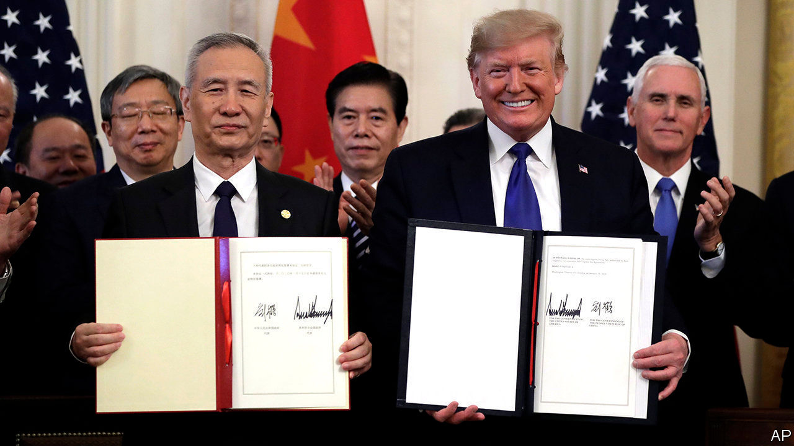
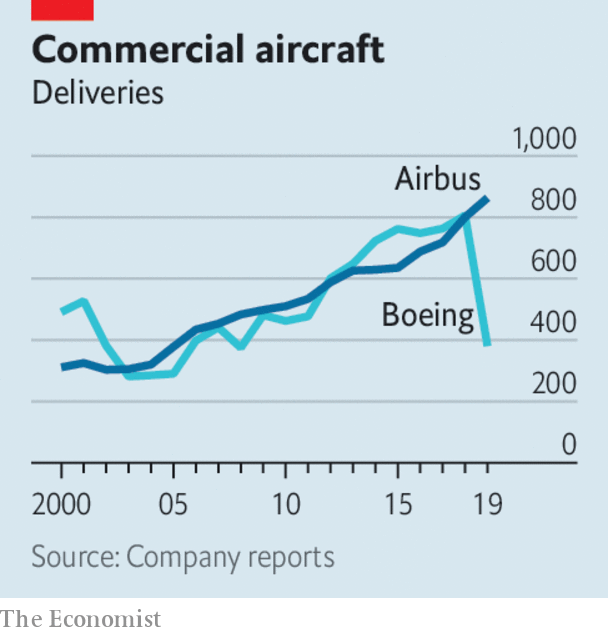

# Business this week

> Jan 18th 2020

The “phase-one” deal suspending trade hostilities between America and China was signed in Washington. The agreement commits China to buy more American agricultural goods, among other things, in exchange for America withholding further tariffs. Most of the penalties that both sides have imposed on each other remain in place. Data this week showed that China’s global exports grew by 0.5% in dollar terms last year, the weakest rate in three years. Its exports to America fell by 12.5%. See [article](https://www.economist.com//leaders/2020/01/18/the-search-to-find-an-alternative-to-the-dollar).

In another gesture that eases tensions, America said China was no longer a currency manipulator, having placed the People’s Republic on its list in August. Since then China has held back from devaluing the yuan in order to gain a trade advantage, according to the Treasury.

ZTE , a Chinese maker of telecoms equipment, launched a private share offering to raise $1.7bn that it will put towards R&D in 5G networks. Like Huawei, a bigger rival, ZTE has faced a ban on working in 5G in America over security issues, but that hasn’t stopped it expanding in other markets.

Car sales in China fell by 8% last year to 26m vehicles. That followed a 3% drop in 2018, which was the first decline in decades. Even sales of electric and other new-energy vehicles went into reverse, after the government cut subsidies.

Aston Martin’s share price retained most of the gains it made after reports emerged that Geely, a Chinese carmaker which owns the Lotus and Volvo businesses, was interested in buying a stake. The British producer of sports cars, featured in many a James Bond film, recently issued a surprise profit warning and said it was talking to potential investors. See [article](https://www.economist.com//business/2020/01/18/aston-martin-is-stuck-in-neutral).

Global trade tensions were in part to blame for Germany’s economy expanding by just 0.6% last year, the slowest pace since 2013 and below the 1.5% it chalked up in 2018. The export industry remains subdued.

BlackRock announced that it would put climate change and sustainability at the heart of its strategy, doubling the number of green funds it invests in and curtailing its investments in coal companies. As the world’s biggest fund manager overseeing $7trn in assets, BlackRock has come under pressure from environmentalists to divest from fossil fuel. Larry Fink, the chief executive, said that climate change is now a “defining factor” in business prospects that will also fundamentally reshape the finance industry. See [article](https://www.economist.com//node/21778411).

America’s big banks reported their earnings for 2019. JPMorgan Chase reported annual net profit of $36.4bn, its most ever. Bank of America’s net income came in at $27.4bn, dented by an impairment charge in the third quarter. Citigroup’s profit was up by 8%, to $19.4bn; at Wells Fargo it was down by 13%, to $19.5bn. Net profit fell by a fifth at Goldman Sachs, to $8.5bn, in part because it set aside money in the fourth quarter to cover litigation costs. The bank is expected to face hefty fines for its role in the 1MDB scandal in Malaysia.

The British government cobbled together a rescue plan for Flybe, an airline that provides services to Britain’s smaller regional airports. The bail-out, which includes deferring the loss-making company’s tax bill, provoked fury from other airlines. Willie Walsh, the outgoing boss of the group that owns British Airways, described it as “a blatant misuse of public funds” and filed a complaint with the EU. See [article](https://www.economist.com//node/21778390).

Buffeted by the grounding of its 737 MAX airliner, Boeing confirmed that last year had been its worst for orders and deliveries in more than a decade. The aerospace company delivered just 380 aircraft in 2019, compared with 806 the previous year. With airlines queuing up to cancel requisitions for new planes, Boeing’s overall net new orders turned negative, at -87. Boeing’s new chief executive, David Calhoun, who started his job this week, has promised to turn things around, assuring staff that he sees “opportunities to be better. Much better.”

A report on drinking habits in the United States from IWSR, which analyses the drinks industry, found that the consumption of wine fell by 1% last year, the first drop in 25 years (the market for sparkling wine remained bubbly, however). Americans in search of a libation are increasingly getting a thirst for ready-to-drink mixes, a market that grew 50% by volume, especially fruity hard seltzers.

Following (unconfirmed) reports that Carlos Ghosn was smuggled out of Japan in a case for a double bass instrument when he fled bail, Yamaha issued a warning for people not to get stuck in boxes intended for musical instruments. The Japanese maker of musical equipment said that (for reasons it won’t mention) there has been a spike in social-media posts of people hiding inside large receptacles for transporting instruments. This could cause, an “unfortunate accident”, it said. Especially if squashed next to a trombone.

## URL

https://www.economist.com/the-world-this-week/2020/01/18/business-this-week
