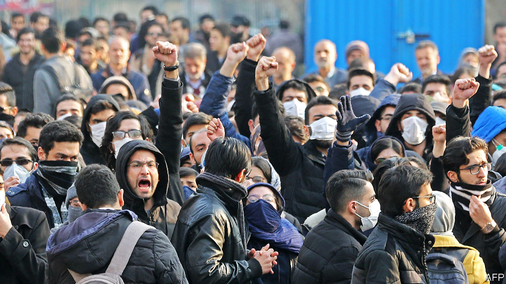

# Politics this week

> Jan 16th 2020

After three days of covering up the cause of the crash of a Ukrainian airliner near Tehran, the Iranian armed forces admitted that they mistook the plane for an incoming missile and shot it down, killing all 176 people on board. Thousands of Iranians demonstrated against the government’s handling of the accident. President Hassan Rouhani, who said he was also lied to, called for a full investigation. See [article](https://www.economist.com//leaders/2020/01/16/its-time-for-the-iranian-regime-to-talk-to-america).

Britain, France and Germany triggered the dispute mechanism in a deal that is meant to curb Iran’s nuclear programme. The move was prompted by Iran’s gradual lifting of limits on its production of enriched uranium, which can be used to make energy or a bomb. Britain’s prime minister, Boris Johnson, called for a new “Trump deal” to replace the old agreement. Mr Rouhani dismissed this. See [article](https://www.economist.com//britain/2020/01/16/johnson-trump-and-the-future-of-the-atlantic-alliance).

Talks in Moscow over Libya broke down when Khalifa Haftar left without signing a ceasefire agreement. His forces are at the gates of Tripoli, seat of the internationally recognised government.

In Sudan former intelligence officers clashed with troops on the streets of Khartoum, briefly shutting the airport. It was the biggest display of force from those still loyal to Omar al-Bashir since his ousting as president last year.

Emmanuel Macron, the president of France, hosted a summit attended by five African leaders on the threat of Islamic militancy in the Sahel. Mr Macron pledged to send an extra 220 French troops to the contingent of 4,500 that are already there. Despite rising regional violence, some locals want them to leave

Ethiopia’s electoral commission set August 16th as the tentative date for an election, the first to be contested by the country’s reformist prime minister, Abiy Ahmed, who is leading a new party.

The House of Representatives at last sent the articles of impeachment for Donald Trump to the Senate, which will allow his trial to start. Democrats released new evidence against the president, based on the dealings of Rudy Giuliani, one of Mr Trump’s personal lawyers, with Ukrainian officials. See [article](https://www.economist.com//united-states/2020/01/16/the-senates-coming-test).

The Democratic candidates for president held their last debate before the real contest kicks off in Iowa on February 3rd. Bernie Sanders denied that he had told Elizabeth Warren in 2018 that a woman could not be elected president. See [article](https://www.economist.com//node/21778380).

Voters in Taiwan re-elected Tsai Ing-wen as president by a margin of almost 20 percentage points. Ms Tsai’s Democratic Progressive Party also retained control of the legislature. The landslide victory was seen as a rebuff to China’s intensifying efforts to isolate and intimidate Taiwan. See [article](https://www.economist.com//asia/2020/01/11/in-a-blow-to-china-taiwans-president-coasts-to-a-second-term).

China reported the first death resulting from a virus that has infected more than 40 people, most of whom had visited or worked in a fish-market in the Chinese city of Wuhan. The WHO said it was possible that “limited” human-to-human transmission was occurring. See [article](https://www.economist.com//science-and-technology/2020/01/16/a-new-human-coronavirus-has-appeared-in-china).

The first of a new class of destroyer, the Type 055, formally entered service in China’s navy. It is regarded as one of the most advanced of its kind in the world. China hailed the official launch of the vessel, the Nanchang, as a “great leap” in its naval modernisation.

Taal volcano, one of the most active in the Philippines, erupted. The huge plume of ash disrupted flights at Manila’s main airport, some 50km away. Volcanologists fear a bigger eruption is imminent.

A court in Pakistan overturned the death sentence issued by a special tribunal last month against Pervez Musharraf, a former army chief who led a coup against the civilian government in 1999. Mr Musharraf had been found guilty of treason and subverting the constitution in relation to a separate incident in 2007.

Alejandro Giammattei, a pro-business conservative, was sworn in as Guatemala’s president. Although he has promised to fight corruption, Mr Giammattei has no plans to bring back a UN-backed anti-corruption body that was expelled from the country by his predecessor, Jimmy Morales. Mr Morales was sworn in as a member of a regional parliament, which may give him immunity from charges that he violated campaign-finance laws, which he denies.

Haiti’s parliament was supposed to start sitting on January 13th. But the country is now being governed without a functioning legislature because an election due last October was never held. President Jovenel Moïse can now rule by decree. See [article](https://www.economist.com//the-americas/2020/01/18/jovenel-moise-tries-to-govern-haiti-without-a-parliament).

Vladimir Putin took Kremlin-watchers by surprise when he proposed an overhaul of Russia’s political institutions that could expand the power of the Duma and the state council, a body that currently has little weight but which he heads. Mr Putin must step down as president in 2024, according to the constitution. The opposition says he is manoeuvring to hold on to power. Dmitry Medvedev, an ally of Mr Putin, stood aside as prime minister. See [article](https://www.economist.com//node/21778375).

Robert Abela became Malta’s prime minister when the governing Labour Party elected him as leader to replace Joseph Muscat. Mr Muscat resigned amid an outcry over claims he protected friends linked to those accused of involvement in the murder in 2017 of a journalist who was investigating corruption.

Leo Varadkar, the Irish prime minister, called an election for February 8th. It will be the first ballot in Ireland held on a Saturday, which Mr Varadkar hopes will increase turnout.

A new power-sharing deal was agreed to in Northern Ireland, ending three years of stalemate for the devolved government. Pressure from Westminster and voter dissatisfaction forced the Democratic Unionists and Sinn Fein to compromise. The parties agree on one thing: they say that the extra spending promised as part of the deal is inadequate. See [article](https://www.economist.com//britain/2020/01/10/northern-ireland-gets-a-government-again).

Boris Johnson, Britain’s prime minister, gave his first TV interview since his election victory in December. Mr Johnson claimed it was “epically likely” that he would secure a trade deal with the EU by the end of this year, but conceded that “you always have to budget for a complete failure of common sense”. Mr Johnson was clearer about the cost of getting Britain bonging on Brexit day: £500,000. That is how much is needed to get the clapper ringing again on Big Ben, which has fallen silent during lengthy repairs.

Correction: Last week we said that both of Harvey Weinstein’s accusers in a court in New York were unnamed. In fact, only one of the women is unnamed. Sorry.