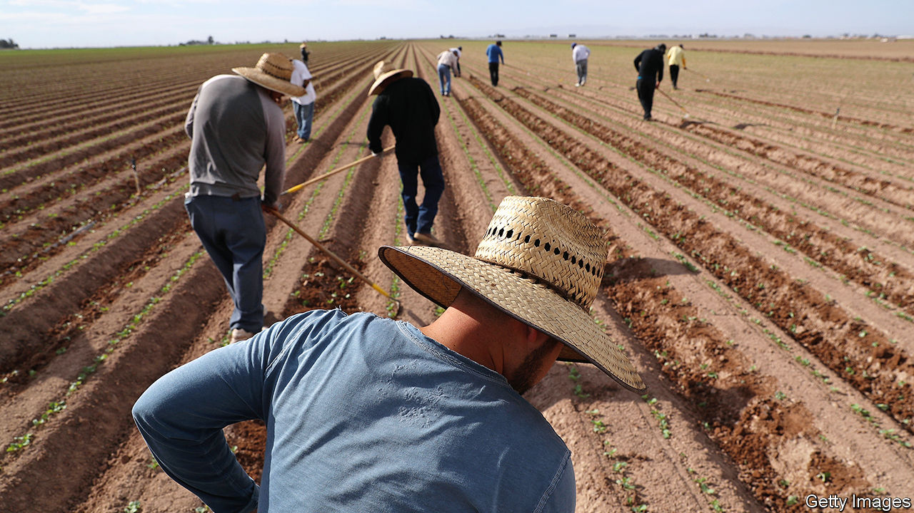
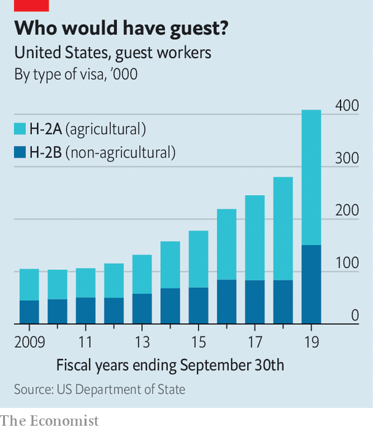

## Well documented

# America’s guest-worker boom

> Donald Trump’s administration is encouraging low-skilled Mexican migrants to come to America, legally

> Jan 18th 2020LOS ANGELES

ALTHOUGH AMERICA’S immigration policy now seems dominated by a desire to seal the country’s southern border, Donald Trump’s administration has been surprisingly tolerant of a certain type of crossing. Those by legal, temporary migrants—or guest workers—in search of low-wage work have risen dramatically over the past decade.

The government granted 408,000 visas for guest workers in 2019, up from 103,000 in 2010. This growth began well before the start of Donald Trump’s term, but has recently come back into focus. If a proposed rule-change takes effect, guest workers could become an even larger source of labour in low-wage industries.

Part of this expansion stems from America’s strong economy. There are jobs available for people who want them. The problem is that many people do not. In industries such as agriculture, many employers say they cannot find workers willing or able to fill low-wage jobs.

Guest workers fill this chasm. The programme offers two types of visa. Seasonal farm workers get the H-2A. There is no limit on their number, which has tripled in a decade (see chart). Non-farm workers get the H-2B. Their number is capped at 66,000 annually, but the administration has granted more H-2Bs every year.

To qualify for either visa, an employer must prove they cannot find an American to do the job. Once the Department of Labour has approved the request, the employer—usually a contractor—sends recruiters to find workers, usually in Mexico. Employers are in charge of applications, placement, transport and housing. They can refuse to renew a worker’s visa at will. Unlike most documented immigrants, guest workers do not pay Social Security, Medicare or unemployment taxes, making them cheaper to hire.

Employers say the process is too bureaucratic and expensive, though once they start hiring guest workers, they rarely stop. Labour advocates worry that it could undercut wages and is potentially exploitative, handing employers too much power. America also has a spotty record with guest workers. Between 1942 and 1964 the country granted 4.6m agricultural contracts, largely to Mexicans, as part of its bracero programme. Yet the man who ran it during the Kennedy and Johnson administrations later lambasted it as “legalised slavery”.

The issue remains fraught. But there have been signs of progress. In December a moderate bill passed the House of Representatives with bipartisan support, the first agricultural-labour reform bill to do so in more than three decades.

It would codify a rule-change proposed by the Department of Labour over the summer that would make the visa-application process easier, addressing some employers’ concerns and potentially expanding the programme further. It also would offer a path to legal status for potentially thousands of unauthorised immigrants. Those who have worked in agriculture for at least 180 days in the past two years could apply for “certified agricultural worker” status. Those who have worked longer could eventually apply for green cards.

The bill’s fate is less certain in the Republican-controlled Senate. The guest-worker programme is far from perfect. But a policy that encourages legal low-skilled migration and pleases both businesses and workers is certainly worth debating.■