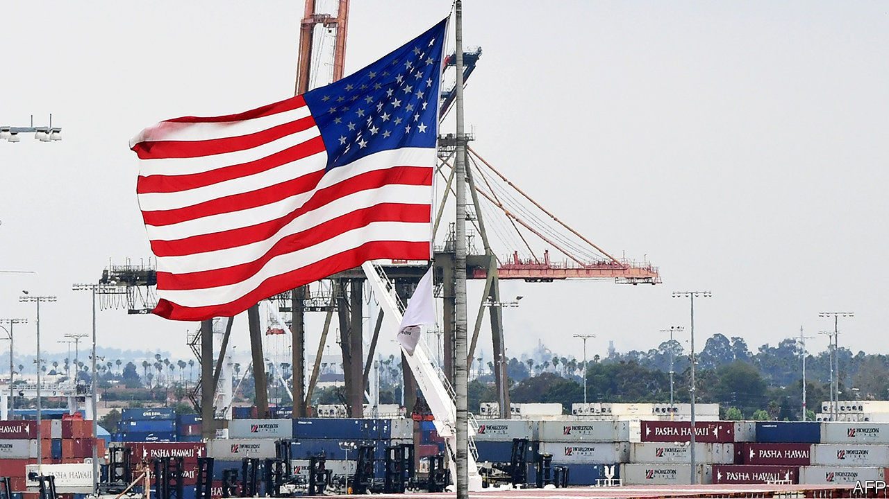

## Weapon of choice

# Old export regulations get a new use

> Donald Trump’s administration leverages rules from the Department of Commerce to confront Chinese firms

> Jan 16th 2020WASHINGTON, DC

AN OBSCURE PART of the Department of Commerce called the Bureau of Industry and Security (BIS) is not used to grabbing the limelight. But lately it has had plenty of attention. That is thanks to its control of rules governing the flow of goods from and through America, called the Export Administration Regulations (EAR). Under Donald Trump, these rules are being transformed into a new weapon in the fight against Chinese technology. But changing them risks driving high-tech business out of America.

The traditional tools for attacking foreign companies are the economic sanctions available through the Department of the Treasury. Sanctions prevent the target firm from doing transactions in American dollars, essentially cutting them off from the global financial system. But Steven Mnuchin, the treasury secretary, is widely understood to be against that option for one of the main objects of America’s beef with China, the tech giant Huawei. That is possibly because shutting out Huawei could risk global network blackouts and great economic turmoil.

Mr Mnuchin’s resistance meant the Trump administration needed another option. It found BIS. The idea was to target Huawei through the “entity list”, first published in 1997 as a part of the EAR and designed to fight the proliferation of weapons of mass destruction. Back then it was understood that if the American government somehow became aware of a shipment bound for a dangerous regime it could invoke the EAR, place that regime on the entity list, and halt the components’ movement in its tracks.

The Trump administration’s first big EAR salvo came in May 2019, when it placed Huawei on the entity list, claiming it posed a threat to America’s national-security and foreign-policy interests. Huawei denies that it does. The listing prohibited the export of components from America to the company, and seemed to inhibit the export of American-made components from other countries to Huawei. After some initial confusion, companies worked out that they were in fact prohibited only from exporting components directly to Huawei from American soil.

Now the Department of Commerce is preparing new rules that would clamp down afresh on exports to Huawei. That is despite the fact that on January 15th the Trump administration signed a “phase one” trade deal with China—the latest demonstration that the many disagreements between the two countries do not scale up and down in tandem (see [article](https://www.economist.com//finance-and-economics/2020/01/16/the-new-us-china-trade-deal-marks-an-uneasy-truce)).

Those rules would cut Huawei off from a greater proportion of American technology than at the moment, according to many people close to the process, removing the option of shipping American technology in from abroad. Companies such as Intel, which manufactures semiconductors, and Arm, which designs chips, would have to strip more American content out of their products, or stop shipping to Huawei.

The rules are still under discussion, but are expected to be published soon. Deeper controls on tech exports to the whole of China are also being considered. According to people familiar with the process the changes are driven not by Wilbur Ross, the commerce secretary, but by Earl Comstock, the department’s director of policy and deputy chief of staff. How and whether these new rules will go into effect is unclear. As with Huawei’s initial entity listing, they may be held back as ammunition in case phase-two negotiations stall, or used as leverage to keep them on track. American tech firms say that tightened export controls, especially the misfired first round, are misjudged. Instead of cutting Huawei off, American unilateralism forces Huawei to obtain non-American components from competitors. Other Chinese firms may do the same for fear of similar treatment. (Treasury sanctions do not come with this unintended consequence of helping non-American suppliers.)

This process may slow Huawei down, but lost revenue and commensurate gains by competitors could lead to a downward spiral for American firms that leads to lower relative spending on research and competitiveness. Newly flush with Huawei’s cash, European and East Asian suppliers could overtake American firms. At best, the industry expects the controls to force American firms’ operations offshore, into the hands of non-American suppliers. At worst, they risk scalping firms’ competitive advantage entirely.

The mission statement of the BIS takes these trade-offs into account. It promises not to impose “unreasonable restrictions on legitimate international commercial activity that is necessary for the health of US industry”. That is no simple task. If Washington and Beijing carry on along the path of technological “decoupling” then American industry will inevitably suffer (as will Chinese). Few organisations have greater power to determine the nature of that suffering than the Trump administration’s Department of Commerce. The entity list was not designed as a tool of geostrategic competition. But, increasingly, it is being turned into one.■