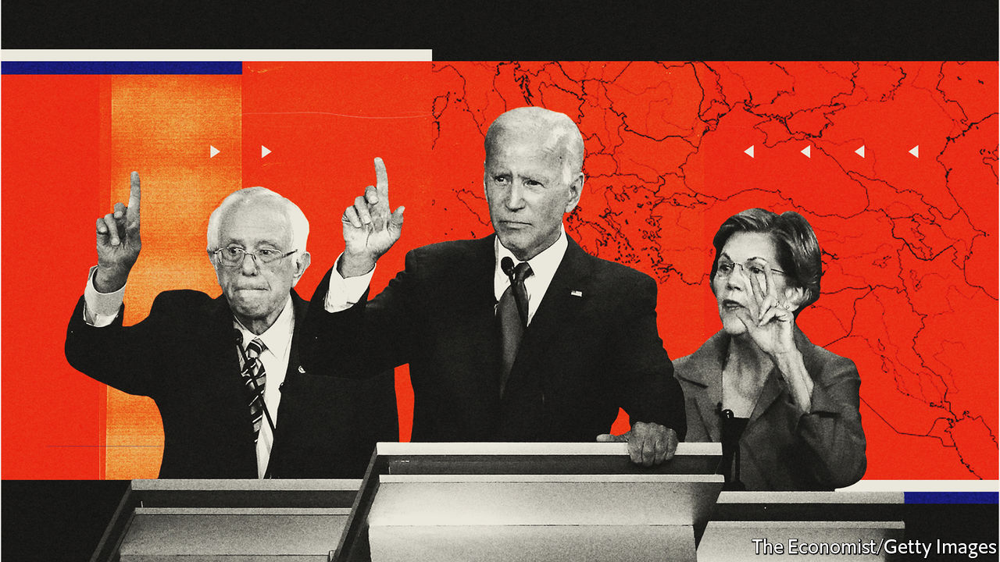

## The world intrudes

# The Democrats’ debate in Iowa covers foreign policy at last

> His challengers agree that Donald Trump gets it wrong, but they express real differences with each other

> Jan 16th 2020AMES, IOWA AND WASHINGTON, DC

BEFORE LAUNCHING into a speech for the 30 or so Joe Biden-curious Iowans who had gathered in Ames on a frigid Wednesday evening in early January, John Kerry, the Democratic presidential nominee in 2004 and a secretary of state for Barack Obama, made sure to hug an old friend in the crowd: the gunner from his Swift Boat in Vietnam many decades ago. Soon after returning from that war as a wounded and decorated veteran, Mr Kerry had concluded that it was a pointless misadventure. In Iowa he worried that America was again on the brink of another disastrous war—this time with Iran.

President Donald Trump had ordered the killing of General Qassem Suleimani, perhaps the second-most-powerful man in Iran, eviscerating what little remained of the detente that Mr Kerry and Mr Obama had worked to establish through diplomatic channels. “We didn’t sit there publicly pissing and moaning and screaming about how bad they were and tweeting away and creating a storm,” Mr Kerry said.

This, Mr Kerry argued, is the reason to trust in Mr Biden, who, between his time as a senator and vice-president, has nearly half a century of experience in matters of foreign policy. More years, in other words, than Pete Buttigieg—another candidate vying to represent the moderate faction of the party—has had on Earth. His long experience is why Mr Biden thinks that foreign-policy debates will help him.

Unfortunately for him, the race has focused largely on domestic matters. Foreign affairs have been relegated to one-off speeches. None of the four leading candidates has published a specific China policy on their campaign websites, for instance. All mightily agree to disagree with Mr Trump’s impetuosity and self-imposed crises—whether by launching trade wars, leaving the Paris climate accord or by alternately taunting and serenading Kim Jong Un of North Korea. General Suleimani’s death has changed that. On January 14th the candidates had their final debate before the Iowa caucuses, with foreign policy dominating. It revealed big differences beneath their superficial agreement.

Of the major candidates, Mr Biden is most keen on restoring the pre-Trump status quo. Reassuring NATO allies, rejoining both the Paris accord and the Iran nuclear deal and pursuing arms-control treaties with Russia rank high among his priorities. He is the candidate most in line with the Washington foreign-policy establishment, often mocked as “the blob”. Critics to his left have suggested this is hardly a mark of good judgment. They point to Mr Biden’s vote to authorise the Iraq war in 2002—ressurecting the issue for the fourth primary season in two decades.

But Mr Biden is not in the liberal interventionist tradition of Hillary Clinton. He disagreed stridently with the secretary of state over the decision in 2011 to intervene in Libya. Though he would like to “end the forever wars in Afghanistan and the Middle East”, he is open, unlike some of his opponents, to leaving residual forces in Afghanistan. He would also like to increase arms sales to Ukraine.

Though voters may appreciate a return to the old ways, some breaks are more difficult to mend than others. The Paris accord would be simple to rejoin, but Iran might not be put back in the bag so easily. Great-power competition with China continues apace. Mr Trump’s norm-breaking around matters of trade—such as imposing tariffs on stretched national-security grounds—may embolden other countries to try the same tactics.

Both Bernie Sanders and Elizabeth Warren, the leading left-wing candidates, differ from the blob by framing foreign policy in the context of domestic projects. Mr Sanders sees international affairs in terms of a binary contest, between “a growing worldwide movement towards authoritarianism, oligarchy and kleptocracy” and his own egalitarian vision. For decades he has been a sharp critic of American interventions, particularly in Latin America.

Ms Warren views corruption as the wellspring of all problems, both domestic and foreign. Her analysis of global disorder, published in Foreign Affairs, blames both “endless wars” and the export of “a particular brand of capitalism, one that involved weak regulations, low taxes on the wealthy and policies favouring multinational corporations”, for America’s diminished standing in the world. In her view, reducing inequality can enhance stability internationally as well as at home.

Mr Sanders and Ms Warren are trying to overcome the somewhat artificial divide between foreign and domestic policy. This is sensible regarding competition with China—where infrastructure, education, research funding and industrial policy may matter more to long-term outcomes than any reshuffling of aircraft-carriers.

“It is easy to draw the contrast with the current president, who has no obvious plans other than dragging us closer and closer to war in the Middle East,” said Ms Warren, when asked about her vision of foreign affairs after an event in Mason City, Iowa. “We need a State Department that is fully staffed up, we need to use our economic tools, and we need to work with our allies.” Ms Warren’s published plan to rebuild the foreign service—which Mr Trump seems to have damaged for years to come—is thoughtful and detailed. She has hinted at an enthusiasm for using trade policy to extract concessions on issues such as the environment, labour standards and human rights. Both she and Mr Sanders may agree with Mr Trump in keeping tariffs on China, for instance, though for less haphazard and more principled reasons.

The Democratic candidates may keep in lockstep in their denunciations of Mr Trump’s foreign policy, but the differences between them are significant. And if Congress remains divided, their plans for America’s relationship with the rest of the world are more likely to be implemented than their domestic agendas, which tend to receive more attention.

Much foreign policy can be made by executive fiat. Overseas, adversaries and allies alike will find a change in the American presidency entails bumpier seesawing than ever before. “As Congress has become more and more dysfunctional, the presidency has taken more and more power,” says Daniel Drezner, a professor of international politics at Tufts University. “If you combine consolidated executive power with polarisation,” he adds, “it leads to schizophrenic foreign policy.” ■

[Sign up to receive Checks and Balance](https://www.economist.com//checksandbalance/), our new weekly newsletter on American politics