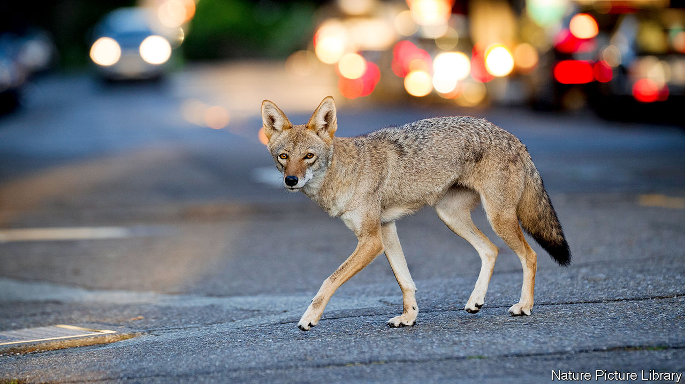

## City critters

# Unpacking the rise of urban coyotes

> Shifting patterns of global trade may explain the canine’s spread across America

> Jan 16th 2020CHICAGO

THE ATTACKER sprang from the tall grass in a lakefront park, leaving a five-year-old victim terrified, blood streaming from his head. After the boywas taken to hospital, a hunt ensued. Helicopters, police and specialist trackers fanned across the Chicago neighbourhood. A man brought himself to hospital saying he, too, had been bitten. Two nearby schools were locked down for a day. Eventually a suspect—a brindle coyote with puppy-dog eyes—was apprehended behind a theatre.

The incident excited much of Chicago. Although coyote attacks on humans are rare, the animals have become an increasingly common part of urban American life. Once mostly found west of the Mississippi, they have spread east. Coyotes have settled in almost every urban area in the country, including New York City. There are few reliable estimates of the national population, but over 400,000 are hunted each year. Survivors roam an ever-larger territory.

In Chicago, coyote sightings have become routine, especially in the past decade. Stan Gehrt, a professor of wildlife ecology at Ohio State University, launched a study of the animals two decades ago after they began showing up in sizeable numbers. “Before then, not much research had been done into urban coyotes. We didn’t know what it meant,” he says. The population has soared. Depending on whether the count includes cubs, Mr Gehrt conservatively estimates that between 2,000 and 4,000 coyotes live in the city.

What lies behind this boom? The loss of deciduous forests and wolves (which hunted coyote) are long-term factors. Federal efforts to poison the animal reduced in the 1970s because of concerns over the dangers of releasing toxins haphazardly into the environment.

Mr Gehrt also points to a shift in global trade. Hunters and trappers continue to kill coyotes. A pelt can sell for as high as $70 to $100 to be used as trim or linings for winter coats, including Canada Goose jackets. But overall demand for American furs from Chinese, Russian and other European buyers has slumped in recent years, he says. With fur unfashionable, sales down and “trapping animals not as acceptable as before”, Mr Gehrt says rural areas have become “saturated” with the animal. Today, as cubs mature and seek their own territories, many have been pushed into cities.

Coyotes can be troublesome. They eat wandering pet cats and small dogs. But on balance they are benign. They mostly eat fruit and other wild species, including pests that flourish in cities, such as rats, rabbits, woodchucks, young Canada geese and the fawns of white-tailed deer. Keeping these populations in check is a welcome public service.

Predatory attacks on humans are rare. Just one American—a toddler snatched from her garden in Los Angeles in 1981—has been reported killed by a coyote in the past four decades. Public anxiety about the spread of a large predator is certainly understandable. But by comparison, dogs are a much greater menace. They kill some 50 people and send thousands to hospital a year in America. Deer, too, appear cute but cause traffic accidents that kill more than 200 Americans a year. Coyotes may look less docile, but they are linked less closely to death.