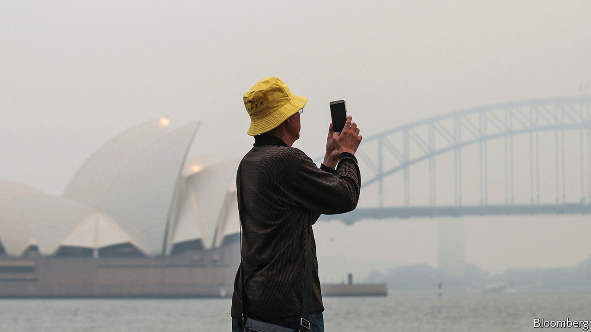
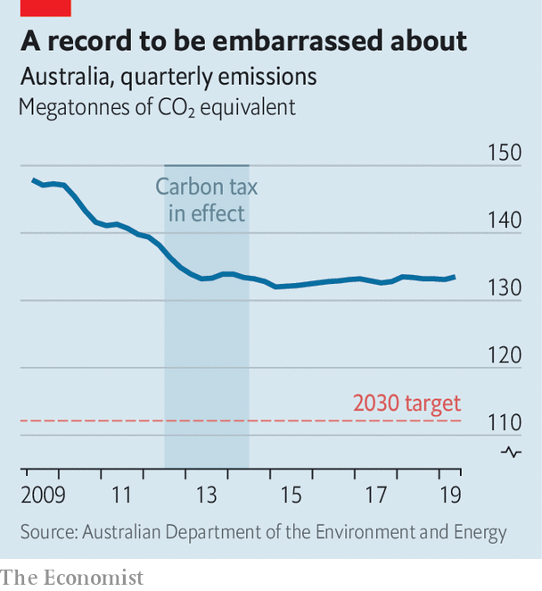

## Smoke and numbers

# Australia expresses pride in its dismal record on greenhouse gases

> It is still patting itself on the back for questionable achievements a decade ago

> Jan 25th 2020SYDNEY

AUSTRALIA’S CONSERVATIVE coalition government has a favourite new catchphrase. It is on track to “meet and beat” its emissions-reduction targets, its ministers chime. The Liberal-National coalition has faced pressure to strengthen its laggardly climate policies since wildfires started tearing across the country last month, but the prime minister, Scott Morrison, has so far declined to do so. Australians are already “carrying our weight” on climate change, he insists.

Australia’s goal under the Paris agreement is to reduce emissions to 26-28% below the level of 2005 by 2030. A previous Liberal government seems to have come up with that target by mimicking America’s pledge, but giving itself an extra five years to achieve it. The European Union, in contrast, promised to cut to 40% below the level of 1990 by 2030—a much tougher target.

Despite the government’s talk, Australia will not meet its modest aim. Its dependence on cars and coal-fired power makes it one of the world’s biggest emitters relative to population. Its emissions have hardly budged in the six years since the Liberals came to power (see chart). On the government’s own projections, they will fall by only about 16% by 2030, to 511 megatonnes a year, well above the required 447.

The government wants to make up the difference using “carry-over credits” from the Kyoto protocol, the precursor of the Paris agreement. It exceeded its targets under Kyoto, so is “ahead of its mortgage”, Mr Morrison says. Scientists argue that this is especially rich because Australia’s Kyoto targets were piffling. In the first phase of the agreement, it was allowed to increase its emissions by 8%, whereas most rich countries cut theirs. Its stance is akin to “showing up to a university exam and asking for extra credit because you nailed your kindergarten colouring-in”, says Tim Baxter of the Climate Council, an NGO.

Other countries are dumbfounded that a place that stands to lose so much from rising temperatures is “among those trying to water down commitments”, according to Frank Jotzo of the Australian National University. But Mr Morrison became prime minister because his more environmentally minded predecessor, Malcolm Turnbull, was toppled by colleagues after attempting to enshrine an emissions-reduction target for power generation in law. Mr Morrison won a subsequent election by capturing swing seats in Queensland, a state with a weak economy and lots of planned coal mines. The prime minister says he will not do anything that jeopardises the mining and oil industries and so threatens “millions of jobs”.

Lots of Australians, particularly those who do not live in big cities, applaud that position. But recent history suggests that Australia could reduce emissions without scuppering the economy. In 2012 a government led by the Labor Party introduced a scheme which charged big polluters for each tonne of carbon they coughed out. It was repealed two years later by the Liberals, who had labelled it a “giant new tax on everything”. But during its brief life emissions fell and the economy did just fine.

Neither the Liberals nor the chastened Labor Party espouse anything like a carbon tax these days. The Liberals have set up a fund to pay for schemes to plant trees and prevent the clearing of forested land, but have no policies to deter the burning of fossil fuels. Greener voices are being ignored. When the environment minister in the Liberal government that runs the state of New South Wales, Matt Kean, called recently on his colleagues in the national government to abandon carry-over credits, Mr Morrison scoffed, “Most of the federal cabinet wouldn’t even know who Matt Kean was.”

Hope comes from Australia’s states and territories, which are setting themselves demanding emissions targets for the middle of the century. They have less power to clean up transport or industry than states in America, notes Mark Butler, the shadow energy secretary. But South Australia already generates more than half its electricity from wind and solar. The tiny capital region is powered almost entirely by renewables. Australia is as rich in sun and wind as it is in fossil fuels.

Meanwhile, the bushfires sent some 400 megatonnes of carbon dioxide—roughly 75% of Australia’s annual emissions budget—up in smoke in the last three months of 2019. The government does not include these in its emissions count. ■

Sign up to our fortnightly climate-change newsletter [here](https://www.economist.com//theclimateissue/)