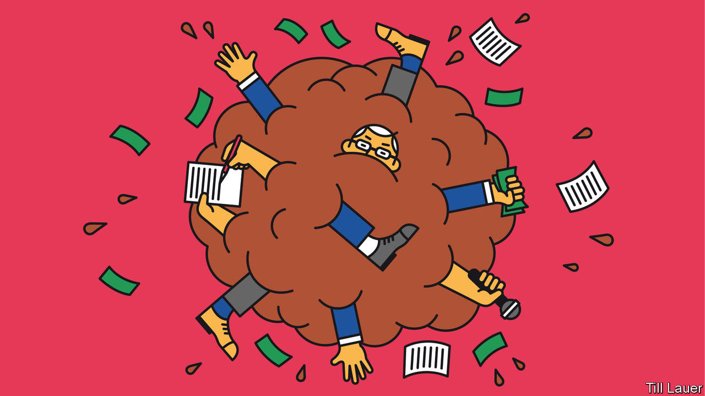

## Banyan

# Malaysia’s reformist government has not put an end to sleaze

> Its members are too busy plotting against one another

> Jan 23rd 2020

TO SEE HOW topsy-turvy Malaysian politics have grown, consider the case of the previous prime minister, Najib Razak. In 2018 the party he led lost power for the first time since independence. Mainly to blame were allegations of massive graft against Mr Najib, who denied wrongdoing but admitted that almost $700m had found its way into his bank accounts. Soon after he left office, police seized a thumping haul of bling belonging to his wife, Rosmah Mansor, who also denies any crime. It included 567 handbags, 423 watches and 14 tiaras.

Mr Najib faces more than 40 charges of corruption and abuse of power, but his star is rising again. His chutzpah has made him an unlikely hit with the country’s moped gangs, who have taken to calling him bossku (“my boss”). With deft use of social media, Mr Najib has reinvented himself as a man of the people. He paints himself as the victim of a show trial. This week the 94-year-old who replaced him as prime minister, Mahathir Mohamad, who was once Mr Najib’s mentor, expressed bafflement that “people are kissing the hands of thieves and calling them bossku.”

The reinvention of Mr Najib is unlikely to go so far as to return him to the centre of politics, even if he manages to escape imprisonment. Apart from anything, Ms Rosmah is too widely loathed. But his renaissance reflects poorly on Dr Mahathir and the ruling Pakatan Harapan coalition. It promised much when it came to power. By forging an alliance among ethnic Chinese, Indians and Malays, it offered a heartening alternative to the defeated Barisan Nasional (BN) coalition, which had long pursued an often nasty form of identity politics that pandered to the Malay Muslim majority. Equally refreshingly, Pakatan had also promised inclusive economic growth and an end to sleaze.

So much for that. Under Pakatan, everything is subordinate to internal wrangling over the future leadership of the coalition and thus the job of prime minister. In a pre-election pact, Dr Mahathir agreed to head the government for just two years before handing over to Anwar Ibrahim. Twenty years ago, during Dr Mahathir’s previous stint as prime minister, he saw the younger and brilliant Mr Anwar as a threat and had him jailed on trumped-up charges of corruption and homosexual acts, which are illegal in Malaysia. The rift between the two men came to define Malaysian politics, prompting Mr Anwar to leave the ruling United Malays National Organisation (UMNO), the linchpin of the BN, and turn the country’s fractured opposition into genuine contenders for power.

Yet in 2018, the two enemies saw the use of each other. Mr Anwar was again in prison, where Mr Najib had also had him thrown, and so was banned from politics. That meant the opposition needed a credible leader. Dr Mahathir, who in retirement had turned on Mr Najib and UMNO, could bring a crucial slice of Malay voters over to Pakatan’s side. Having helped secure Pakatan’s victory, Dr Mahathir also secured a pardon for Mr Anwar.

But those who muttered that two lions cannot live on the same mountain proved right. Dr Mahathir is now cussedly vague about when he will step down, while a pro-Anwar campaign attempts to discredit the prime minister and his allies. Last year a video was circulated that purported to show one ally, the economy minister, Mohamed Azmin Ali, in bed with a man. Mr Azmin denies it was him. But if the personal attacks echo Mr Anwar’s past treatment, consider that nearly all political insiders believe pro-Anwar people to be responsible for the video’s dissemination.

Meanwhile, Mr Anwar’s former research assistant is suing his political secretary for alleged assault (he denies it). Other modernisers, including Mr Anwar’s daughter, have recoiled from the tone of the debate. It all leaves the direction of Malaysian politics unclear. Dr Mahathir may yet hand over to Mr Anwar later this year. Or he may attempt to abandon Pakatan and forge a new government pandering to Malays, encompassing the rump of UMNO and conservative Islamists. One straw in the wind is the government’s refusal wholeheartedly to condemn a fiery, race-baiting TV evangelist, Zakir Naik, wanted in India on money-laundering charges. The prime minister says ominously that he can work with anyone except Mr Najib.

Meanwhile, the region’s leaders wonder what on earth is going on. An entrepreneur says that the lack of political direction is having an “appalling effect” on the investment climate. Indeed, it is a blow to reform in general.