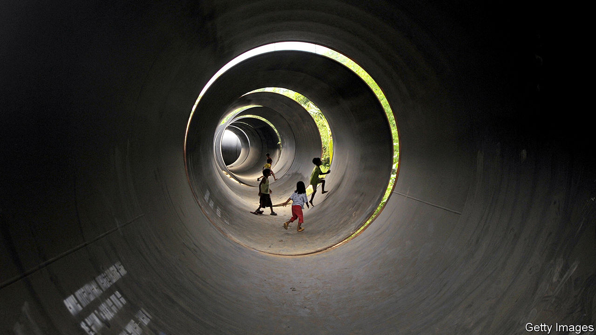
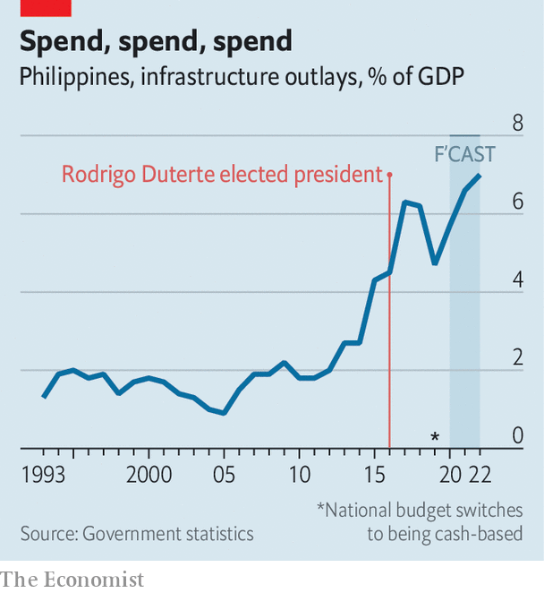

## “Build, Build, Build”

# The Philippines, a country with dreadful traffic, may start to unclog

> President Rodrigo Duterte is investing massively in roads, ports and airports

> Jan 25th 2020MANILA

SHOULD YOU get up at 4am to get to work on time, or risk waiting until five? That is the question confronting many commuters in Manila, the capital of the Philippines, which has some of the world’s worst traffic jams. Geography is one reason: the 2m people trying to get in and out of the metropolis each day must squeeze into a narrow strip between the sea on one side and a lake and hills on the other. But poor urban planning and a dearth of infrastructure investment in recent decades have compounded the problem. Filipinos spend 16 days a year stuck in jams, according to the Boston Consulting Group. The World Economic Forum ranks the Philippines 96th of 141 countries for the quality of its infrastructure. Nearby Indonesia, another nation of thousands of islands, is 72nd.

On January 17th the public-works minister announced that by the time President Rodrigo Duterte leaves office in 2022, he wants to have cut the number of cars that pass along the city’s main artery each day by a third. Such bold declarations have been characteristic of Mr Duterte’s approach to infrastructure. When he became president in 2016 he considered demanding emergency powers from Congress to help him deal with the traffic. In the end, he settled instead on a long-term scheme to spend 9trn pesos ($177bn) on new infrastructure called “Build, Build, Build”. The focus on construction represents a “very bold shift in government priority”, believes Vince Dizon, a presidential adviser.

As the jams in Manila suggest, not much has shifted yet. But change is coming. “Build, Build, Build” involves 100 big projects. Construction is under way on almost half of them. In 2018 the government introduced a law to cut red tape in permitting, partly to speed up infrastructure investments. Some planning committees are meeting three times as often as they used to. Twenty projects were approved in the final three months of last year, says Mr Dizon. Impractical schemes promoted by the president, such as a plan to link all the main islands of the Philippines by bridge, have been quietly set aside.

One of the biggest projects still in the works is New Clark City, which is eventually supposed to house 1.2m people and lots of government offices, in an effort to ease traffic in nearby Manila. The city was planned under Mr Duterte’s predecessor, but embraced by him in an unusual display of political continuity. The first phase was completed in November. Mr Duterte has also presided over the opening of a new airport in the province of Bohol, and of the Philippines’ largest passenger-ferry terminal on his home island of Mindanao.

Spending on infrastructure has roughly doubled since the president took office. The plan is for it to reach 7% of GDP by 2022, up from 2.6% in 2015 (see chart). The austere policies of past presidents have left Mr Duterte scope to borrow. Public debt is around 41% of GDP. He has introduced a series of sensible tax reforms, which are expected to help boost government revenue, and diversified the Philippines’ sources of funding. Japan has provided some $12bn in recent years. The Asian Development Bank (ADB) is so enthusiastic about Mr Duterte’s infrastructure plans that last year it lent the Philippines more than any other country bar India. China has also promised $9bn for infrastructure, although it has signed formal agreements to provide only $900m.

Public-private partnerships are also being used. More than a quarter of big projects under “Build, Build, Build” will involve private investors. Ensuring that the terms of concessionary agreements are fair, however, has been an obsession of Mr Duterte’s administration. The president’s ongoing spat with two water companies in Manila over their contractual rights is a case in point. Shares in one of the firms, Manila Water, dropped to a 14-year low at the height of the furore last month. That may worry companies that are thinking about joining the infrastructure push.

The government says that by the middle of 2022 roughly half of the 100 “Build, Build, Build” projects should have been completed. Kelly Bird of the ADB says even finishing 30 would make the programme “hugely successful”. Filipinos are well aware of Mr Duterte’s efforts. A survey by Pulse Asia, a pollster, in December found that 69% of respondents thought his government was doing a “better” job of developing infrastructure than its predecessor.

Obstacles will mount as Mr Duterte nears the end of his time in office, however, and his political power begins to ebb. And once he steps down there is no certainty that his successor will complete his plans. New presidents in the Philippines often kill projects initiated by their predecessors. In 2011 Benigno Aquino, the president of the day, cancelled 66 of 72 car-ferry ports planned by the previous president, Gloria Arroyo, alleging corruption. With luck, though, Mr Duterte’s successor will see the benefit in inheriting dozens of partially constructed projects and a host of shovel-ready ones. A bulging pipeline of sensible projects could prove as important a legacy as the infrastructure Mr Duterte actually manages to build. ■

## URL

https://www.economist.com/asia/2020/01/25/the-philippines-a-country-with-dreadful-traffic-may-start-to-unclog
