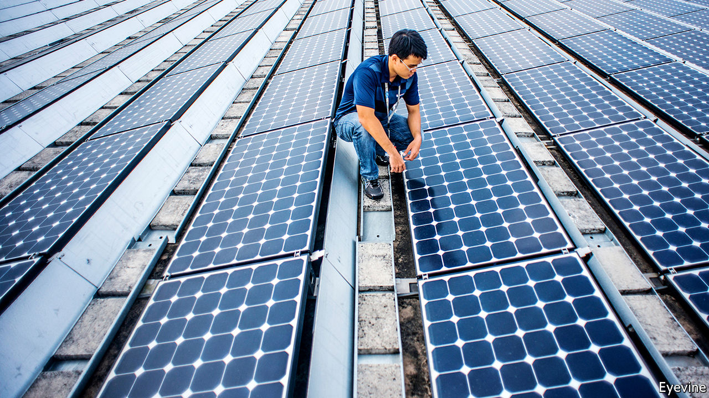

## Sunny spell

# Vietnam grapples with an unexpected surge in solar power

> The energy-hungry country may need fewer coal-fired plants than it thought

> Jan 25th 2020HO CHI MINH CITY

SOLAR POWER played almost no part in Vietnam’s energy mix in 2017. To speed the technology’s adoption, the government offered that year to pay suppliers a generous $0.09 for every kilowatt-hour produced by big solar farms, but only if they started operations within the following two years. It expected some 850MW of capacity to be installed. Instead, by the end of 2019 the country found itself with 5 gigawatts—more than Australia, with an economy almost six times the size.

The surge is all the more surprising given the terms on offer from Vietnam Electricity (EVN), the cash-strapped state-owned enterprise that runs the national grid. Although the government’s “feed-in tariff” was tempting given that costs typically amount to $0.05-0.07 a kilowatt-hour, EVN only promised to pay for the power it needed on any given day. Developers worried that potential investors would balk at that. As it turned out, they leapt at the chance to cash in on Vietnam’s hunger for power.

The Vietnamese economy has been growing by 5-7% a year for the past two decades. The government has plans to double power generation by 2030, but estimates that supply may run short as soon as next year. It needs to find new sources of power as soon as possible.

Coal is the cornerstone of Vietnam’s energy supply. Under current plans, the fleet of coal-fired power plants will soon triple. But construction has been dogged by regulatory delays, local opposition and flagging investor interest. Building a new plant takes the better part of a decade. Solar farms, in contrast, incite far less opposition and take about two years to build.

The solar boom has not been without problems. Almost all the new facilities are in the sunny south-east, where they overwhelm the local grid and occasionally force EVN to refuse to buy the power they generate—the exact scenario developers had feared. Moreover, the feed-in tariff is expensive. The government is adapting, however. It has begun improving the grid and in November decreed that in future it would not offer a feed-in tariff, but instead auction the right to sell solar power to the grid, with the winner being the firm that offers to do so at the lowest price.

Environmentalists hope that solar’s success will persuade the government to scale back its ambitions for coal-fired plants. Later this year it is due to release new targets for generation capacity in 2030. Wind and solar have almost already met their current goal of providing 10% of power, ten years ahead of schedule. They could easily eat into the 43% share allotted to coal at present. Analysts assume, after all, that prices are likely to continue to move in renewables’ favour. Wood Mackenzie, a consultancy, thinks power from large solar farms in South-East Asia will be at least as cheap as that from almost all coal plants within five years. Given that coal plants have lifespans measured in decades, Vietnam and others risk locking in unduly expensive generation capacity.

In Malaysia a recent auction to build 500MW of solar capacity drew bids for 13 times that. In Cambodia the winning bidder to build a 60MW plant said it would supply power at less than $0.04 a kilowatt-hour, a record low for the region. Although the pipeline of proposed coal plants in South-East Asia remains huge, at around 100 gigawatts, the International Energy Agency, a think-tank, has noticed a gradual shift over the past five years. Approvals for new coal plants have slowed; additions to solar capacity have jumped.

Vietnam’s experience suggests that not all the planned coal plants will be built. Even if that proves correct, South-East Asia will still have a lot more coal-fired generation than environmental activists would like. But solar’s sudden spark in Vietnam should at least change officials’ views of what is possible. ■

Sign up to our fortnightly climate-change newsletter [here](https://www.economist.com//theclimateissue/)

## URL

https://www.economist.com/asia/2020/01/25/vietnam-grapples-with-an-unexpected-surge-in-solar-power
