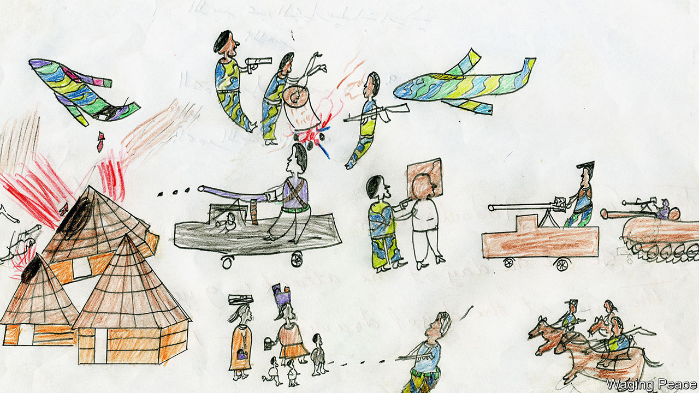
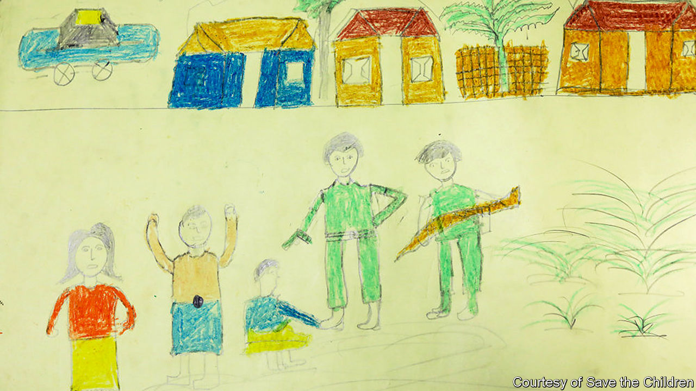

## Caught on paper

# For child survivors, drawing is therapy—and a tool of justice

> From the trials of Nazis to the genocide in Darfur, children’s sketches have provided vital evidence

> Jan 25th 2020

ABDUL JABBAR was nine years old when he was given some coloured pencils and asked to draw scenes from his life in Darfur. Like hundreds of thousands of others he had been driven from his village in a ferocious assault by the Sudanese army and their merciless accomplices, the Janjaweed, meaning roughly “evil on horseback”. Abdul Jabbar was surviving in a refugee camp—but at least he had survived. His drawing records the fates of some who did not. Here a young child is being thrown into a fire (see above). In the middle of the picture, a hooded man is being shot at close range. Towards the bottom, a soldier is cutting off another man’s head.

This drawing, and hundreds of others, were collected by Anna Schmidt (not her real name), a humanitarian worker for Waging Peace, a British NGO. She met Abdul Jabbar in a refugee camp in Chad, to which many Darfuris had fled. She was there to gather evidence of what had really happened in Darfur since full-scale conflict had erupted four years earlier, in 2003. The Sudanese government of President Omar al-Bashir claimed that its forces had carried out only a limited counter-insurgency operation, which rebels had provoked. Others suspected something much worse. For all the authorities’ sophisticated attempts to cover up their atrocities, the children’s drawings helped give the lie to the official version of events.

Ms Schmidt remembers that it was the mothers who urged her to talk to the children. “If you really want to know the truth,” they told her, “speak to them. Don’t just take it from us.” At first she wanted them to write about their experiences. Many, however, preferred to draw. They were asked simply to give an account of life in their villages; Ms Schmidt was shocked by the visceral images they produced.

Time and again, the same motifs recur. Helicopter gunships swoop low, bringing fire from the sky even as the people below are still sleeping. Next come the Janjaweed, on camel or horseback, followed closely by regular Sudanese troops in their “technicals”, pick-up trucks with heavy machine-guns mounted on the back. The detail—down to the flashes on the troops’ uniforms, clearly identifying them as regular Sudanese soldiers—is remarkable. The government claimed that this was never an ethnic conflict, but the children tell a different story. Often the victims are rendered with grey or brown skin, whereas their attackers are coloured pink. This indicates that the villagers are non-Arab, African groups (often Masalit), while their assailants come from Nilotic Arab tribes. In other words, this was ethnic cleansing and, as the International Criminal Court (ICC) was to rule, a genocide.

Some of these haunting images are on display at the Wiener Holocaust Library in London until April 1st. As Barbara Warnock, the curator, avers, they “provide crucial evidence of the experiences of child survivors of the genocide in Darfur”. They have previously stirred viewers elsewhere in Europe and in North America. But this new exhibition comes at a poignant moment for Sudan, and for the prosecution of the most grievous crimes against humanity.

Except for remote satellite images of incinerated villages, there was no contemporaneous photographic proof of the carnage in Darfur. That means the children’s sketches may be the most important visual representations of the killings that the world is ever likely to see. In 2007, as it investigated possible war crimes in the region, the ICC admitted the drawings as “contextual evidence”; Mr Bashir was himself indicted for genocide in 2010. Yet, tragically, the suffering is by no means over.

Despite a popular revolution in Sudan that toppled Mr Bashir and his regime last year, peace has yet to reach Darfur. Fierce fighting in early January killed roughly 50 more people, and displaced a further 40,000, according to the UN. After years of denial, the new Sudanese government has promised to investigate crimes in the region. The children’s drawings could yet be used in that process, even if Mr Bashir himself is never hauled off to the ICC.

Precedents for such use were set by war-crimes trials following the Holocaust. The best-known children’s drawings of that era are from Theresienstadt, a holding camp in Czechoslovakia in which Jews were imprisoned before many were transferred to death camps farther east.

Twelve thousand children passed through; few ultimately survived. Some were encouraged to draw by Friedl Dicker-Brandeis, a pioneer of art therapy. Although the Nazis used Theresienstadt as a show-camp to fool delegations from the Red Cross about the horror of the Final Solution, the truth breaks through in the drawings. One frequent motif is food—reflecting the hunger in a place where over 30,000 people were deliberately starved to death. Some of the images are all the more evocative for their eerie normality.

One Theresienstadt artist, Yahuda Bacon, also survived Auschwitz, which was liberated 75 years ago, on January 27th 1945. Soon afterwards, the 16-year-old drew his memories of the camp. Those pictures, including sketches of the gas chambers, were presented as forensic evidence in the early 1960s at the trials of Adolf Eichmann in Israel and of Auschwitz personnel in Frankfurt. Other drawings were considered, too.

These examples could yet have a bearing on the latest genocide, of the Rohingya Muslims by the Myanmar army. Last year Save the Children, a charity, asked youngsters in Rohingya refugee camps to draw what they wanted to tell the world, as part of their therapy. Again, some rendered extraordinarily detailed portrayals of the destruction of their homes and their flight to relative safety in Bangladesh (see below).

As yet, there is no plan to enlist these as evidence. But as courts whirr into action—on January 23rd, as The Economist went to press, the International Court of Justice was due to issue a ruling on the slaughter—interest in them may grow. Experience shows that, uncluttered by adult artifice, children can provide the most honest impressions of unspeakable acts, and the most searing. ■

## URL

https://www.economist.com/books-and-arts/2020/01/25/for-child-survivors-drawing-is-therapy-and-a-tool-of-justice
