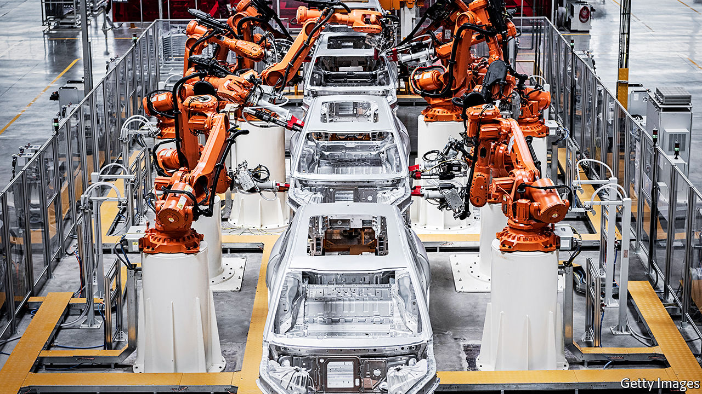

## If you can get it

# Robots may well take your job—eventually

> Or so reckons Daniel Susskind in “A World Without Work”

> Jan 23rd 2020

A World Without Work. By Daniel Susskind. Metropolitan Books; 307 pages; $28. Allen Lane; £20.

INNOVATORS ARE not always welcome. In 1589 William Lee made his way to the English court, hoping to be granted a patent for his invention, a knitting machine. Queen Elizabeth I turned him down: “Consider thou what the invention could do to my poor subjects,” she enjoined. “It would assuredly bring to them ruin by depriving them of employment.”

The fears of Good Queen Bess have echoed down the centuries—from the Luddites, who smashed textile machinery in the early 19th century, to John F. Kennedy, who warned of the dangers of automation during his presidential campaign of 1960. In the 21st century the concerns have switched to robots and artificial intelligence (AI); 30% of American workers believe their jobs are likely to be replaced by robots and computers in their lifetime.

Daniel Susskind has written about this issue before in “The Future of the Professions”, co-authored with his father, Richard. That book focused on the threat posed by machine-learning to doctors, lawyers and the like. His new tome is a much broader look at the economic and social consequences of automation.

In the past the relationship between machine and human labour has been driven by two factors: the substituting effect, which caused people to lose jobs, and the complementing effect, which allowed employees to do their work more productively. The author worries that, in the future, the substituting effect will dominate. Advances in AI have been so rapid that machines will eventually be better than people at most activities, he says, and so will be the “default choice” for performing them. A few highly paid humans will still be employed, but the rest will either struggle to find work or fall into the “precariat”, stuck in jobs that are not just poorly paid but unstable and stressful.

Mr Susskind thinks that this scenario will require a change in political thinking. Part of his answer would be a “conditional basic income”, paid by the government and financed by taxes on the better-off. Rather than being universal, this would come with provisos: recipients would have to make some contribution to society, such as providing social care or teaching children. Given all the superabundant free time, societies will also need a more coherent leisure policy, coaxing people away from their smartphones and televisions.

This gloomy view of the impact of technology is plausible. But so is a more optimistic outlook, as the economist Roger Bootle showed in “The AI Economy: Work, Wealth and Welfare in the Robot Age”, published last year. Mr Bootle argued that AI and robotics would improve productivity and economic growth, and release people from performing the most humdrum tasks. As for employment, there will always be demand for services with the human touch, just as there is an appetite for “artisanal” loaves as well as sliced white bread.

Which of these visions is right? Recent history has not vindicated either the optimists or the pessimists. Employment has surged in both America and Britain, suggesting that technology has not led to widespread labour replacement. On the other hand, growth in productivity has consistently been extremely disappointing, indicating that technology is not yielding the hoped-for increases in prosperity. This record is a shaky basis on which to make forecasts. Mr Susskind wisely hedges his bets, declaring that “in all likelihood, there will be enough work for humans to do for a while yet.” The problem, he says, lies in the long run.

Perhaps. The truth is that, seductive as prognostications like Mr Susskind’s may be, it is impossible to be sure whether the latest advances will in the end have mainly benign or malign economic effects. Books like his are a useful summary of the current debate on an important subject. But they are not crystal balls. ■