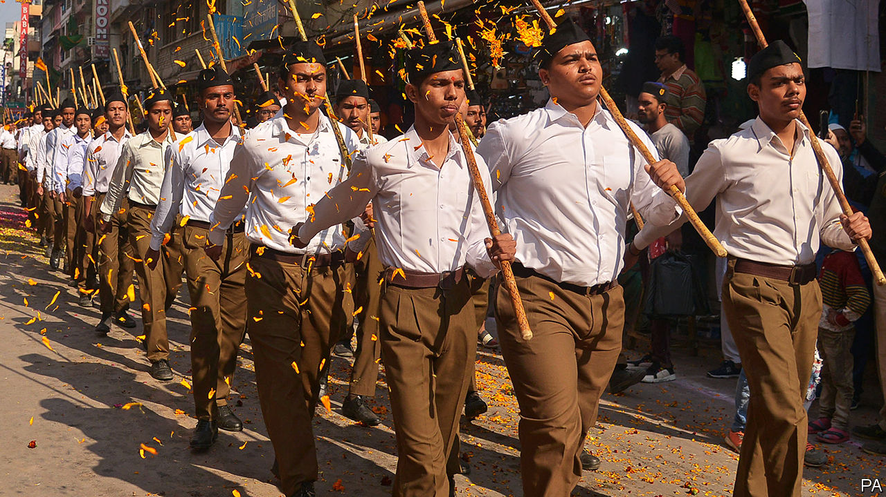
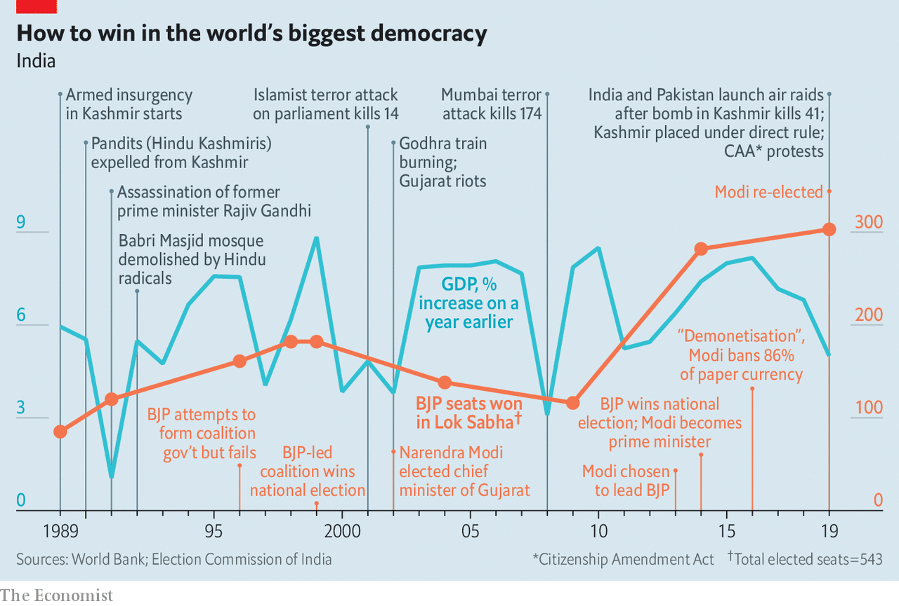
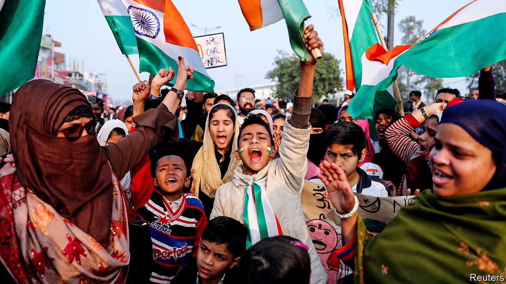

## Protests in India

# Narendra Modi’s sectarianism is eroding India’s secular democracy

> The Indian prime minister has united a broad coalition against him

> Jan 23rd 2020DELHI

AT A FANCY dinner in the Indian capital a newscaster wonders aloud whether India has entered a new and darker era, what he calls a second republic. “More like a Second Reich,” mutters a seasoned politician, staring into his whisky glass. Others nod. One guest disables her phone; someone might be eavesdropping. No one laughs.

Not long ago, such talk would have been derided as churlish. Overbearing and ruthless as the ruling Bharatiya Janata Party (BJP) might sometimes seem, there was no questioning its democratic legitimacy. Narendra Modi, India’s prime minister, won two national elections in 2014 and 2019. And he won them fairly, by outperforming and outsmarting his lacklustre opponents. India’s robust institutions, as well as its sheer size and diversity, also appeared to be adequate brakes against authoritarian rule.

Yet after seven weeks of unrest, sparked by the passage in December of a law that ominously redefines the nature of Indian citizenship, doubts about where the country is heading have grown commonplace. Like the proverbial boiling of a frog, until recently what has been a slow but steady drift—of civil liberties being eroded, democratic institutions weakening and base populist urges being empowered—had met with only sporadic resistance. Now, suddenly, the frog seems to have woken up and found itself in hot water.

India has seen plenty of mass-protest movements; indeed, the republic was created through one. That tradition has continued. In 2011 the cause was corruption, while in 2012 a brutal rape in Delhi prompted a nationwide demand for more protections for women. Today’s protest seems different, and so perhaps more momentous. The initial spark for the unrest was the Citizenship Amendment Act (CAA), a few lines of text added to a law from 1955 that regulates the acquisition of Indian citizenship. But the strength of the movement draws on something more profound. The list of grievances has expanded from questions of citizenship and rising sectarianism to embrace economic woes and deeper questions about the kind of nation India actually is and aspires to be.

For decades after independence in 1947, that last question seemed to have been settled in favour of an “Idea of India” (in the words of Sunil Khilnani, the author of a book thus titled, published in 1997). This is as a secular, broadly inclusive country that draws its strength from diversity. Its constitution of 1950 captured that spirit. So too did citizenship laws that granted rights based not on blood, ethnicity or faith but rather on where people were born.

Even before independence, the Hindu nationalist (or Hindutva) movement posed an alternative vision. This held that India was for people of particular Indic faiths—meaning principally Hindus, but also Buddhists, Jains and Sikhs. After centuries of rule by invading Muslims and then Christians, it was time for “authentic” Indians to reclaim their heritage.

Until the 1980s this was a minority view. But a series of agitations, such as the campaign to destroy a 16th-century mosque in the city of Ayodhya that was allegedly built on top of a temple marking the birthplace of the god Ram, helped spread this Hindutva discontent further.

The BJP, and Mr Modi in particular, have repeatedly won elections by posing as the protectors of Hindus, who are 80% of the population. Mr Modi has burnished his Hindutva credentials. Before entering politics, he was a volunteer in the Rashtriya Swayamsevak Sangh (RSS), a Hindu-nationalist umbrella group with 6m members, some of whom parade in white shirts and wield batons on ceremonial occasions (see picture above). Shortly after Mr Modi became the chief minister of his home state of Gujarat, in 2001, violence erupted there. Possibly 2,000 people, mostly Muslim, were killed. Mr Modi’s role during this period led him to be denied access to America; it was also the Hindu nationalist springboard from which he leapt to national office in 2014.

In his first term as prime minister Mr Modi was careful not to project an explicitly Hindutva agenda. His sunny campaign slogan was “all together, development for all”. But there were subtle changes, such as the systematic replacement across government services of the old “Idea of India” guard with proponents of a Hindu Rashtra, or state. The government was slow to condemn a spate of murders committed by Hindu vigilantes claiming to be acting to protect cows from suspected Muslim butchers. Even so, the harder core of Hindutva believers often expressed dissatisfaction with “their” men in power, displeased that the government shied away from putting more muscle behind issues such as crushing separatist sentiment among Muslims in Kashmir.

Having secured an even bigger electoral victory in May 2019, Mr Modi has now taken his gloves off. Despite facing a rapidly slowing economy (see [article](https://www.economist.com//finance-and-economics/2020/01/23/indias-economy-risks-swapping-stagnation-for-stagflation)), his government has used its whopping parliamentary majority to pursue a Hindutva social agenda. In July it criminalised a form of instant divorce still practised by Indian Muslims. This was a welcome social reform; indeed, the practice has long been banned in most Muslim countries. But it was enacted with minimal consultation, breaching India’s tradition of granting each religion some control over family matters.

In August Mr Modi annulled the statehood of Jammu & Kashmir, part of a region long disputed over by India, Pakistan and China. The constitution gave the state special status, with its own constitution, flag and degree of autonomy. Now, it is split in two, and both parts of the state have been placed under direct rule. The 7.5m inhabitants of the Kashmir valley—nearly all of them Muslim—are under watch by 600,000 soldiers, who infuriate them with a range of shifting restrictions, such as curfews and roadblocks. Police also rounded up hundreds of potential troublemakers, among them local politicians, and severed mobile phone and internet services. These services have been partly restored, but the region remains isolated and many Kashmiris are fearful. Relative peace was only restored to the valley in the last decade, ending 20 years of violence in which between 40,000 and 70,000 people died.

Then in November a long-delayed ruling from India’s Supreme Court asserted the right of Hindus to take over the contested site at Ayodhya. This was not unexpected, and was even welcomed by many Muslims who wanted an end to the tiresome issue. But the ruling involved such a glaring legal sleight of hand that it marked another shift away from equality between India’s faiths.

All this might have passed without much protest. But Mr Modi’s government appears to have gone too far in its attempts to combat what it terms illegal immigration. This has long been a hobbyhorse for BJP leaders. They have repeatedly claimed that tens of millions of “infiltrators” have sneaked into India from neighbouring countries, despite there being little recent evidence of this. (Indeed, India’s own censuses reveal a steady decline in the foreign-born population, from 6.2m in 2001 to an estimated 5.1m in 2019.)

In the north-eastern state of Assam, where immigration has been a particularly divisive issue, chauvinist demagogues had for years outbid each other, claiming that anything from 5m to 8m intruders, mostly Muslim, had invaded from neighbouring Bangladesh. But when the state actually completed a costly count of its 33m people in August, only 1.9m of its inhabitants had failed to provide sufficient documents. Most of these “foreigners”—who can still contest their status at special tribunals—turned out to be Hindu.

This did not deter Mr Modi. His government has proposed a two-pronged approach to deal with immigration. First is a loophole allowing some long-term immigrants to naturalise as Indians through the CAA, which came into force on December 12th. Second, Mr Modi wants to impose a nationwide version of Assam’s count that would force all of India’s 1.3bn people to produce evidence of their citizenship.

To Muslims, many of whom are India’s poorest and most marginalised, the government’s plans are alarming. The CAA bill grants adherents of particular religions a path to speedier naturalisation, but glaringly omits Muslims from the list. Those who could not produce birth certificates or decades-old ration or voting cards would be declared foreigners, and then be denied a path to citizenship. A government survey in 2016 gives some idea of the difficulty of the task: 40% of Muslim children had no birth certificate (around the same proportion of Hindu children under five also did not have one). The measures could also change the way in which Muslims are regarded, from being equal citizens to second-class ones.

The first protests erupted shortly after the passage of the CAA. Angry crowds appeared at historically Muslim universities and in Muslim quarters of cities such as Delhi, Lucknow, Kanpur and Meerut. They were met with swift and brutal force, led by police but in some cases including “concerned citizens”. Some 27 people died, nearly all of them young, male and Muslim. Many of those released from detention, including children, claim they were beaten and starved.

Such an excessive response shifted public sympathy in favour of the protesters. It received a further boost when, on January 5th, dozens of thugs associated with Hindutva youth groups mounted a night-time raid on Jawaharlal Nehru University in Delhi, an institution that BJP leaders have long targeted as a supposed bastion of “anti-national” thought. This time the victims were not Muslims, but angry middle-class Hindus.

In Delhi not a day now goes by without a protest. Some involve the usual suspects: university students, leftist unions or Muslim slum-dwellers. But the anger can also be glimpsed in more ordinary folk. Several hundred women in a working-class neighbourhood of Delhi have camped out day and night for more than a month through extreme cold and choking smog. They are blocking one of the city’s main bridges, refusing to budge until the government scraps the CAA. Protests in Hyderabad and Mangalore have drawn crowds of 100,000 or more. In the southern state of Kerala, fishermen staged a floating demonstration. Following initial incidents of vandalism and violence—which were notably worse in states ruled by the BJP—the protests have generally been peaceful.

Mr Modi initially responded to the outcry by trying to insinuate that the protesters were merely Muslims; you could “recognise them by their clothes”. But the demonstrators have defied easy categorisation by adopting the Indian flag, national anthem and constitution as their symbols.

The protests have also energised other opponents of the Hindutva project. Non-BJP state governments have felt emboldened not just to voice support for the protests but formally to challenge the BJP. Eleven of India’s 28 chief ministers have told Mr Modi they will not apply his citizenship rules in their states. The states of Punjab and Kerala have added their own petition to more than 60 other constitutional challenges to the CAA that have landed before the Supreme Court. Led by Congress, 20 opposition parties have issued a joint demand to suspend the law.

On previous occasions when his will has been challenged, Mr Modi has tended to backtrack. During his first term he abruptly scrapped plans to reform labour laws for fear of irking workers. This time Mr Modi appears less malleable. His government now pretends that, despite the repeated public pledges from top ministers to pursue first the CAA and then a national tally, it never really did intend to do the counting part. The line is that the policy has been “misunderstood”. Yet the government has not explained why its budget in July included initial costs for mounting a count of citizens, nor why it ordered all states to build detention centres for a surge in “foreigners”, with walls three metres (10ft) high and topped with barbed wire.

And even as Mr Modi has backed away from pursuing the controversial national register of citizens, he has doubled down on the CAA. His home minister, Amit Shah, has vowed not to give an inch on the citizenship rules. Instead, the BJP has mobilised the formidable party and government propaganda machines to push their message. The offensive is likely to prove effective among Mr Modi’s base. “There are an awful lot of Hindus, I’d guess 40%, who basically dislike Muslims and have no problem at all with this government’s approach,” says an American political scientist of Indian origin, who prefers anonymity (a subclause of the CAA allows the government to strip émigrés of their Overseas Citizen of India status).

Yet even if Mr Modi and Mr Shah do get their way, and if India’s Supreme Court overlooks the plainly contentious aspects of the CAA, the costs of the citizenship row to Mr Modi and his country are high. From a financial perspective, the outlays would be prohibitive even if India’s economy had not slowed in the past year to its lowest level of growth in four decades. In Assam compiling the citizens’ register took many years, employed 52,000 people and cost the government close to $200m. Given that Assam is home to less than 3% of India’s population, stretching this exercise nationwide would be very costly.

A big diplomatic cost looms, too. In December Mr Modi was forced to cancel a summit with Abe Shinzo, his Japanese counterpart, owing to unrest in Assam, where they were scheduled to meet. So too has the government of Bangladesh, one of India’s closest allies, cancelled three ministerial visits to signal displeasure at the repeated implication that millions of “intruders”—Mr Shah has called them “termites”—might be dumped on its borders. (Nearly 1m Rohingya Muslims, fleeing pogroms in Myanmar, live in refugee camps in Cox’s Bazar, a Bangladeshi coastal town.) Ramachandra Guha, a historian, finds all this puzzling, considering the energy Mr Modi has exerted to burnish his image abroad. “All that effort has now come to naught,” he says.

Such recklessness could be just a matter of ideology; Mr Modi could indeed be pursuing an agenda to undermine secularism and turn Muslims into second-class citizens. Others ascribe his moves to hubris. Mr Modi and Mr Shah have shared unchallenged power for so long it has “curtailed their ability to tolerate dissent...and accommodate different opinions”, according to Amit Ahuja and Rajkamal Singh of the University of California.

More likely, the citizenship row is chiefly political. The BJP has repeatedly and successfully bet on sectarian issues. Many point to a looming electoral battle in West Bengal, a big state with a large Muslim population, where the BJP has made steady inroads. Its tactics there have been blunt: in a recent speech the local BJP head asserted that there were 10m “Muslim infiltrators” in the state, and that other states ruled by the BJP had done the right thing to quell protests by “shooting these people like dogs”. It is said that Mr Shah is so obsessed with winning West Bengal in 2021 that the Gujarati is learning to speak Bengali.

With 56% of seats in the lower house of parliament, and enough allies to command the upper one, Mr Modi could have used his second term to pass badly needed reforms to make it easier to build homes, lay roads or create jobs in India. But six years in power appear to have made him stubborn. Many people have underestimated the grit and political acumen of the former tea-seller from Gujarat. Even so, he has now created a broad coalition against him. ■

## URL

https://www.economist.com/briefing/2020/01/23/narendra-modis-sectarianism-is-eroding-indias-secular-democracy
