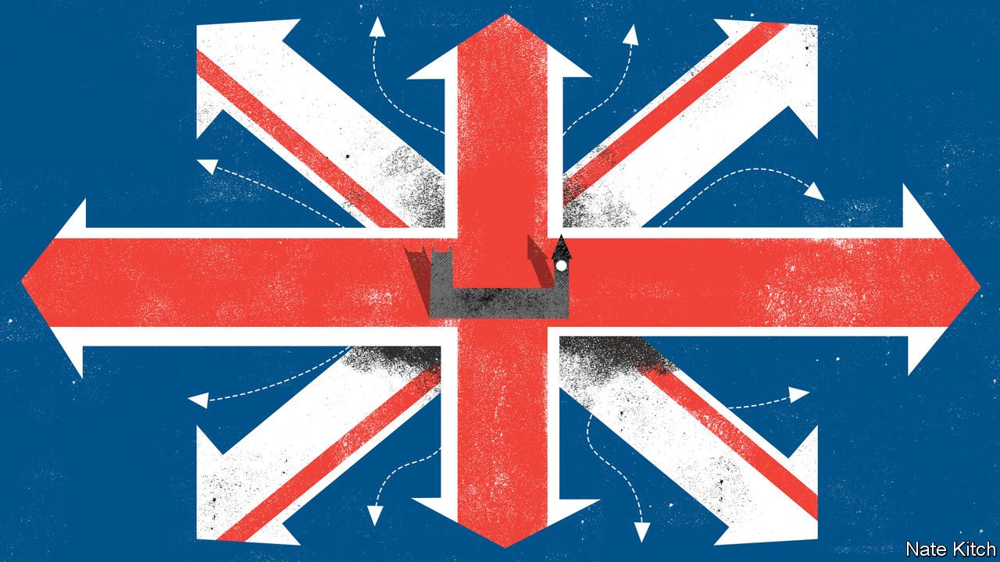

## Bagehot

# Brexit and the politics of somewhere

> The new crop of Tory MPs have deep roots in their constituencies. That’s going to make a difference

> Jan 23rd 2020

MATT RIDLEY has many roles in life. As the author of popular science books (and former science editor of The Economist) he is a bestselling writer on genetics and evolution. As political pugilist he is one of the most articulate supporters of Brexit. As the Fifth Viscount Ridley he is a pillar of the House of Lords. He now has yet another role—as a guide for newbies to the Palace of Westminster with its winding corridors and arcane practices. The general election in December saw large numbers of Tories elected to the House of Commons from constituencies such as Blyth Valley, next door to Lord Ridley’s Blagdon estate, that have voted Labour for generations: men and women who speak with northern accents (they’re “branded on the tongue” in George Orwell’s phrase) and who never really expected to end up in the House of Commons. The viscount’s class does not make him the obvious man to show newcomers the ropes, but his geographical origins do.

Place used to be central to British politics. Lords took their names from towns or counties. MPs represented particular constituencies rather than getting allocated seats from party lists as is often the case on the continent. The bulk of MPs never really looked beyond their constituencies at high office: ex-miners were content to represent the people of Blyth for the Labour Party just as retired brigadiers were content to represent the people of East Hampshire. But during the Blair-Cameron era place became less important as a caste of professional politicians took over the House of Commons.

These politicians had more in common with each other than they did with the people of Blyth or East Hampshire. They went to the same universities (usually Oxford) where they read the same subjects. They got their first jobs in think-tanks or parliamentary offices. They were parachuted into safe seats in their late 20s (no need for an old hand to show them around the House of Commons!). They quickly gained high office, and if they encountered a hiccup in their career they stayed in London to make money as consultants or else eloped to the United States in search of global fame. David Miliband and Nick Clegg, two archetypical examples of the species, now live in New York and California respectively.

Now place is regaining its importance in British politics. Dean Godson, the boss of Policy Exchange, a right-of-centre think-tank, says that “somewhereisation” is one of the great trends of our time. He points to a prescient book published a couple of years ago, “The Road to Somewhere”, by David Goodhart. The book argued that voters can be divided into “anywheres” who possess portable skills and subscribe to cosmopolitan values and “somewheres” who have deep local roots and embrace more than traditional values; the Brexit result was just one in a series of rebellions by the “somewheres” against a class of “anywheres” who had grown more and more ambitious over the previous decades.

The new Conservative MPs who now make up 30% of the parliamentary party are the latest evidence of the rise of the “somewheres”. Lee Anderson (Ashfield) is a former miner who took part in the strikes of the 1980s. Dehenna Davison (Bishop Auckland) lost her father at 13 when he was punched to death. Jacob Young (Redcar) worked in the chemicals industry, as his father and grandfather did. Ian Levy, the MP for Blyth Valley, is a former mental-health-care worker who surprised everybody, including himself, by overcoming an 8,000 Labour majority.

The big question is how deep this goes. James Frayne, a long-standing advocate of the “provincial tilt” and author of a column on Conservative Home, a website, subtitled “Far from Notting Hill”, worries that the party’s recent advance might have been the result of a confluence of circumstances (Brexit and Corbyn) rather than a sea-change. The upper echelons of the Conservative Party still speak with a strong southern accent. Boris Johnson—born in New York, brought up in Brussels, trained in the duplicitous arts of political journalism—is an “anywhere”.

But the “somewhere” wing is now in the driving seat. Dominic Cummings, Mr Johnson’s chief of staff, was brought up in Durham and put down roots in regional politics running Business for Sterling and campaigning against a North-East Regional Assembly. The Downing Street policy unit is populated by advocates of the “politics of place” such as Oldham-born Munira Mirza and Sheffield-born Liam Booth-Smith. Neil O’Brien, MP for Harborough, points out that in 2017 the party’s geographical centre of gravity was in leafy Buckinghamshire. Now it is in the “wild and windy moors on the edge of Sheffield”. The Tories cannot hold onto its new northern seats without making big changes.

Ideas are being flung around. Most are still without substance—move the House of Lords to York!—but some changes are rooted in reality. The party is planning to move some of its functions out of London. New MPs who were carried into Westminster on the 2019 wave are building local constituency operations. Activists are creating new organisations such as Young Blue Northerners. Policies are being reoriented to appeal to provincial Britain. Under David Cameron and George Osborne the Northern Powerhouse, a scheme to boost economic growth in the north of England, was largely about linking cities into the global economy. Under Mr Johnson it is much more about making poorer people more economically secure (hence the emphasis on police and the NHS) and dealing with the decline of provincial towns.

The shock that Brexit is administering to Britain is likely to do the place plenty of harm, but it may do it some good, too. The political class had come to see its job as representing the state to the people rather than the people to the state. It had also come to resemble a cloistered elite that knew more about New York than old York. Britain is engaged in a process of self-correction. The political system is being reattached to the people it represents. In the process the social contract, which has been frayed almost to breaking-point in recent years, may slowly be repaired. ■

## URL

https://www.economist.com/britain/2020/01/23/brexit-and-the-politics-of-somewhere
