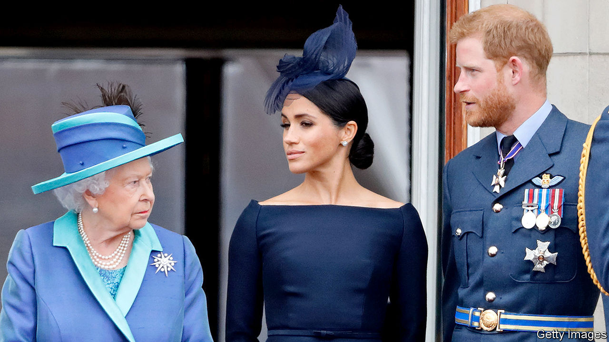

## Losing the title

# The remarkable similarities between Queen Elizabeth and Alex Ferguson

> Two innovative managers who are willing to take tough decisions

> Jan 25th 2020

THE PARALLELS between a royal family and a football squad are not exact—footballers tend to be more disciplined and better trained than royals—but monarchs and football managers are both in charge of small groups of unusual individuals who are constantly in the public eye. Missteps by one mean disaster for all. So it is not surprising that similarities are emerging between the queen and English football’s most successful manager, Manchester United’s Sir Alex Ferguson.

Both royal and football squads have to be refreshed to keep the fans happy, and Ferguson and Windsor have both shown the ability to nurture young talent to maturity (David Beckham and Ryan Giggs; William and Harry) and to bring in outsiders (Wayne Rooney and Eric Cantona; Kate and Meghan). But new hires do not always work out, and great managers have to be willing to sacrifice talented individuals in the interests of the team. Just as Ferguson sacked Beckham when his ego and his endorsements got in the way of his football, so the queen has dealt ruthlessly with Harry and Meghan. They wanted to be able to stay half in the family, doing some royal work while exploiting their titles for their private interest; and, as the most popular of the royals, they might reasonably have expected that Windsor would accede to their demands. Instead, they have been put on the transfer list, and will lose their royal titles. Like Beckham, they will be relegated to North America.

Neither Windsor nor Ferguson have tolerated incompetence. Just as Massimo Taibi, an Italian goalkeeper, was out in less than a year after a series of gaffes, so Prince Andrew was dropped from the royal squad after his disastrous interview on his relationship with Jeffrey Epstein, a sex abuser. The palace’s announcement that he would be withdrawing from royal duties is more lenient than the treatment that might have been meted out in previous ages, when royals lost their heads rather than their jobs. Still, firing one’s favourite son shows a certain steeliness.

Although Windsor, with 68 years in the job, has surpassed Ferguson, his 27 in post made him the longest-serving manager at the top of British football. Both managers’ long reigns have conferred a degree of stability from which their organisations have benefited. Ferguson’s many years in power enabled him to assert an iron grip, since there was no hope of unhappy players ousting him; Windsor’s long stint in the job—she has taken the titles of Britain’s longest-ever reigning monarch, longest-lived British monarch and longest-reigning queen of all time—enabled her to ease her country through a long period of relative decline.

Monarchies, like football clubs, outlive their incumbents. Since Ferguson stepped down, United have struggled. Manager after manager has failed in his shadow. Windsor’s many fans must hope the similarities do not extend that far.