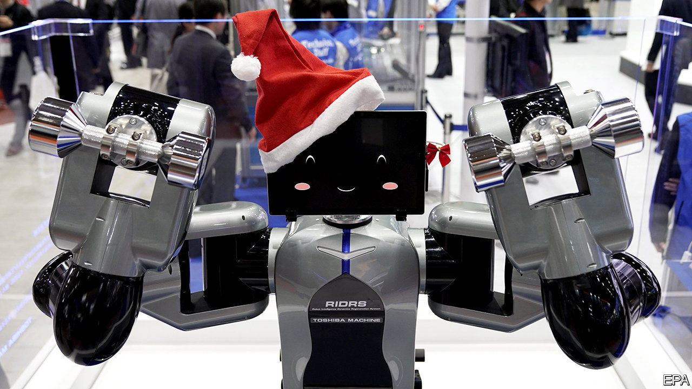
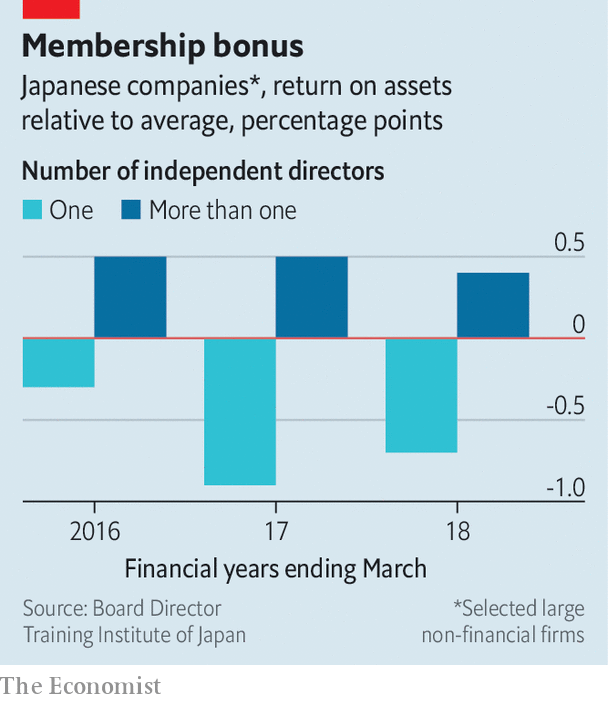

## Cross about cross-shareholdings

# A clan of activist investors takes on Japan Inc

> More Japanese shareholders are growing restless

> Jan 23rd 2020TOKYO

MURAKAMI YOSHIAKI, activist investor and scourge of Japanese boardrooms, knows how to rattle cages. On January 21st his family launched a hostile bid for Toshiba Machine, a maker of industrial robots. The company’s threat to block the takeover by issuing shares should alarm anyone who cares about how Japanese firms are run, says Mr Murakami’s daughter, Aya, who runs one of the family funds.

The Murakamis want Toshiba Machine either to deploy its roughly ¥50bn ($456m) in reserves more productively or to return more to owners. Shareholders support the bid, she claims, but are being ignored. “If this is allowed to go ahead, what is the point of shareholders?” she fumes.

Her clan’s wider aim, says Ms Murakami, is to get Japanese boardrooms to operate more openly. On that score Japan Inc has seen progress since a corporate-governance code was introduced in 2015, says Oguchi Toshiaki of Governance for Owners Japan, which represents shareholders. The share of big listed firms with two or more external directors has tripled in five years to over 90%.

That is welcome. But outsiders on boards are useful only if they are truly independent, says Nicholas Benes, who helped draft the new code. With four outside directors, Toshiba (which owns about 3% of Toshiba Machine) was considered a model of good governance until it was hit by an accounting scandal in 2015. Nissan’s board, which also looked diverse, failed to rein in the carmaker’s imperious boss, Carlos Ghosn, for years before turning on him.

For oversight actually to benefit shareholders, it must be more than token, according to a new study by Mr Benes of listed non-financial firms’ performance between 2014 and 2018. He found, among other things, that Japanese companies which created nominating committees for directors and then allowed them to appoint independent outsiders outperformed rivals which did neither.

By contrast, firms with big “allegiant” shareholdings—large stakes held by other firms which help protect against unwanted takeovers but also insulate management from the remaining shareholders—did relatively poorly. Every 1% of allegiant stakes was linked to a 0.12-percentage-point drop in the return on invested capital. That is a problem for investors in Japan. Hundreds of companies on the Tokyo Stock Exchange own allegiant stakes in each other. The total market value of such cross-shareholdings in non-financial blue chips is roughly ¥31trn, reckons Mr Benes—big enough to weigh on overall stockmarket returns.

These peculiar listed subsidiaries, a unique feature of Japanese capitalism, are under less pressure to reinvest profits or hand them back to shareholders because those who wield ultimate control care more about maintaining it than about returns. Japanese companies’ cash piles exceeded ¥446trn last year, even after they had bought back a record ¥6.5trn in shares the year before. Firms’ reluctance to part with cash shortchanges investors in Japan by ¥16trn a year, according to one estimate. The Murakamis are unlikely to be the last to grow restless. ■