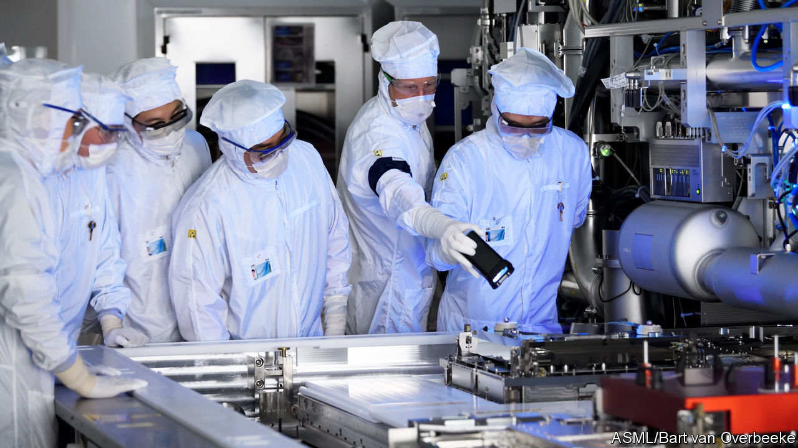
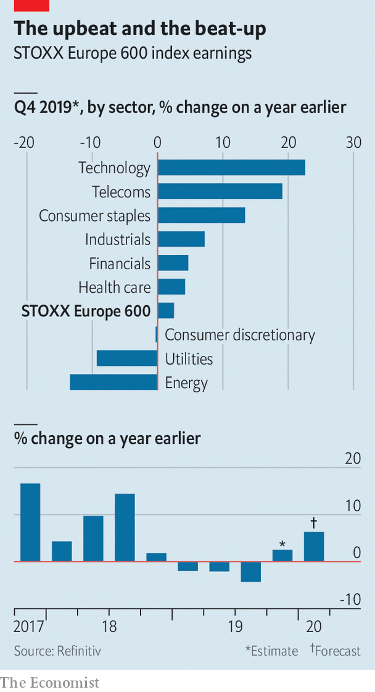

## Techno-charged

# Europe’s earnings recession may be at an end

> Thank its also-ran technology companies

> Jan 25th 2020

LAST YEAR was one for corporate Europe to forget. Although the continent was not in recession, its firms were—at least in terms of profits. The STOXX Europe 600 index of biggest European companies suffered three consecutive quarters of falling earnings. From July to September these declined by 4.3% year on year. As Europe SA reports results for the decade’s final quarter in the coming weeks, analysts expect a modest earnings bounce of 2.5%.

Much of this is down to technology companies, which are on a tear even as some other sectors look sickly (see chart). Their profits are estimated to have shot up by 23%. ASML, a Dutch company, has reported a 44% jump in earnings, thanks to soaring demand for its specialised chipmaking equipment.

European tech still pales next to America’s titans. At a combined market value of $5.3trn, Apple, Microsoft, Google, Amazon and Facebook are worth as much as Europe’s 40 biggest firms put together. Tech makes up a third of the S&P 500 but only 6% of the STOXX Europe 600. As the likes of ASML keep outperforming the rest of Europe, at least that share will grow.

## URL

https://www.economist.com/business/2020/01/25/europes-earnings-recession-may-be-at-an-end
