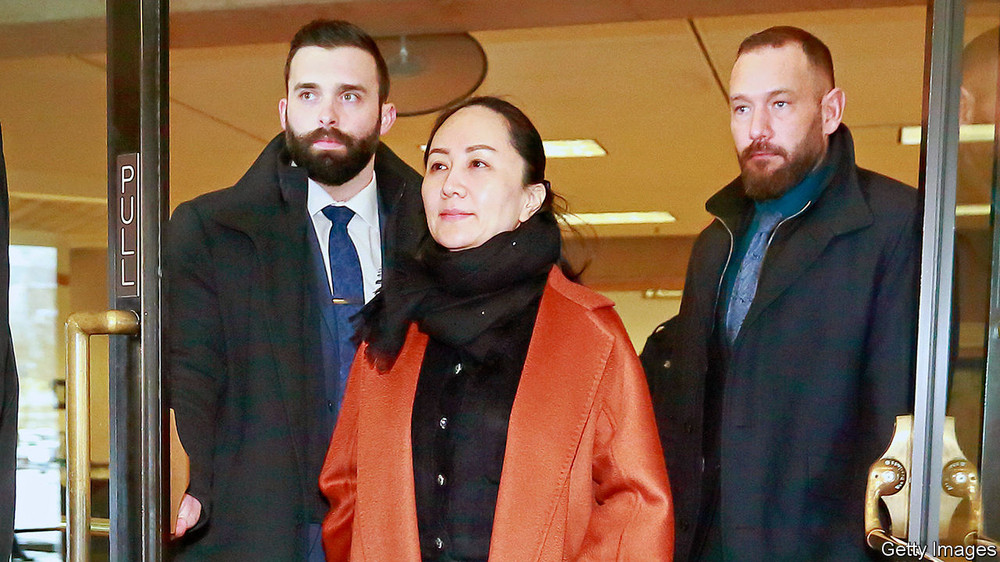

## Coming to America?

# Huawei finance chief’s extradition hearings begin

> The broader meaning of Meng Wanzhou’s case for China’s telecoms giant

> Jan 23rd 2020VANCOUVER

MENG WANZHOU sat quietly as her lawyer unpicked the finer points of Canadian law in a subterranean Vancouver courtroom. Ms Meng (pictured) was not on trial. But the decision in front of the judge will be momentous nonetheless. She is the chief financial officer of Huawei, a Chinese telecoms giant, and the daughter of its founder, Ren Zhengfei. The court must decide whether to grant an American request to extradite Ms Meng to face charges of fraud and sanctions-busting.

Hearings in the case began on January 20th. Proceedings will drag on for months—maybe years, if either side appeals all the way to Canada’s Supreme Court. Ms Meng’s lawyers claim that America’s request is politically motivated and so illegitimate, pointing to President Donald Trump’s hints that he might push for charges to be dropped as part of a trade deal with China. Moreover, they say, the manner of her detention at Vancouver airport in December 2018 was unlawful.

For Huawei it all means more uncertainty at an uncertain time. In May the Trump administration barred American suppliers from selling the company chips and other components made in or shipped from America. So far Huawei has withstood the campaign against it. It is a big customer for American firms, which have found ways around the sanctions. Its decent but cheap kit appeals to buyers in rich and poor countries alike. Revenues last year grew 1.5 percentage points slower than in 2018. But at 850bn yuan ($122bn) they were still 18% higher than the year before.

Tighter American export controls are in the works, however, and Ms Meng’s case looks central to them. The sanctions-busting of which she stands accused was America’s main stated reason for putting the firm on its blacklist in the first place. Resolving the extradition tussle may thus bear on Huawei’s broader prospects. There is precedent. Having blacklisted a smaller Chinese tech firm, ZTE, in 2016 for violating sanctions against Iran and North Korea, America’s Commerce Department relented after the company vowed to stop shipping to those regimes and paid a fine.

The Huawei hurly-burly is messier than ZTE’s predicament was. American security hawks worry about Chinese eavesdropping on Western networks. Some see Huawei as a strategic threat to America’s global technological dominance. Legal rights and wrongs aside, if Ms Meng were extradited—and if she and Huawei subsequently settled with American authorities as ZTE did—both parties would gain a face-saving way out of a stand-off that risks hurting Chinese and American companies alike. ■