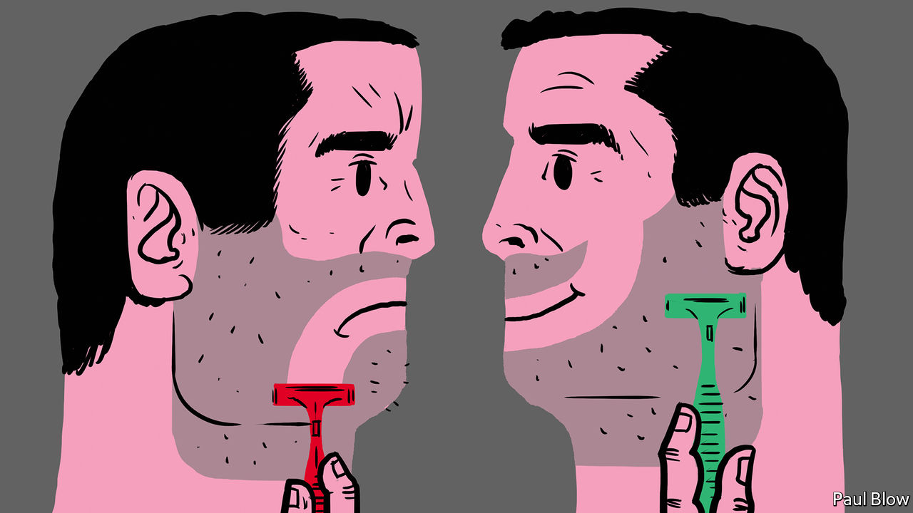
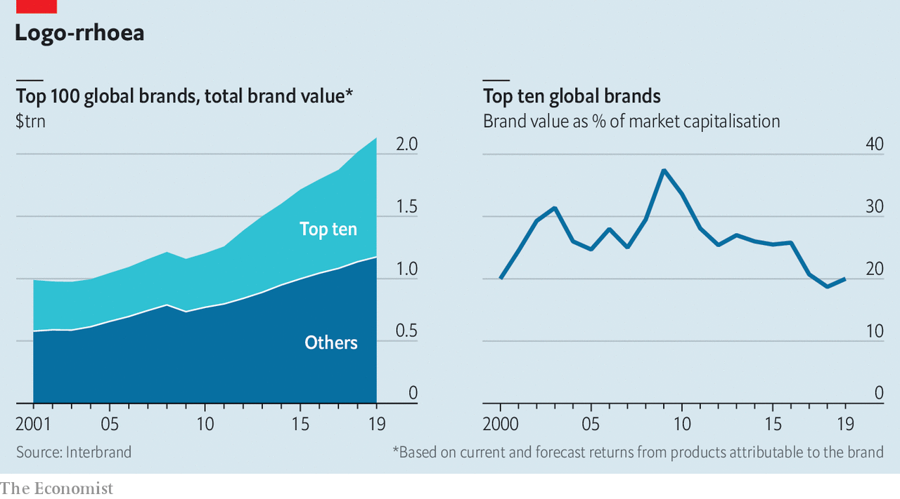

## A brand new world

# It has never been easier to launch a new brand

> It may be getting harder to build a world-beating one

> Jan 23rd 2020NEW YORK

AROUND 2013 Jeff Raider and Andy Katz-Mayfield spotted a gap in the market. Many men, they noted, were fed up with overpriced shavers overendowed with blades. Technology and globalised commerce allowed them to find a cheap supplier of decent-quality razors, outsource back-office work, advertise their wares on social media for a song, and sell them directly to consumers on the internet thanks to merchant platforms like Shopify and payment processors such as Stripe. In six years their firm, Harry’s, has carved out 4.3% of America’s $2.2bn men’s razor market from the likes of Gillette, whose share has fallen from 73% to 53% since 2009, according to Euromonitor International, a market-research firm.

Such success stories give bosses of consumer-facing multinationals in America and beyond the heebie-jeebies. Last year Procter & Gamble (P&G) admitted Gillette was perhaps not the best it could get by taking an $8bn write-down on the brand, which it bought in 2005 for $57bn. From industry to industry insurgent labels seem to be eating incumbents’ lunch. Chobani, a 15-year-old company, sells one in five American yoghurts. Halo Top, a low-calorie ice cream created in 2012, was the top selling ice-cream pint in America five years later, ahead of Häagen-Dazs and Ben & Jerry’s. Rodan + Fields, relaunched from obscurity in 2008, has been America’s top-selling skincare brand for three years running. An average of 19,000 new non-food products entered the American market annually in the ten years to 2015, up from 11,000 a year in the previous decade and 3,500 in the one before that. According to the Boston Consulting Group and IRI, a research firm, between 2013 and 2018 extra-small, small and retailers’ private-label brands picked up some $20bn of sales from big rivals.

The challengers’ success is in large part the result of successful branding. Brands used to signify provenance and consistent quality, helping businesses build trust—and charge a premium for trustworthiness while encouraging repeat custom. Though not quite identical, many rival products today look pretty similar. What differs is the story told about them. And spinning a yarn is considerably simpler than dreaming up an innovative product. Corporate owners of household names from Adidas to Zara are understandably worried. Yet even though launching a new brand has never been easier, building a big global one may, in fact, be getting harder. The upstarts’ rapid conquest of market share is real. But so are the incumbents’ structural advantages.

Start with the insurgents. Messrs Raider and Katz-Mayfield approached Mythology, a brand agency in NoHo, a hip district of Manhattan, for help with crafting their narrative. It gave them the name, the logo, the original packaging and the voice, says Anthony Sperduti, Mythology’s boss, adding that “obviously, this is collaborative”. As a result, Harry’s doesn’t just sell razors. It sells simplicity (subscribe online and get blades delivered) and good vibes (the company donates 1% of revenue to men’s mental-health charities). Perhaps Mythology’s most important insight was that “for people to believe in Harry’s, they have to believe in us, personally, as founders,” says Mr Raider. Harry’s first ad revolved around him and his partner.

Manufacturing authenticity for upstart brands has become a thriving cottage industry in New York. In Chinatown, a short walk from Mythology’s offices, an agency called Gin Lane worked with Sweetgreen, a trendy salad chain, and Everlane, a clothing-maker that promises “radical transparency”, as well as with Harry’s. Across the East River in Brooklyn, Red Antler has dozens of startup clients including Casper, a mattress firm, Allbirds, which makes popular (if ungainly) trainers, and Brandless, an online corner shop whose brand is apparently all to do with not being a brand.

Mr Sperduti says he gets 100 pitches a month, of which his firm chooses maybe two. J.B. Osborne, Red Antler’s boss, says he accepts perhaps four out of a potential 150 clients every month. Startups see their services as so crucial that they are happy to part with equity in exchange. Pattern Brands, as Gin Lane has rebranded itself, creates its own labels. Its first, Equal Parts, was launched in August and sells cooking implements “to help people find a sense of comfort and intuition in the kitchen”. It will, naturally, give 1% of revenues to local community organisations.

Consumers increasingly care about such “brand purpose”. To demonstrate theirs, many challenger firms, like Equal Parts, donate a percentage of revenue to good causes. Warby Parker, a spectacles-maker, gives products away to poor people. Others minimise their carbon footprint or buy only from local sources. At the turn of the century brands were under attack from activists and polemicists. Today brands have become activists and polemicists. Then, Naomi Klein preached the gospel of “No Logo”. Now you can buy a “No Logo” fixie bike (they take AmEx).

A survey by Edelman, a public-relations and marketing firm, found that two-thirds of respondents in eight countries, including America, Britain, China and India, make buying decisions based on a brand’s stand on social issues. More than half said they believed brands can do more to solve social ills than governments, which are often seen as dysfunctional. A separate study by Cone Communications, another PR firm, found that three-quarters of Americans would abandon brands with which they disagreed on divisive subjects like immigration, gun control and gay rights.

Both purpose and authenticity are easier to confect for young brands unladen with historical baggage of polluting the environment or mistreating workers. They present a challenge for big, established companies striving for universal appeal. For big firms, purpose-based messaging is not about raising sales but maintaining them, says Jill Avery of Harvard Business School. “You are trying to remain relevant.”

This still involves selling a lifestyle—except with fewer cowboy hats and more conscientiousness. “Brands without a purpose will have no long-term future with Unilever,” intoned Alan Jope, the newish boss of the consumer-goods multinational (which owns Dove soap, Lipton tea and Ben & Jerry’s, among other household names) last year. Mr Jope has also cautioned against woke-washing, which plugged-in consumers immediately detect. In 2017 Pepsi had to retract a commercial which depicted a rose-tinted version of a Black Lives Matter protest against racial injustice almost as soon as it aired.

To be effective, virtue-signalling must be seen to carry a cost. Some traditional brands seem to grasp this better than others. Part of the $15 an hour that Walmart pays its average store hand could be considered marketing dollars. Likewise for the $30m or so that EasyJet spends a year to offset its carbon emissions. In 2018 Delta, another airline, and Hertz car-rental, among others, revoked discounts for members of America’s National Rifle Association after a gruesome school shooting in Florida, risking a boycott from millions of gun-lovers.

Big brands have other ways to deal with modern branding dilemmas. One is to be clear-headed about their customer base (see Schumpeter). Nike’s recruitment of Colin Kaepernick, a mixed-race American athlete who lost his job after protesting against racism, was seen as a high-risk, high-reward move because old white conservatives wear sneakers, too. But likely Nike buyers skew young and non-white—and so anti-racist and pro-Kaepernick.

Another tactic is to snap up fresh-faced rivals and let them do the hard work of being authentic. Last year Edgewell, which makes Schick blades in America and Wilkinson Sword in Britain, acquired Harry’s for $1.4bn, citing its “best-in-class brand building”—and put Messrs Raider and Katz-Mayfield in charge of its floundering American operations. Unilever bought Dollar Shave Club, a rival to Harry’s, for $1bn in 2016. Homely craft brews like Camden Town Brewery and Goose Island now belong to Anheuser-Busch InBev, the world’s biggest beer producer.

In a new spin on private labels, some multinationals are themselves creating brands that appear independent (and sometimes operate independently). Amazon has well over a dozen, such as Goodthreads (clothing) and Solimo (household essentials). Walmart has Allswell, a mattress company in the vein of Casper, but sells it on an Allswell-branded website, not in its own supercentres.

Working against upstarts are big brands’ deep pockets, which perpetuate their dominance of traditional advertising and sales channels. Social media can be a boon for startups too skint to run adverts on broadcast television or billboards. But an over-reliance on unpredictable online influencers can be a problem. This month, in a prospectus ahead of a planned initial public offering, Casper listed its “use of social media and influencers” as a risk factor that “may materially and adversely affect our reputation”. And some 85% of America’s $3.7trn retail spending happens offline. P&G’s chief executive, David Taylor, has admitted that fast growth does not necessarily equal quick profits at upstarts his firms has bought, like Native Deodorant. Especially in fast-moving goods, making money still often means putting products in front of shoppers on supermarket shelves. P&G sells Native at Walmart and Walgreens. Harry’s has been on sale at Target since 2016.

The newest brands can also find it hard to stand out. Mr Sperduti admits that parts of the purpose-driven strategy employed by Harry’s in 2013, such as donations, have grown tired. Plus consumers are becoming exhausted by the onslaught of labels.

At the same time, the world’s biggest brands seem to be getting stickier. Of the 100 most valuable global ones in 2001, as ranked by Interbrand, a consultancy, 37 had fallen off the list by 2010. Of the top 100 in 2010, only 24 were not there in 2019. Once established, big brands can get away with a lot. Despite its myriad image problems, Facebook remains 14th on Interbrand’s list. The financial crisis of 2007-09 notwithstanding, the bulge-bracket cachet of JPMorgan Chase (25th), Goldman Sachs (53rd) and Morgan Stanley (69th) persists.

Owners of the world’s best-loved brands have one last reason for cautious optimism as they fend off insurgent rivals. Labels and logos may matter less than they did—at least in investors’ eyes. In 2008-10 the value of the top ten brands (measured by the current and forecast revenues from products attributable to the brand rather than factors like price) equalled roughly a third of their owners’ market capitalisation. Since 2017 the figure has been closer to a fifth (see chart). Since 2017 GE has destroyed 60% of its shareholder value but only 40% of its brand equity. In 2000 Coca-Cola’s brand, number one at the time, was worth more than half its market capitalisation. Last year Apple’s brand, the current top dog, was valued at $234bn, a mere quarter of the value of its shares.

Such findings could reflect problems with brand valuation, which is more art than science. But they hint that, even in the era of intangible assets, shareholders may prize size and market dominance over the nebulous allure of labels. Insurgent brands can help keep incumbents on their toes. Cutting the ground from under the giants’ feet is another matter.■