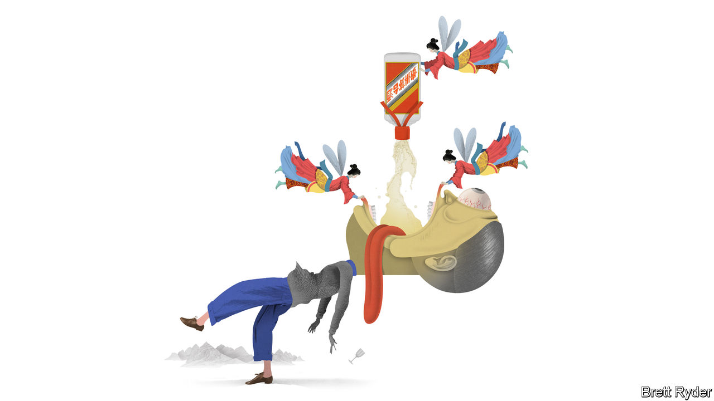

## Schumpeter

# Moutai madness

> The secrets behind the world’s biggest booze sensation

> Jan 23rd 2020

PICTURE A STATE-RUN distillery in the mountains of Guizhou, China’s poorest province. The smell of fermented sorghum fills the air. Barefoot men shovel the grain into pits. Hundreds of women work the bottling line. Visitors are given a snifter. At first it intrigues: the dominant notes are of fermented beans and soy sauce. But then it becomes a Hobbesian battle for survival. One throat-singeing toast leads to 15. In come the “Demolition Girls”, forcing guests to drink bowls of the stuff, until they collapse under the table. Hosting the proceedings is Yuan Renguo, the distiller’s chairman, with “narrow eyes, a receding hairline, and the unsmiling countenance of a trained assassin”.

These scenes, recounted in “Drunk in China”, a new book by Derek Sandhaus, a self-confessed aficionado of Chinese liquor, take place at the headquarters of Kweichow Moutai, the most renowned producer of China’s national drink, baijiu—which will be quaffed by the skinful this Chinese new year. Some might see it as an object lesson in the perils of doing business in China; foreigners are told to avoid the worst pitfalls of baijiu binges by tipping unwanted toasts discreetly into their rice bowls. Far better, though, to focus on the firm itself.

Moutai has been the global booze sensation of the decade. A bottle of its Flying Fairy which sold in the 1980s for the equivalent of a dollar now retails for $400. Moutai’s listed shares have soared by almost 600% in the past five years, outpacing the likes of Amazon. At $200bn, its market value is only $50bn shy of that of Coca-Cola, the world’s biggest beverage company. It cranks out EBITDA margins of 68%, twice that of global rivals such as Diageo.

It does this while disregarding every Western marketing mantra. It is not global, has meagre digital sales and does not appeal to millennials. Its scores pitifully on environmental, social and governance measures. In the Boy Scout world of Western business it would leave a bad taste, in more ways than one.

Moutai owes its intoxicating success to three factors—not all of them easy to emulate. First, it profits from Chinese nationalism. Moutai is known as the “national liquor”. It was used to raise spirits and disinfect wounds in Mao’s Long March. It was Premier Zhou Enlai’s favourite tipple, shared with Richard Nixon in 1972. Its centuries-old craftsmanship—it is distilled eight times and stored for years in earthenware jars—is a source of national pride. It also claims to be hangover-proof, which would make it an invention to rival gunpowder. (Having tested the assertion with a few $30 shots, your columnist cannot in good conscience corroborate it.)

Second, it chose to serve China’s super-rich rather than its middle class. Markets are littered with the corpses of firms that could not compete in the cut-throat battle for Chinese middle-class wallets. And the country’s premium market is massive—at 73m-strong, bigger than the population of France, notes Euan McLeish of Bernstein, an investment firm, and still less crowded with prestige brands than advanced economies. Moutai is to these well-heeled drinkers what vintage champagne is to the rest of the world. French cognacs, Scottish single malts and fine wines rightly smell lucre in China’s high Gini coefficient. So do luxury car brands, global fashion houses and top-end hotels.

Third, Moutai looks beyond affluent millennials and digital natives. The elderly and the middle-aged, it found, can be just as lucrative. Its biggest market now is (male) drinkers in their mid-30s. Many have no siblings, thanks to four decades of China’s one-child policy—which also means their elderly parents can splash out on weddings and banquets. Moutai is often a guest of honour.

Moutai has succeeded thanks to nationalism, elitism and ageism, in other words—not in spite of this unholy trinity. But it faces risks. One is a scandalous reputation. Until President Xi Jinping cracked down on bribery, it was the Communist Party’s drink—and gift—of choice. About two-thirds of the precious firewater ended up lubricating the banquets of government and military officials—and their bank accounts when they sold the pricey gifts back to shops. The price of a bottle of Moutai became known as China’s “barometer of corruption”. When the shenanigans stopped, it temporarily hit the firm’s share price.

More recently, another anti-corruption push has shaken the firm. Mr Yuan, who stopped being chairman in 2018, was arrested last year on suspicion of bribery. According to JPMorgan Chase, a bank, six other top executives were arrested in 2019, some 400 distributors were dismissed for corruption, and Moutai’s e-commerce subsidiary was closed for the same reason.

Next, the government is its largest shareholder—and a meddlesome one. It appears to want prices to remain stable. Exorbitantly priced booze is at odds with its professed socialist ideals. Yet minority investors—including many foreign funds—lament that Moutai’s wholesale price is a third of what it sells for in shops. Raising it could boost the company’s profits further. Many shareholders would also like Moutai to increase direct sales to capture more of the retail value. Instead, in what some see as a travesty of corporate governance, its majority owner has plans to set up its own sales channel. As Mr McLeish delicately puts it, Moutai does not behave like a “value-maximising shareholder company”.

In the long run, its biggest risk may be millennials. As they grow older, health concerns, work-life balance and the desire for more wholesome pursuits than binge-drinking may curb the “Ganbei!” toasting culture on which so much of the demand for Moutai rests. For the time being, though, the party goes on. As Mr Sandhaus writes, citing a saying that has gained currency on Chinese social media: in China it is still better to do one bad thing with your boss than a hundred good things for your boss. That is not a sentiment on which Western marketers would build a business. But in China it has helped create the world’s biggest alcohol brand. ■