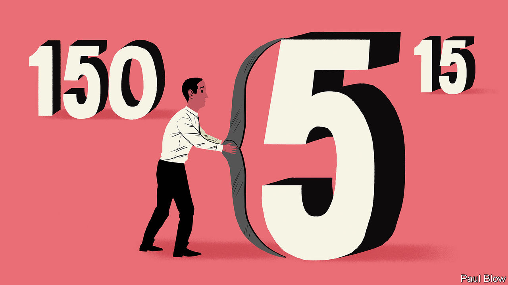

## Bartleby

# The number of the best

> Finding the optimal size of teams and organisations

> Jan 23rd 2020

HOW BIG should a business team be? It is an enormously important issue for companies. Teams that are too small may lack the skills required to get the job done; teams that are too big may be impossible to co-ordinate.

Similar trade-offs may apply when it comes to firms as a whole. Startups are often short of staff. The founders must play a host of different roles, from obtaining finance to product development and marketing, for which they may not be equally suited. But the upside is that they can have highly collaborative working environments.

People who have worked for startups say the culture changes when the company reaches a certain size. Patty McCord, formerly of Netflix, referred to the “stand-on-a-chair number”—the biggest group that can easily hear the boss address them.

Robin Dunbar, an anthropologist at Oxford University, has done a lot of work on primate groups. His argument is that the size of the group is linked to the size of the brain. With their large brains, humans can cope with larger bands. A larger social group has many advantages, allowing for greater protection and specialisation.

Whereas 150 is sometimes referred to as the “Dunbar number”, the academic himself in fact refers to a range of figures. He observes that humans tend to have five intimate friends, 15 or so good friends, around 50 social friends and 150-odd acquaintances.

Running a larger network can be difficult. So much time is needed to maintain relationships that their quality inevitably suffers. The armed forces have spent millennia experimenting with unit size. A Roman centurion oversaw 100. The modern American army company has 180 members. Britain’s equivalent numbers 120.

These are rough estimates, rather than rigid figures. But it is striking that many group activities seem to be close to a Dunbar number. The Special Air Service, Britain’s elite fighting unit, has four-man patrols; when your life depends on it, you need to have absolute trust in your colleagues. As a result, such groups are limited in size.

Sports-team sizes relate to the playing area. There are five players in a basketball side and six in ice hockey; outdoors there are 11 players in football and cricket teams, and 7-15 in the various forms of rugby. Perhaps this is the optimal size for coaching purposes, or perhaps crowds would struggle to distinguish individual players if teams were larger.

Small work teams may also tend towards these two size ranges. “If you want a committee to decide something, limit it to four to five people,” says Mr Dunbar. “But to brainstorm in a meeting, you need 12-15.” Many companies use “agile” teams which draw employees from across the company; they tend to have between five and nine members.

Most businesses are small. A survey of British firms in 2015 found that only 0.6% employed more than 150 people. Nor are small companies necessarily ephemeral. One study concluded that 89% of organisations that last more than 100 years employ fewer than 300 people.

Another group of long-lasting organisations is religious congregations. The Hutterites, a Protestant group with German origins, limited their communities to 150. They believed that it was possible to maintain solidarity in a group of fewer than 150 people with peer pressure; once you exceeded that number, you needed the equivalent of a police force.

For much of economic history, work was conducted in small units by peasants, tenant farmers and artisans (for example blacksmiths). The advent of powered machinery enabled production at a much larger scale, with workers crowded into factories. These days the rise of the service economy means that workers are no longer concentrated in such large groups.

This may not be a bad thing. It was easy for employees in large factories to regard remote company owners as “them” rather than “us”, and indeed it was easy for business owners to perceive workers as an undifferentiated mass of people and treat them accordingly. Strikes were common.

The modern company may settle on a model with a small group of “core” workers and a larger group of contract workers. The result may be more cohesion within the core staff but the non-core staff may be less well treated. The small core teams may work effectively. The big question will be the effect on morale of those outside those teams.

## URL

https://www.economist.com/business/2020/01/23/the-number-of-the-best
