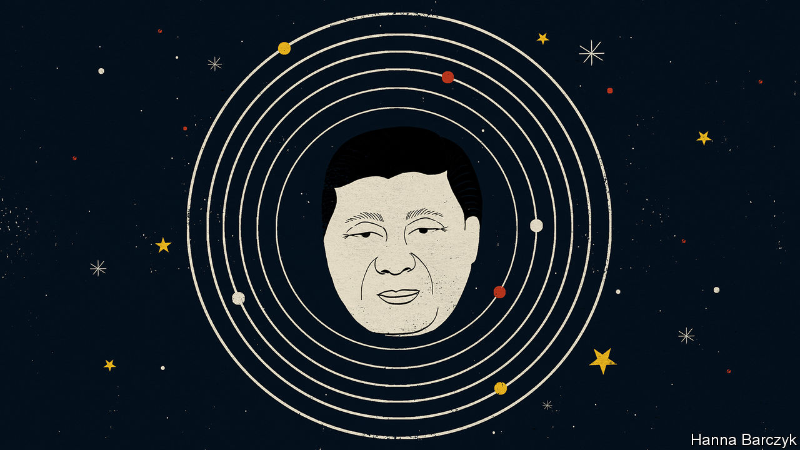

## Chaguan

# A year of Euro-summits will reveal much about China’s worldview

> Does it want to be the sun around which European planets revolve?

> Jan 23rd 2020

IF JUDGED BY words, rather than deeds, China is the world’s most powerful supporter of European unity. At a time when populist leaders such as President Donald Trump barely conceal their scorn for the European Union and other multilateral institutions, China talks of deepening and strengthening ties with the EU and other international bodies dear to Europeans.

Their great nation’s rise is powered by globalisation, Chinese officials explain. That gives China cause to fear anti-European populism that often overlaps with hostility to trade. As a result, it wants to work with all of Europe on crafting a fairer, more just, multilateral order fit for the 21st century.

There are reasons to be sceptical of such pledges. Start with core principles. China’s worldview is built on absolute deference to state sovereignty, chin-jutting nationalism and a belief that one country should not meddle in the internal affairs of another. In contrast, the belief that small and mid-sized countries can gain by pooling some sovereignty is the EU’s founding idea. Meddling in members’ affairs, to defend inviolable norms, is the union’s point.

This year will test China’s commitment to Europe in deeds, as well as words. Twice in 2020 the country’s leader, President Xi Jinping, will meet European counterparts at summits. The largest will take place in September in Leipzig, co-hosted by Germany and the EU. With Britain out of the club by then, Mr Xi will meet 27 national leaders, alongside the heads of Euro-institutions. European diplomats talk of a meeting of equals: two economic giants discussing such goals as a long-stalled agreement on two-way investments, or action on climate change, and all at a time when America’s commitment to international co-operation is in doubt. Even the place, in former East Germany, sends a message, it is said. Germany’s chancellor, Angela Merkel, wants to show China that western and ex-communist EU members stand as one.

China has a counter-message. In April it will host a summit of a grouping known as “17+1”. Founded in 2012, the club brings together China and 12 EU members—Bulgaria, Croatia, the Czech Republic, Estonia, Greece, Hungary, Latvia, Lithuania, Poland, Romania, Slovakia and Slovenia; and five aspiring ones—Albania, Bosnia and Herzegovina, Montenegro, North Macedonia and Serbia. Recent years have seen growing discontent among EU members of the group. Most have not seen hoped-for Chinese investments in bridges, roads and other infrastructure, and their farm goods and other products still struggle to enter China’s markets. Detecting trouble, China upgraded this year’s 17+1 summit. It is to be hosted in Beijing by Mr Xi, rather than the prime minister, Li Keqiang, who has presided over the group’s meetings to date.

Chaguan asked half a dozen European ambassadors in Beijing whether China was a source of unity or disunity in their continent. The question divided them. One diplomat calls the 17+1 grouping a mostly benign attempt by China to re-establish fraternal links with ex-socialist countries, and no more divisive than the endless bilateral exchanges that bigger countries, like Germany or France, have with China. Still, he concedes, if China sees a chance to get its way by driving wedges between EU members, it will. “The Chinese take the EU as seriously as the EU takes itself. They are taking advantage of the opportunities we give them,” he says.

Other envoys relate how China, a bureaucratic superpower, pushes 17+1 members to attend hundreds of sub-meetings on everything from food safety to cultural co-operation, generating blizzards of Chinese-drafted documents. Each must be checked for phrases which either encroach on areas of lawmaking which members cede to the EU, or which advance China’s worldview. Recent 17+1 drafts talk about co-operation on the basis of the sovereignty of participating countries, worries a diplomat, seeing a coded Chinese challenge to multilateralism and European values. Such papers are a “sneaky way to test how vigilant we are”, he sighs.

China is currently urging 17+1 leaders to express political support for Mr Xi’s global plan for Chinese-led infrastructure projects, the Belt and Road Initiative. Some envoys call the BRI a useful source of investment, and shrug at pressure to praise it as harmless propaganda. Others are more doubtful, noting how strict EU laws on public procurement or sustainable debt mean that rather few Chinese infrastructure contracts are signed inside the union. That encourages China to sign murkier deals on the EU’s periphery.

Some detect serious intent when Chinese officials work tirelessly to fill draft statements with empty-seeming phrases, such as Mr Xi’s call to build a “community with a shared future for mankind”. To that wary camp, it is no comfort when China says this or that document is non-binding, so hurry up and sign. If countries start routinely using Chinese vocabulary in international forums, when disputes arise China will be the logical arbiter, they say.

European countries agree on some points. For one, they each crave bilateral favours from China, but fear being left to confront such an assertive giant alone. For a while Chinese officials caused alarm by calling the Leipzig summit a “27+1” meeting, as if Mr Xi were an emperor receiving tributary kingdoms, as one envoy puts it, or a sun around which European planets revolve. Chinese diplomats even questioned whether there would be time for an annual EU-China summit, an event involving the EU’s top officials but not its members’ leaders. China eventually agreed to hold one in late March, and to use it to plan the larger gatherings that follow.

The Europeans also concur that they must keep America in mind when dealing with China. Some diplomats suggest that if China were to agree on an investment treaty with the EU, the price could be an EU promise to keep selling high technology to Chinese firms, no matter what America thinks. But if told to choose between China and America, Europeans’ horror would be unanimous. That is not the Euro-unity that China has in mind. ■

## URL

https://www.economist.com/china/2020/01/23/a-year-of-euro-summits-will-reveal-much-about-chinas-worldview
