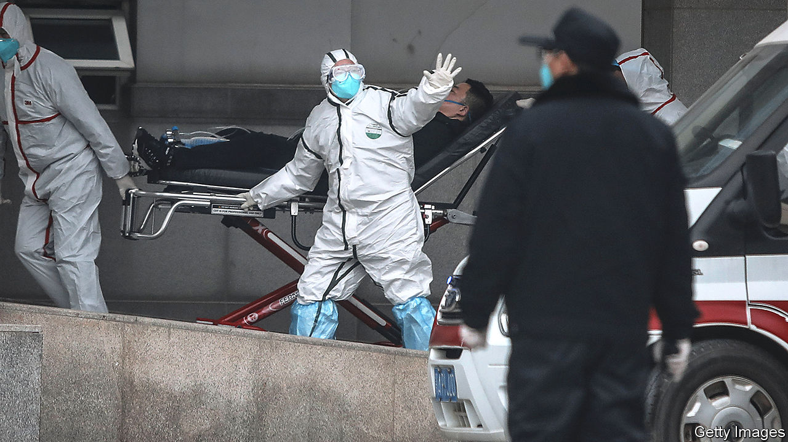

## The Wuhan crisis

# The coronavirus discovered in China is causing global alarm

> The possible economic impact worries many, too

> Jan 23rd 2020BEIJING AND SHANGHAI

CHINA’S LEADER, Xi Jinping, often warns officials to be wary of “black swan risks”, meaning sudden unexpected events that can harm the economy. People typically assume he means wobbly banks or trade tensions. But the most immediate threat may be a new, sometimes deadly, virus that appears to be spreading. The outbreak raises dark memories of another one 17 years ago that killed hundreds of people and, briefly, nearly halted China’s growth.

The main worry is whether the government can control the virus, which can cause severe pneumonia. The bug is known as 2019-nCoV, or more commonly, the Wuhan virus. It appears to have originated in early December in a fish and animal market in Wuhan, a city of 11m people. On January 20th an official said 14 health workers who had treated patients were ill. This was the first clear evidence that the disease could pass from human to human and therefore spread more widely.

Between January 17th and 22nd the number of confirmed infections grew tenfold. It stood at 618 as The Economist went to press, of whom 17 had died. There are cases in most of China’s provinces. Infected travellers from China have been found in America, Japan, South Korea, Taiwan and Thailand. On January 23nd Wuhan declared a travel ban. Hours later Wuhan’s public transport was halted, airports closed and expressways blocked. A similar lockdown was imposed on two nearby cities, Ezhou and Huanggang.

This has echoes of SARS, a respiratory disease also caused by a coronavirus, the family to which the Wuhan virus belongs. More than 8,000 people in China and other countries contracted SARS between 2002 and 2003. Close to 10% of them died. Data released so far suggest the new virus may be less lethal. Officials tried to cover up SARS, probably increasing its toll. This time, they have been quicker to take preventive measures and give information.

Officials in Wuhan initially downplayed the new virus, but that changed just before the government said that health workers had been infected. On the day of that announcement, Mr Xi said officials should “put people’s lives and health first”, a crucial signal that he would tolerate no cover-ups. The government started providing daily updates. It has appointed Zhong Nanshan, a doctor renowned for disputing the official line during the SARS crisis, to lead an advisory team.

Now that China has switched to crisis mode, few doubt the government’s resolve. But there are still plenty of reasons to worry, both about the impact on people’s health as well as on firms and investors. Just as SARS suggests how a coronavirus might spread, it also has lessons for how such a pathogen might affect an economy. In May 2003 passenger traffic numbers in China plunged more than 40% from a year earlier. Shops, restaurants and hotels all suffered. In annualised terms, quarter-on-quarter growth at the peak of SARS fell to 3.5%, down from more than 12%, according to Wang Tao of UBS, a Swiss bank.

In the case of the Wuhan virus, there are some grounds for optimism. Most hopefully, the government’s faster response could mean that it takes less time to contain it. If experts conclude that the virus is not as dangerous as the one that caused SARS, China might also be able to relax its controls on travel to and from Wuhan before big economic damage is done. Efforts to ensure transparency could reduce panic.

However, Chinese people are far more mobile than they were in the early 2000s. About 450,000 of them travel daily by train in Hubei, the province of which Wuhan is the capital. That is more than double the daily passenger volume in Guangdong in 2002 when that province became a hotspot of SARS. Helped by a vast bullet-train network built over the past decade, passengers from Wuhan will have gone farther and faster than those in Guangdong back then. China is also far more connected to the rest of the world. In 2018 some 205,000 people took flights into and out of China each day, six times as many as on the eve of SARS.

The timing of the new outbreak compounds the difficulty of containing the virus. It has come just ahead of the spring festival, a public holiday which this year runs from January 24th to 30th. In recent days millions have travelled across the country to celebrate with relatives. At transport hubs, travellers’ temperatures are being checked to detect fever. But it may take a week or more for the virus to incubate, so some infected people may not be spotted.

The economy is bigger but less fizzy than it was in 2003. During the SARS outbreak a few big sectors thrived even as others struggled. Exports surged 35%. Spending on infrastructure and housing held strong. Today, however, export growth is far weaker—only 0.5% in 2019. Property sales have started falling after a long boom. And the country has less scope to increase its spending on infrastructure, having already built so much over the past decade. In the first few days after the number of confirmed infections surged this month, Chinese stocks fell about 5%. They could tumble further. During SARS, Hong Kong’s main index declined by nearly 20%.

The part of the economy most hurt by SARS was the services sector, which then accounted for about 40% of GDP. Today the share is higher than 50%. But consumer spending could be more resilient this time because of huge growth in the popularity of online shopping. If they are fearful of venturing out (Wuhan has ordered residents to wear masks in shops and other establishments where people congregate), people can continue to buy goods at home.

China can also draw comfort from the speed with which its economy recovered after SARS was conquered. By the second half of 2003 it was back to double-digit growth. Consumers indulged their pent-up demand for everything from cars to beer. But as the current crisis grows, the grim reality of the present is all that many people—especially the millions confined to Wuhan—are likely to be contemplating. ■

## URL

https://www.economist.com/china/2020/01/23/the-coronavirus-discovered-in-china-is-causing-global-alarm
