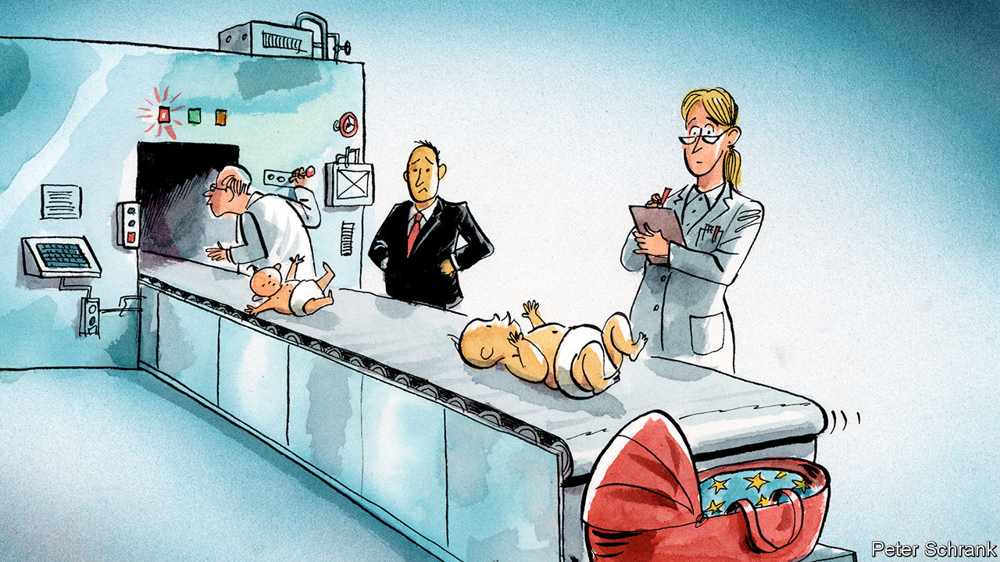

## Charlemagne

# Europe has good and bad reasons for wanting more babies

> Policies to reward fertility can disguise vote-buying, or worse

> Jan 23rd 2020

IT TAKES SURPRISINGLY little effort to get a Eurocrat to talk about sex. The European Commission plugs its various exchange programmes with cartoons of young people dreaming of meeting hot Spanish ladies and hunky French men. Spokespeople boast that such liaisons on its Erasmus student exchange have led to 1m babies. The scheme “increased the European libido” said Jean-Claude Juncker, the Luxembourgish former president of the European Commission. Umberto Eco, an Italian writer, summed up this strand of thinking about the EU: “I call it a sexual revolution: a young Catalan man meets a Flemish girl—they fall in love, they get married and they become European, as do their children.”

Now Eurocrats have a new excuse to bring up the topic: babies, or rather the lack of them. A demographic slump in eastern Europe has led to panic among its leaders, who are scrambling to come up with ways of boosting baby production. At summits, EU leaders grumble about lousy birth rates as well as great affairs of state. Across the bloc women can expect to have an average of 1.6 babies each, or as few as 1.3 in some countries. That leaves Europe with too few children to maintain its population absent immigration. After years of nagging from eastern member states, the topic was placed on the European Council’s strategic agenda for the next five years. For the first time, the issue of demography has its own dedicated commissioner in Brussels, who will look at ways to make life easier for families. Natalism, where the state tries to increase the birth rate, is back.

The new natalism is most pronounced in eastern Europe, where toddler-production statistics are the new tractor-production statistics. At one event, Croatia’s prime minister boasted that his countrywomen had generated 900 more baby Croats than the year before. Politicians compete to offer wildly generous schemes to new parents. Estonia offers 18 months of paid parental leave. Poland dishes out 500 zloty (about €120) per month for each child after the first, meaning a parent with three would reap the equivalent of nearly half the minimum wage. In Hungary mothers of four are exempt from income taxes for life, and the government is considering extending the benefit to mothers of three.

Having more babies is one area where eastern and western Europe can agree. French governments have always showered parents with goodies, ranging from cash benefits through to medals for those with four or more children. Germany is a more recent convert, boosting spending on welfare for parents and state-sponsored child care over the past two decades. The minister who oversaw that transformation was Ursula von der Leyen, now president of the European Commission (and a mother of seven, as her Twitter page proudly notes).

In some ways, the baby-policy bonanza is nothing new. Natalism has a long history in Europe, but not a happy one. The Romans banned childless women over the age of 24 from wearing precious metals, while single men paid a bachelor tax. In 17th-century France, anyone who married before the age of 20 was exempt from taxes until they were 25. In the interwar period, German and Italian fascists were the most enthusiastic natalists. “Go back home and tell the women I need births, many births,” Benito Mussolini, the Italian dictator, told women’s groups. After the war, most European governments understandably skirted the topic.

Natalist schemes do not work very well. Governments of all bents, whether totalitarian or democratic, failed to boost birth rates in the run-up to the second world war. Yet a more laissez-faire approach after the war coincided with a baby boom. “No one decides to have another child for €500,” points out Richard Togman, the author of “Nationalising Sex: Fertility, Fear, and Power”, an account of governments’ often cack-handed attempts to control breeding. Even schemes that do work, such as providing child care to help parents rejoin the workforce, have only a modest effect on the number of children. For the most part, governments throw money at people who would have had offspring anyway.

Fear has played a large role in dragging the state back into the bedroom. Demography is a canvas onto which politicians can paint their deepest worries. For those in western Europe, the fear is economic. With productivity growth low, welfare states need to generate more young workers to fund themselves lest they collapse like a population-based Ponzi scheme. Further east the fear is around identity. Some nationalists worry that low birth rates coupled with emigration of natives and immigration of newcomers will change the essential character of their nations. “We will effectively be consenting to...a process in which the European population is replaced,” declared Viktor Orban, the Hungarian premier, at a demography conference—echoing a xenophobic conspiracy theory. In this, Mr Orban and his kind resemble the eugenicists of the early twentieth century, who worried that the “superior races” (meaning Europeans) were doomed.

Baby subsidies may not produce many more babies, but they are an excellent way of buying votes. For centre-right governments, they are an excuse to give handouts to the bourgeois families who are their traditional constituents. For centre-left governments, they are an excuse to expand the welfare state.

They can also have a more sinister edge. A legitimate worry about depopulation can be hijacked by those who want to roll back the rights of women, argues Neil Datta of the European Parliamentary Forum for Sexual and Reproductive Rights. Activists for banning abortion were given prominent slots at a demography conference hosted by Mr Orban last year. Making it easier for women to return to the workforce does not fit into the idea of a traditional family put forward by the likes of him. On the surface the EU is united when it comes to boosting births. But dark differences lurk beneath. Eurocrats should watch whom they jump into bed with. ■

## URL

https://www.economist.com/europe/2020/01/23/europe-has-good-and-bad-reasons-for-wanting-more-babies
