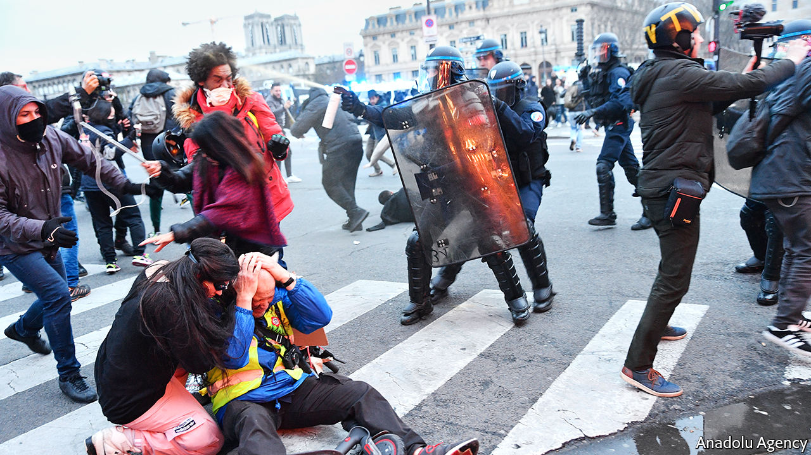

## Brutal facts

# France admits its police are too violent

> A minister urges cops to keep their sangfroid, even with rioters

> Jan 23rd 2020PARIS

IN ONE VIDEO clip, filmed in the French capital on January 18th, a protester is pinned to the ground on his back and punched several times in the face by a policeman. In another, the previous week, a riot policeman shoots a rubber bullet into a protester at a range of just 2 metres (2.2 yards). Neither of these incidents by itself is more shocking than many others that have taken place over the past year. But for the first time the government has now recognised that the police are too violent.

The Paris public prosecutor has launched an inquiry into each of these cases. Last year the number of investigations opened by the Inspection Générale de la Police Nationale, the force’s internal watchdog, jumped by 20% to 1,400. One reason was the rise of the gilets jaunes (yellow jacket) protests, which often turned violent and elicited a heavy-handed response. Since the movement began in November 2018, according to a count by David Dufresne, a reporter, 25 people have lost an eye, five have lost a hand, and 318 have suffered head wounds. But excessive force is not confined to demonstrations. This month a motorbike courier died after asphyxiating while being arrested in Paris.

At first the French government underplayed the seriousness of the problem. With a hard core of protesters torching cars, vandalising buildings and hurling cobblestones at the police, ministers defended tough policing as a proportionate response to threats to public order. Policemen have been dispatched to deal with scenes that have sometimes resembled guerrilla warfare. In the year to October 2019, fully 1,944 police, gendarmes or firefighters were wounded. During one of the “great national debates” that he held a year ago to calm the protests, President Emmanuel Macron declared that it was “unacceptable” in a country governed by the rule of law to use phrases such as “repression or police violence”.

Yet the accumulation of serious injuries, and the damage this has done to the image of the police, seems to have shifted minds. Last year France found itself the subject of harsh criticism. The office of the United Nations’ human-rights commissioner deplored “serious allegations of excessive use of force” and “disproportionate use of so-called ‘non-lethal’ weapons”. Dunja Mijatovic, the Council of Europe’s commissioner for human rights, urged France to suspend the use of rubber bullets. In the three months to February 2019, 13,460 rubber bullets were fired by the French police—more than twice the number fired during the whole of 2017.

The message seems to have sunk in. This month Christophe Castaner, the interior minister, urged the police to “keep their sangfroid” even in the face of provocation. For his part, Mr Macron acknowledged that there have been cases of police action that are “not acceptable”, stressing that such behaviour undermines the overall credibility of the forces. He has asked Mr Castaner for proposals on how to improve police ethics.

Tension remains high, not least within the police force, where some see the government’s criticism as a betrayal. Exasperation and fatigue contribute to excessive use of force, says one officer, and proportionate violence belongs to the police force’s toolkit. Further incidents may be inevitable. A long-running public-transport strike over pension reforms is coming to an end, and as it does the conflict is radicalising. Mr Macron had to be rushed out of a theatre by security agents on January 17th, after irate protesters tried to force their way in. With or without new police tactics, France’s dispiriting violence looks set to continue. ■

## URL

https://www.economist.com/europe/2020/01/23/france-admits-its-police-are-too-violent
