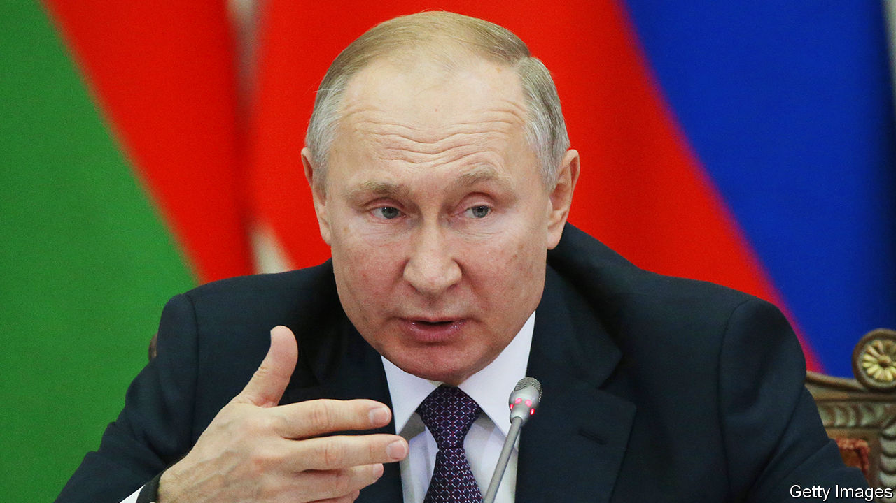

## Memory wipe

# Vladimir Putin wants to rehabilitate Stalin’s pact with Hitler

> Russia’s latest disinformation campaign is aimed at Poland and the EU

> Jan 23rd 2020

MORE THAN a million people, 90% of them Jews, had been murdered at Auschwitz-Birkenau by the time the Soviet army liberated it on January 27th, 1945. The biggest German death camp in Poland is a universally acknowledged symbol of Nazi evil. Yet the 75th anniversary of its liberation has become a political battleground.

One ceremony to commemorate it will be hosted by Poland on January 27th at the site of the camp. Vladimir Putin, Russia’s president, will boycott it. Another took place four days earlier at Yad Vashem, the Holocaust memorial in Jerusalem. Andrzej Duda, Poland’s president, boycotted that one because Mr Putin was asked to give a speech and he was not. (Yad Vashem said only liberating countries’ leaders could speak—though they included Germany.)

Antipathy between Poland and Russia is ancient. But over the past month Mr Putin has fanned the flames by launching one of the biggest propaganda offensives of his 20-year hold on power, comparable to the anti-NATO speech he delivered in Munich in 2007. This time he tried to upend the entire history of Soviet aggression towards eastern Europe. A key moment in that story is August 1939, when Hitler and Stalin signed a non-aggression pact and agreed to carve up eastern Europe. The next month, the Nazis and the Soviets invaded Poland and the second world war began.

Yet on December 20th, at a summit of leaders of former Soviet republics, Mr Putin delivered an hour-long presentation blaming Poland and its western allies for the outbreak of the war. He noted Poland had previously formed an anti-Soviet alliance with Germany and took part in the division of Czechoslovakia in 1938, implying it had no right to pose as a victim. The Soviets, he told the stunned leaders, had no choice but to make a deal with Hitler, as Western powers would not ally with them against the Nazis. “The Soviet Union never took anything from Poland,” he added. (He did not mention that Soviet troops massacred 20,000 Poles in Katyn Forest in 1940 and, after the war, imposed a communist dictatorship on the country for decades.)

A few days later, speaking to Russian generals and MPs, Mr Putin cited a dispatch by Poland’s ambassador to Nazi Germany in 1938 applauding Hitler’s plan to deport Jews to Africa. “A bastard, an anti-Semitic pig,” Mr Putin commented. Polish Jewish leaders pointed out that the ambassador, Jozef Lipski, had helped Jews flee from Germany to Poland before the war. They warned that distorting the war’s history threatens “the foundation of modern European identity”.

This may be Mr Putin’s goal. He sees it as self-defence. Russia’s regime exploits celebrations of the Soviet victory over the Nazis, hoping that Russians will associate the current Kremlin with historical triumphs. In September the European Parliament passed a resolution blaming Stalin’s pact with Hitler for the war. It denounced “fascist, Stalinist, and other totalitarian and authoritarian regimes” and called for “resilience against modern threats to democracy”—a veiled jab at the Kremlin.

To hit back, propagandists advised the Kremlin to exploit divisions between Poland and the EU created by Poland’s attacks on the independence of its judiciary. Poland had hurt its credibility in 2018 with a bill that would have made it a crime to say that Poles collaborated in the Holocaust (which some did). In a discussion among historians, reported in the Russian press, Fyodor Gaida of Moscow State University laid out the strategy: “If we and the European bureaucrats need a common enemy, I guess Poland will be the first candidate …Our main ally is, yes, Israel. These topics must be developed: Jews in the Red Army and so on.”

Israel has its own reasons to be nice to Russia, which has become a dominant player in Syria. Mr Putin is popular with the country’s Russian immigrants; Binyamin Netanyahu, the prime minister, used pictures of the two of them together during his recent election campaign. None of this has much to do with history, which is always a victim of political battles in the present. ■