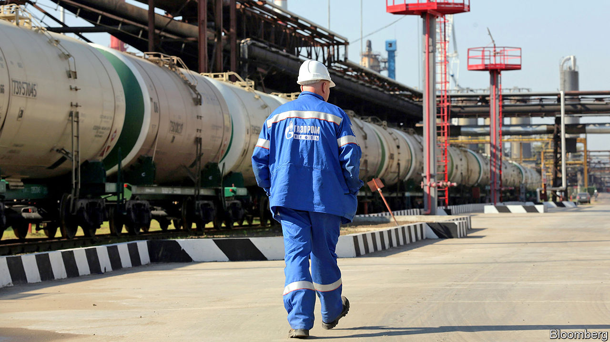
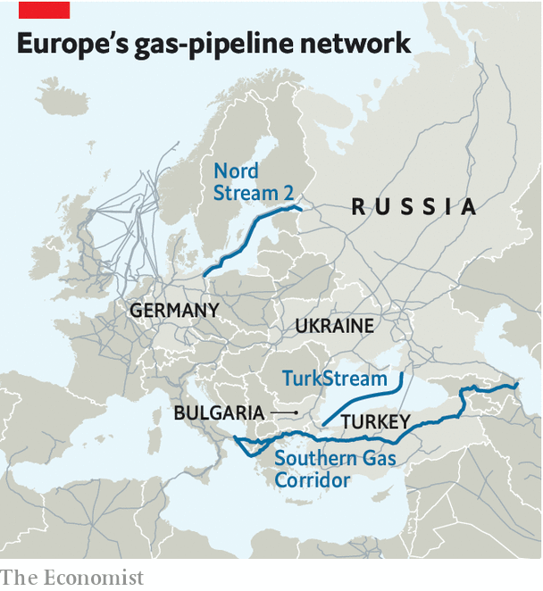

## Special delivery

# Competition, sanctions and the new geopolitics of Russian gas

> Rising Russian supply puts Europe’s energy policy to the test

> Jan 23rd 2020

IN JANUARY 2009 Gazprom, Russia’s state-owned energy giant, cut off gas supplies through Ukraine, one of several disputes in which Russia wielded its energy might. Eleven years later, it seems poised to become even more dominant. Europe’s gas production is declining. Russia has both rising supply and new ways to export it. On January 8th President Vladimir Putin celebrated the launch of TurkStream, a pipeline to bring Russian gas to Europe. American sanctions on Nord Stream 2, a controversial gas pipeline from Russia to Germany, required pipe-laying companies to wind down activities by January 20th. That will delay the project, not stop it.

Yet on January 12th Ditte Juul Jørgensen, the European Commission’s director-general for energy, told industry experts gathered in Abu Dhabi that Europe had become less vulnerable: “Our energy security and our longer-term security is in a different situation now compared to what it was in 2009.” Indeed, Europe has sought not energy independence, but energy competition. As gas courses through new Russian pipelines, that will be put to the test.

Europe’s gas market has been transformed in the past decade. Demand fell after the financial crisis and has not fully recovered, in part due to a ramp-up in renewables. Australia and America have helped bring a boom in liquefied natural gas (LNG). Additional LNG terminals, pipelines and gas-storage facilities have sprouted across Europe, often aided by public investment. Europe imported 123bn cubic metres of LNG last year, nearly twice as much as in 2017, reckons S&P Global Platts, a commodities and analytics outfit.

These supplies of gas, combined with new means of storing and transporting it, have helped support a spot market, which in turn has made the rigid contracts and oil-linked pricing long favoured by Gazprom look less tenable. In 2018 oil-linked pricing accounted for only 24% of Europe’s gas market, according to the International Gas Union, compared with 78% in 2005. “The market has become more competitive, flexible and significantly more efficient,” says Ira Joseph of S&P Global Platts.

New European Union (EU) rules and legal proceedings have promoted competition, too. Owners of gas infrastructure, for instance, must allow third parties access to their pipelines. Last year the EU extended its gas regulations to pipelines connecting member states to external countries. Construction continues on the Southern Gas Corridor, to connect Azerbaijan to Europe.

None of this means that Europe is free of Gazprom. Nord Stream 2 is challenging the EU’s new gas rule in court. In January it also asked German regulators for an exemption. Russian gas remains plentiful and relatively cheap. The International Energy Agency (IEA), a forecaster, expects the share of Russian pipeline gas in the European market to fall only slightly, from 37% in 2018 to 33-36% by 2024. But LNG makes it harder to fleece pipeline customers. Supply agreements with Gazprom now let customers resell Russian gas. In 2018 Gazprom launched an electronic-sales platform, which allows it to maximise sales and serve buyers wanting flexibility.

Two big questions loom. The first is whether Russia will, despite all this, bully customers. Some, such as Bulgaria, remain very reliant on Russian gas. In December Gazprom signed a transport deal with Ukraine’s Naftogaz, but Russia’s willingness to comply with the terms is debatable. It is even less clear if Nord Stream 2 will abide by the EU’s transparency and access rules. Richard Morningstar, a former American ambassador who leads the Global Energy Centre at the Atlantic Council, a think-tank, would prefer America to announce contingent sanctions—punishing Gazprom and its partners if, say, the company violates its gas agreement with Ukraine.

The second question is how Europe’s climate ambitions affect natural gas. In December the European Commission outlined a plan for carbon neutrality by 2050. This may depress demand for Russian gas, says Kateryna Filippenko of Wood Mackenzie, an energy-data firm. It may also sap support for infrastructure that would help countries still unduly dependent on Russian gas. On January 22nd a committee of the European Parliament voted to make 32 gas projects eligible for public funding, despite criticism from the European Climate Foundation, a lobby group. The parliament is due to vote on the list next month.

In the meantime, Russia is hedging its bets. By 2024 gas demand in China will be more than four times that in 2010, according to the IEA. On December 2nd Gazprom marked the opening of Power of Siberia, the first pipeline to bring Russian gas to China. It will face ample competition—from coal and renewables as well as from domestic gas production, LNG and other sources of piped gas. Russia can still throw its weight around in global gas markets. But it may bump into a rival. ■

## URL

https://www.economist.com/finance-and-economics/2020/01/23/competition-sanctions-and-the-new-geopolitics-of-russian-gas
