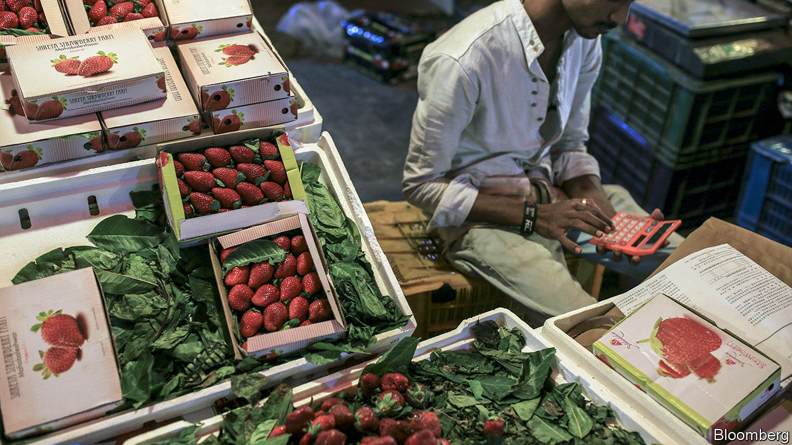
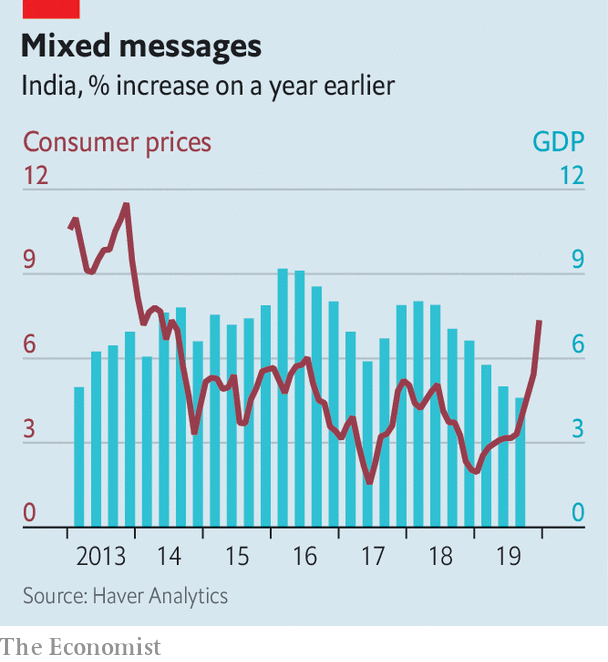

## Good down, bad up

# India’s economy risks swapping stagnation for stagflation

> Inflation is not only an onion phenomenon

> Jan 23rd 2020MUMBAI

MUMBAI’S CHEFS were quick to spot the latest threat facing India’s economy. As they foraged for ingredients in Crawford market, where hawkers sell fruit, vegetables and other kitchen staples, they began hearing prices quoted not per kilogram, but per quarter-kilo—a forlorn attempt to mask price increases. Returning from a recent shopping spree, one prominent chef checked off the items rising sharply in price: tomatoes, cabbages, aubergines, fish, spices—almost every ingredient, in fact, in the Indian cookbook.

The hawkers had some plausible excuses. The weather has been erratic, and delivery systems unreliable. But although an increase in inflation was widely foreseen, the severity of it was not. Consumer prices rose by over 7.3% in December, compared with a year earlier, the biggest jump since July 2014. Onion prices, up by 328%, contributed 2.1 percentage points to the headline figure all by themselves.

But India’s inflation is not only or everywhere an onion phenomenon. A Mumbai tea-vendors’ association recently recommended a price rise because of the increased cost of sugar and tea leaves, as well as the gas that fuels vendors’ stoves. The National Pharmaceutical Pricing Authority allowed sharply higher charges for 21 drugs, including treatments for leprosy, malaria and tuberculosis, which were in short supply because prices had failed to cover rising costs.

Indian Railways, a government entity, announced an increase in ticket prices in December. Its eroding finances apparently left it no choice. Complaints about rising air fares have been circulating since the collapse of Jet Airways last April. India’s mobile-phone operators have raised tariffs sharply after losing a court battle with the government over licence fees and spectrum charges. Despite a collapse in sales, vehicle prices are rising, a result of costly new regulations. Rajiv Bajaj, managing director of Bajaj Auto, a motorcycle-maker, has complained that the government “is killing the industry”.

This miscellany of misery will complicate the government’s efforts to fight an economic slowdown. India’s GDP grew by only 4.5% in the third quarter compared with a year earlier. That figure would have been as low as 3.1% were it not for a hurried government-spending spree. Yet another splurge is expected in the budget on February 1st. But any increase in demand could prompt an offsetting response from the Reserve Bank of India (RBI), the central bank. It may choose to prolong stagnation so as to avoid the uglier scenario of stagflation.

Stagflation usually begins with a setback to supply, such as India’s unseasonal rains. These misfortunes both lower output (the “stag” part of the phenomenon) and lift costs (the “flation” part). But once prices have increased sufficiently to reflect the scarcer supply, they should in principle stop rising. Some economists expect inflation to begin falling as soon as February. After all, core inflation, which excludes food and fuel prices, remains below 4%.

The problem is that before inflation disappears, Indians may start believing it will stay, making it more likely to persist. In most rich countries that have adopted inflation-targeting, headline inflation usually falls back into line with core measures, which reflect the strength of demand better. But in India the opposite is true. Core inflation usually converges towards the headline number, which reflects more accurately the drain on people’s pockets.

The RBI’s inflation-targeting framework, which it adopted in 2015, was supposed to fight this tendency. It was meant to convince people that the central bank’s inflation target of 4% was a better guide to future inflation than the prices quoted at Crawford market and other emporiums across the country. But the framework has “yet to be fully tested”, according to a recent lecture by Raghuram Rajan, the former RBI governor who introduced it. Mumbai’s chefs will hope it passes the thorough examination it will now undergo.■