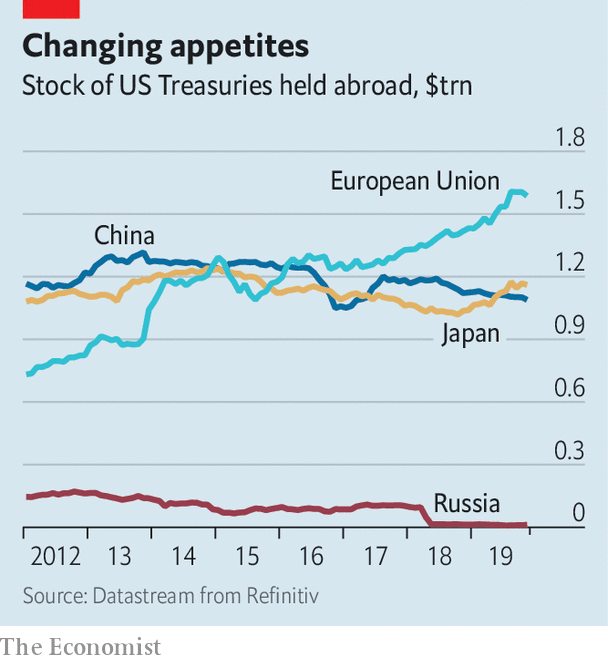

## The great Treasuries binge

# Investors at home and abroad are piling into American government debt

> Fiscal profligacy can continue for now, but is it economically sensible?

> Jan 25th 2020

IN THE GOOD old days, America’s budget deficit yawned when the economy was weak and shrank when it was strong. It fell from 13% to 4% of GDP during Barack Obama’s presidency, as the economy recovered from the financial crisis of 2007-09. Today unemployment is at a 50-year low. Yet borrowing is rising fast. Tax cuts in 2017 and higher government spending have widened the deficit to 5.5% of GDP, according to IMF data—the largest, by far, of any rich country.

It could soon widen even further. President Donald Trump is thought to want a pre-election giveaway. Fox News is awash with rumours of “Tax Cuts 2.0”. This month the Treasury announced it would issue a 20-year bond, which would lengthen the average maturity of its debt and lock in low interest rates for longer. All this is quite a change for many Republicans, who once accused Mr Obama of profligacy, but now say that trillion-dollar deficits are no big deal. Democratic presidential candidates, meanwhile, are talking about Medicare for All and a Green New Deal. A new consensus on fiscal policy has descended on Washington. Can it hold?

Fiscal hawks worry that continued high levels of government borrowing will lead to economic chaos as the engine overheats. Many of them felt vindicated by the turmoil last year in the repo market, through which financial firms lend to each other. To buy Treasuries, investors must hand over money to the government. So rising bond issuance caused demand for cash reserves borrowed on repo markets to rise, sending rates soaring. The Federal Reserve was forced to step in to provide short-term funding.

Aside from that hiccup, however, markets have taken America’s debt binge in their stride. In recent months the yield on ten-year Treasuries has been below 2%. Interest repayments, as a share of GDP, are half the level of the early 1990s. That is despite there being a far higher stock of debt relative to GDP, a sign of investors’ voracious appetite for safe assets.

One source of this demand is investors at home. Much has been made of companies’ rising stock of debt. Yet America’s firms are now net suppliers of savings to the rest of the economy—probably because the money they have raised has been recycled to investors through dividends and share buy-backs. Those corporate savings have to be parked somewhere. Treasuries are an obvious destination.

Post-crisis reforms to the financial system have also played a role. Commercial banks, for instance, are now required to hold more high-quality liquid assets. Treasuries are an ideal candidate, points out David Andolfatto of the Federal Reserve Bank of St Louis. Meanwhile, a rule change in late 2016 has reduced the attractiveness of money-market funds that invest in corporate-debt securities. That, in turn, has increased demand for funds that invest solely in Treasuries.

Households have been saving more. When the financial crisis hit, families, fearing for their jobs and pay, began to stash money away. Despite the recovering economy they have not stopped, perhaps because of lingering economic uncertainty. The personal-savings rate is much higher than it was in the 2000s. In the past three years households’ holdings of public-debt securities have risen by 70%.

Domestic investors have soaked up two-thirds of the extra government borrowing since 2016. Foreigners have bought the rest, equivalent to $800bn-worth of Treasuries. As a consequence, America is now an even bigger net borrower from the rest of the world. Its current-account deficit has widened to around 2.5% of GDP.

It is no surprise that investors have an appetite for American debt. Policy uncertainty abounds, not least thanks to Mr Trump’s enthusiasm for threatening trade war. There are few other havens. Germany’s insistence on running super-tight fiscal policy means there is an undersupply of bunds, argues Brad Setser of the Council on Foreign Relations, a think-tank. Traders moan that the market for Japan’s government bonds is illiquid.

Investors based in Europe appear to have been the most enthusiastic buyers (see chart). In part that reflects some countries’ large trade surpluses. In the past year Norway, a big oil exporter, has doubled its holdings. But that does not explain why Belgium, a country of 11m people, is one of the world’s biggest foreign buyers of Treasuries. Although official purchases by China look stable, some suspect that it is making some of its purchases through Belgian intermediaries.

Can America’s government deficit remain so wide for much longer? Some economists worry that loose fiscal policy at a time of low unemployment will cause the economy to overheat, rousing inflation. That would force the Federal Reserve to raise interest rates, and push up government-borrowing costs. So far, though, there is little sign of that. Inflation is oddly soggy; the Fed cut rates three times last year.

America’s fiscal profligacy may be able to continue for now, especially if the Treasury borrows more at longer maturities. But whether it is economically sensible is a different matter. Despite all the loosening, long-term GDP growth is middling and productivity growth weak. That may be because the splurge has been largely focused on tax giveaways, while federal investment spending has fallen as a share of government outlays. America’s fiscal policy may not be dangerous, but it may not end up doing much good. ■