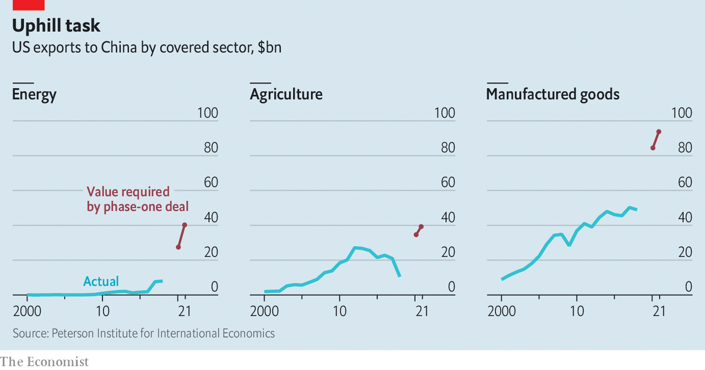

## Free exchange

# The costs of America’s lurch towards managed trade

> China’s vow to buy more American goods carries the risk of waste and distortion

> Jan 25th 2020

STANDING BEFORE the global glitterati at the World Economic Forum in the Swiss mountain resort of Davos, President Donald Trump bragged of a “transformative change” to America’s trade policy. The newly inked “phase one” deal with China, he said on January 21st, would lower trade barriers and protect intellectual property. He crowed about China’s promise to buy an extra $200bn of American services, energy, agricultural produce and manufactured goods over the next two years. He was not exaggerating. The agreement on a level of purchases, rather than on the rules of trade, does indeed mark a fundamental shift in American policy. But not one for the better.

America has embraced outcome-based rules in its trade relations before. Mercantilists like Mr Trump manage trade in two ways: either by restraining foreigners’ sales to America, or by encouraging them to buy more American goods. In the 1980s American negotiators spent most of their efforts on the first, as they faced political pressure to contain a burgeoning trade deficit and became convinced that Japan’s trade practices were unfair. At their peak, these “voluntary” restraints affected around 12% of all exports to America, including cars, steel, machine tools, textile products and semiconductors.

Voluntary import expansions, where a trading partner agrees to import more, as China has, were less common. Most famously, Ronald Reagan’s administration negotiated a commitment from the Japanese government that 20% of its semiconductor market would be imported. The aim was not so much to target the trade deficit directly, but to prise open what America thought was an unfairly closed market. The hope was that the intervention would jolt suppliers into investing in new economic relationships and lead to a sustained shift in trade patterns.

A generous interpretation of Mr Trump’s deal with China is that he is simply trying to do the same. He is not alone in feeling that China’s market shuts out outsiders, or that its policymakers do not always play fair. Veteran trade negotiators tell of haggling away one Chinese trade barrier, only for another to pop up elsewhere. (Economists recognise this problem as the difficulty of writing down a “complete contract” that covers every contingency.) An outcome-based trade deal, tied to easily verifiable trade flows, should help to overcome distrust, and could force China to provide real market access. If it led to more investment in supply-chain infrastructure, then it could have lasting effects.

It could even be argued that managing trade with China would be easier than it was with Japan. Later attempts to repeat Reagan’s semiconductor tactic failed, as Japan’s government had grown tired of cajoling its private sector into changing its sourcing decisions. It had no direct control over who bought the managed products, and had to resort to pleading letters to firms, as well as surveys asking about who they were buying from. By contrast, China’s government has the purchasing power of its state-owned enterprises at its disposal, and sway over the private sector too.

Dig into the details of Mr Trump’s new deal, though, and the risks of waste and distortion become clear. The agreed increase in sales to China is large and rapid. According to an analysis by Chad Bown of the Peterson Institute for International Economics (with whom your columnist hosts a podcast), China has, in effect, pledged to increase its purchases of certain American agricultural products by 60%, and manufactured products by 65%, by the end of this year compared with levels in 2017 (see chart). This must happen regardless of economic conditions in China. Whereas Japan agreed to increase the share of imported goods in domestic demand, China has signed up to buy fixed dollar amounts.

The risk is that China has promised to buy products that it either will not need or would rather get from elsewhere. State-owned enterprises could suck up American commodities and leave them to rot. American exporters, lured by higher prices to Chinese buyers, could switch from more sustainable relationships to ones that fizzle once their artificial advantage ends. Or China could resort to logistical gymnastics to make it appear that it is buying American, such as by transporting goods from third countries through America. It could also have more American goods shipped directly to China, rather than through Hong Kong, so that they appear in the mainland’s trade figures.

Another danger is that China simply diverts trade from its other trading partners, prompting complaints that the biggest actors are carving up markets between themselves—and carving others out. Admittedly, members of the World Trade Organisation (WTO) are already allowed to agree on broad tariff cuts among themselves, which could lead to similar diversionary effects. But trade deals are permitted, whereas discriminatory managed-trade arrangements are not. And if, as Mr Bown warns, Brazilian and Argentine sellers of soyabeans or Russian and Canadian lobster-traders find themselves pushed out of China’s market, they are unlikely to react well.

If the deal sticks, it will threaten the world’s trading system. That system, ironically, is the result of America’s turning away from managing trade in the 1990s. Realising that it could not preach the virtues of free markets while itself practising something so different, America sought the creation of the WTO, as a shift towards a system based on rules rather than power. Mr Trump’s presidency has consistently undermined those rules, and the deal with China again reinforces the idea that they do not matter. Now that he has won his share of the Chinese market, other countries may demand the same.

But the deal could also very easily fall apart, ushering in another round of hostilities. America is tightening its export controls, which could limit the goods available for China to buy. So, whatever the deal’s fate, disruption looks inevitable. Whether Mr Trump will still be in office when that becomes clear remains to be seen. Official figures on whether China’s purchases have met this year’s target will not become available until early 2021, after the presidential election. ■

## URL

https://www.economist.com/finance-and-economics/2020/01/25/the-costs-of-americas-lurch-towards-managed-trade
